<div align="center">

</img><br>

Universidad Peruana de Ciencias Aplicadas<br>
Carrera de Ingeniería de Software<br><br>

<strong>1ASI0729</strong><br>
<strong>Desarrollo de Aplicaciones Open Source</strong><br>
NRC<br>
<strong>11896</strong><br>
<strong>Informe del Trabajo Final</strong><br>
Docente<br>
<strong>Bautista Ubillús, Efraín Ricardo</strong><br>
Equipo<br>
<strong>ElectroCorp</strong><br><br>

Proyecto<br>
<strong>Electrocorp</strong><br><br>

<strong>Integrantes</strong>

<table>
  <thead>
    <tr>
      <th>Código</th>
      <th>Apellidos y Nombres</th>
    </tr>
  </thead>
  <tbody>
    <tr>
      <td>U20241e179</td>
      <td>Tavara Correa, Sebastian Oswaldo</td>
    </tr>
    <tr>
      <td>U202418755</td>
      <td>Santiago Atanacio, Jairo Mathias</td>
    </tr>
    <tr>
      <td>U20241e014</td>
      <td>Cabrejos Chocco, Diego Alexander</td>
    </tr>
    <tr>
      <td>U20241e406</td>
      <td>Loa Rojas, Jean Franck</td>
    </tr>
    <tr>
      <td>U20241b962</td>
      <td>Navarro Aldoradin, Carolina Celeste</td>
    </tr>
  </tbody>
</table>

<strong>Período 202610</strong><br><br>

<strong>Julio 2026</strong>
</div>
<div style="page-break-after: always;"></div>


## Registro de Versiones del Informe

| Versión |   Fecha    |                                                                               Autor                                                                               |                                                  Descripción de modificación                                                   |
| :-----: |:----------:|:-----------------------------------------------------------------------------------------------------------------------------------------------------------------:| :----------------------------------------------------------------------------------------------------------------------------: |
|   AV1   | 03/04/2026 |       Tavara Correa, Sebastian Oswaldo; Santiago Atanacio, Jairo Mathias; Cabrejos Chocco, Diego Alexander; Loa Rojas, Jean Franck; Documet Romero, Timothy       | Avance del trabajo: Completando el contenido del Documento, entre estos La Landing Page, la Applicacion Web, etc |
|   TB1   | 09/05/2026 |       Tavara Correa, Sebastian Oswaldo; Santiago Atanacio, Jairo Mathias; Cabrejos Chocco, Diego Alexander; Loa Rojas, Jean Franck; Documet Romero, Timothy       | Avance del trabajo:Primer entregable de la Web App, mejorar el contenido del Documento, y  actualizar La Landing Page y que este conectada con la Web App|
|   AV2   | 12/06/2026 |                   Tavara Correa, Sebastian Oswaldo; Santiago Atanacio, Jairo Mathias; Cabrejos Chocco, Diego Alexander; Loa Rojas, Jean Franck                    | Avance del trabajo:Primer entregable del backend, mejorar el contenido del Documento, y actualizar La Landing Page, mejorar el Frontend y que este conectada con el backend |
|   TB2   | 05/07/2026 | Tavara Correa, Sebastian Oswaldo; Santiago Atanacio, Jairo Mathias; Cabrejos Chocco, Diego Alexander; Loa Rojas, Jean Franck; Navarro Aldoradin, Carolina Celeste | Corrección de coherencia entre informe e implementación: suscripciones con checkout y validación de pago interna, alertas in-app, y documentación de OpenStreetMap/Nominatim como servicio externo de terceros. |

<div style="page-break-after: always;"></div>

## Project Report Collaboration Insights
A continuación, se detallan los repositorios utilizados a lo largo del proyecto:

#### Link del repositorio del Reporte:

- https://github.com/upc-pre-202610-1asi0729-11896-ecorp/electrocorp-report

#### Link del repositorio del Website:

- https://github.com/upc-pre-202610-1asi0729-11896-ecorp/electrocorp-website

#### Link del repositorio de la Webapp:

- https://github.com/upc-pre-202610-1asi0729-11896-ecorp/electrocorp-webapp

#### Link del repositorio del Platform:

- https://github.com/upc-pre-202610-1asi0729-11896-ecorp/electrocorp-platform

### **Entrega AV1:**
Durante esta entrega se elaboraron los capítulos 1 al 5 del informe. La redacción fue dividida equitativamente entre los integrantes del equipo, quienes se encargaron de desarrollar sus respectivas secciones de manera paralela. Cada miembro subió sus contribuciones directamente al repositorio de GitHub, asegurando así un seguimiento claro de los avances y la colaboración conjunta.

##### Participación por integrante:

- Tavara Correa, Sebastian Oswaldo: Desarrollo de los capitulos 1, 2, 3 y 4.      <br>
- Santiago Atanacio, Jairo Mathias: Desarrollo de los capitulos 1, 2, 4 y 5. 
- Cabrejos Chocco, Diego Alexander: Desarrollo de los capitulos 2,4, 5 y landing page.  
- Loa Rojas, Jean Franck: Desarrollo de los capitulos 1, 2, 4 y Aplicación web.
- Documet Romero, Timothy: Desarrollo de capitulo 1.    

+ **Evidencias de colaboración y commits - Github:**
    * **Análiticos de colaboración** <br><br>
        + **Pulse Image of Github Insights**
        <div align="center">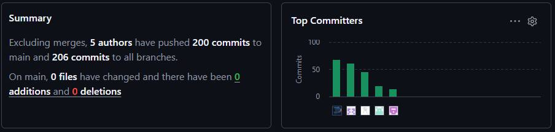</div><br><br>


        + **Contributors Image of Github Insights**
        <div align="center">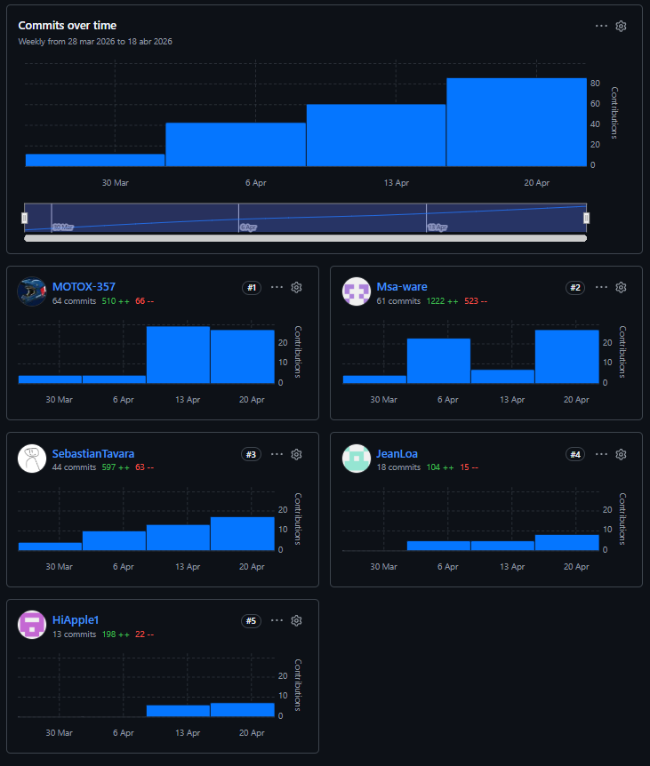</div><br><br>


    * **Commits**

         A continuación se muestran algunos commits realizados en este entrega de TB1.

        + **Sebastian Tavara**
            <div style="display: flex; align-items: center;">
            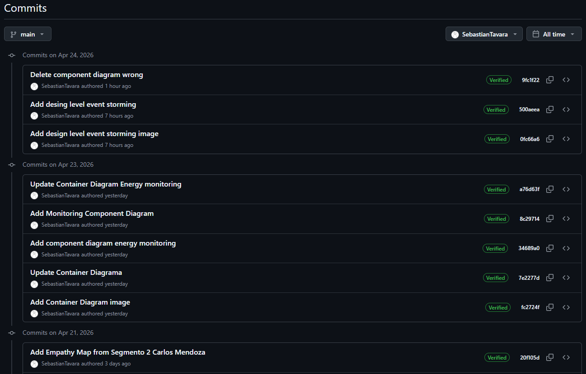
            </div><br>

        + **Jairo Santiago**
            <div style="display: flex; align-items: center;">
            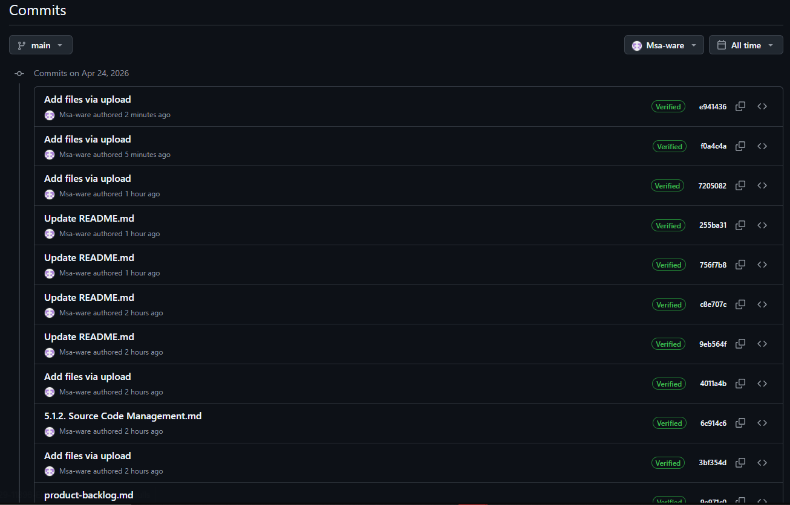
            </div><br>

        + **Diego Cabrejos**
            <div style="display: flex; align-items: center;">
            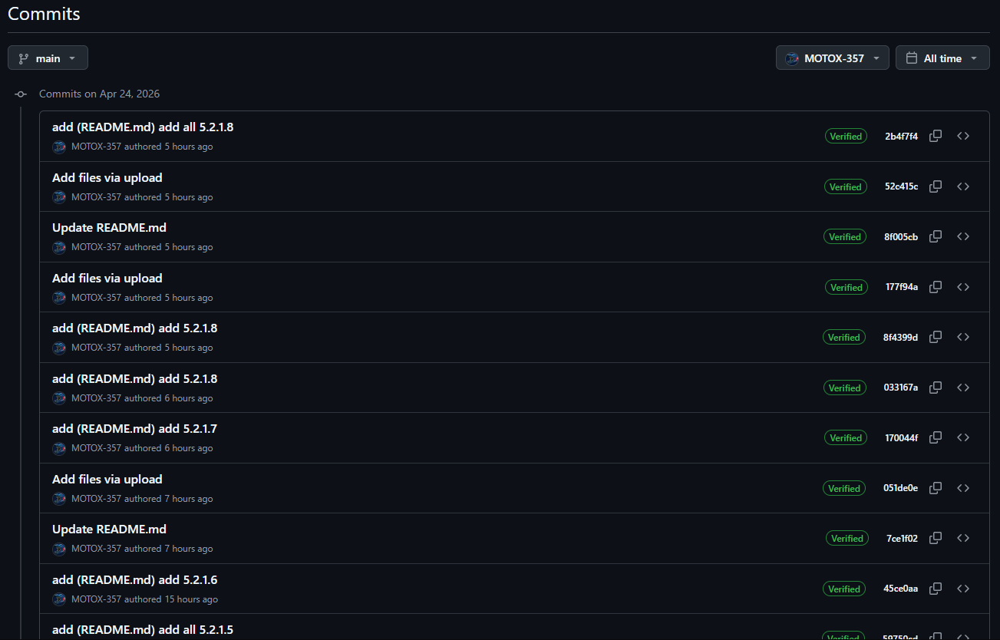
            </div><br>
        + **Jean Loa**
            <div style="display: flex; align-items: center;">
            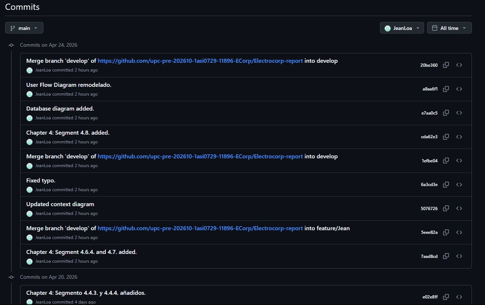
            </div><br>
        + **Timothy Documet**
            <div style="display: flex; align-items: center;">
            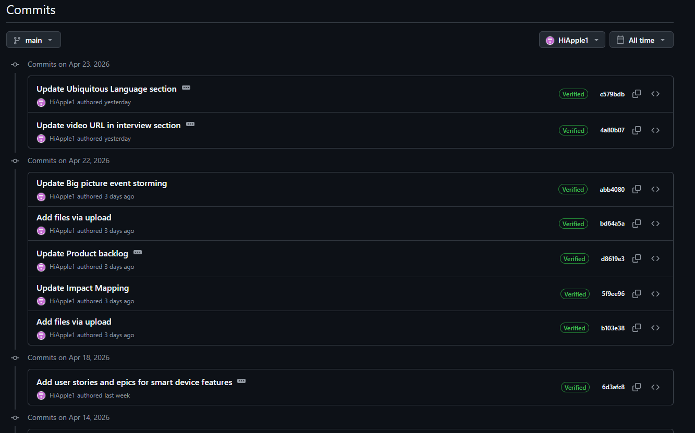
            </div><br><br>

### **Entrega TB1:**
Se hicieron las debidas correcciones a los capitulos del 1 al 5. La correción fue dividida equitativamente entre los integrantes del equipo, quienes se encargaron de sus respectivas secciones de manera paralela. Cada miembro subió sus contribuciones directamente al repositorio de GitHub cada uno en su debida rama, asegurando así un seguimiento claro de los avances y la colaboración conjunta. Ademas hicimos mejoras en la parte del frontend y la landing page.

##### Participación por integrante:

- Tavara Correa, Sebastian Oswaldo: Dirigir y distribuir las tareas según la capacidad de cada miembro.      <br>
- Santiago Atanacio, Jairo Mathias: Se corrigieron los errores presentes en las tablas y diagramas del trabajo. 
- Cabrejos Chocco, Diego Alexander: Crea y mejora versiones de la página de inicio, que a su vez se conecta con la aplicación web.  
- Loa Rojas, Jean Franck: Desarrollar e implementar la primera versión de la aplicación web, asegurando de que se desplegara sin errores y se conectara a la landing page 
- Documet Romero, Timothy: Historias técnicas, corregir historias de usuario   

+ **Evidencias de colaboración y commits - Github:**
    * **Análiticos de colaboración** <br><br>
        + **Pulse Image of Github Insights**
        <div align="center">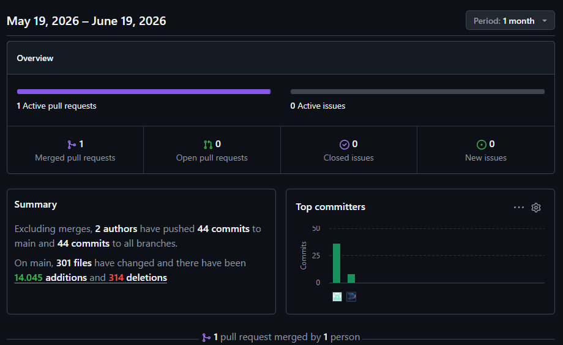</div><br><br>


        + **Contributors Image of Github Insights**
        <div align="center">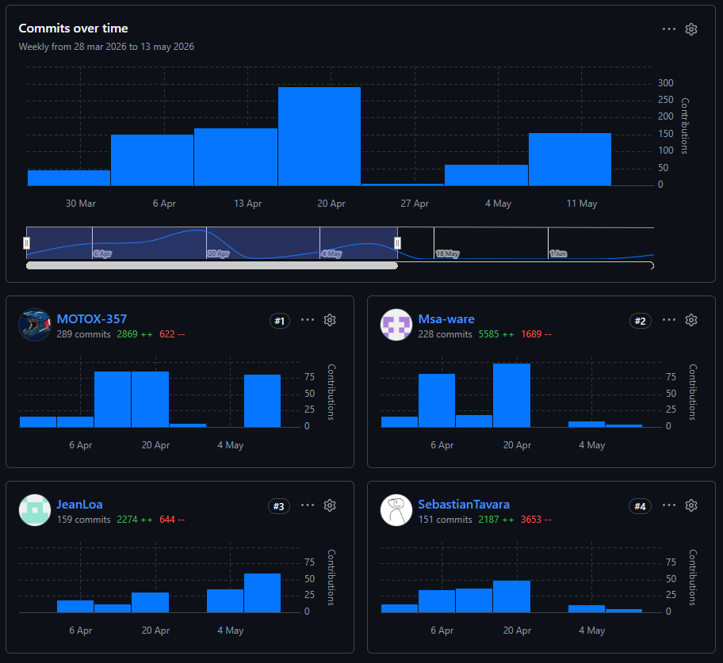</div><br><br>


    * **Commits**

         A continuación se muestran algunos commits realizados en este entrega de TB1.

        + **Sebastian Tavara**
            <div style="display: flex; align-items: center;">
            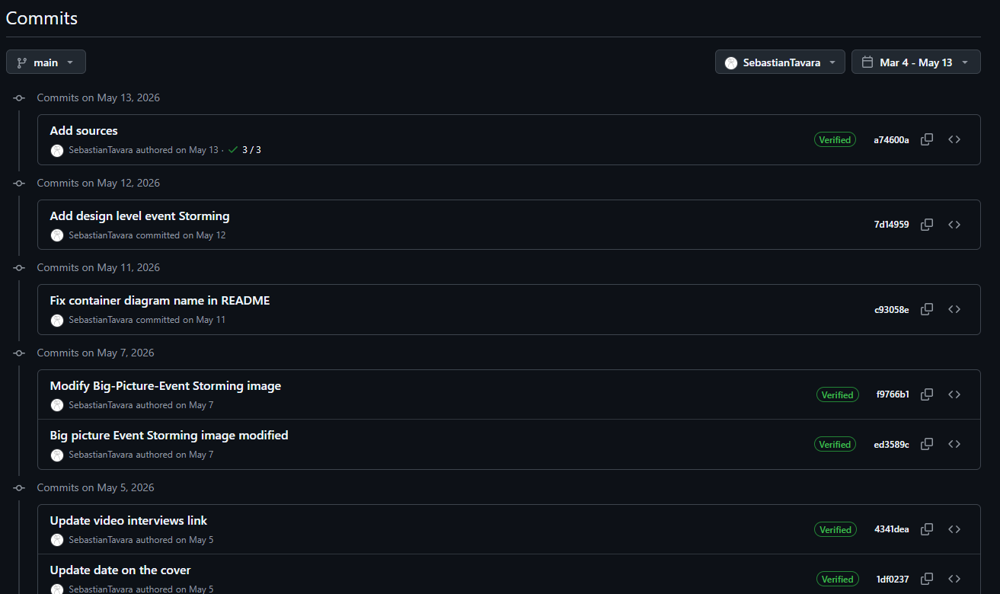
            </div><br>

        + **Jairo Santiago**
            <div style="display: flex; align-items: center;">
            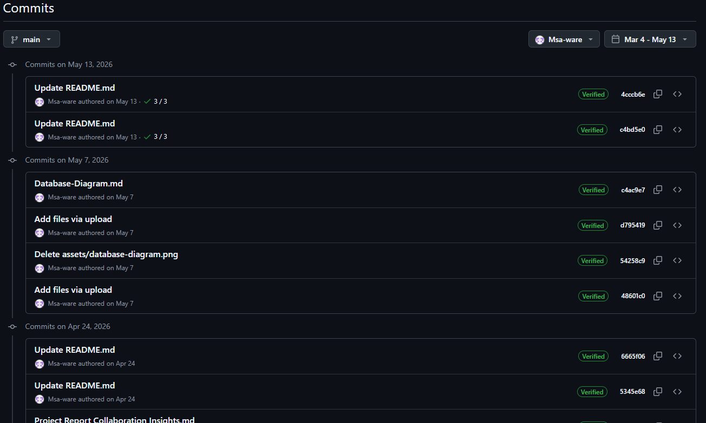
            </div><br>

        + **Diego Cabrejos**
            <div style="display: flex; align-items: center;">
            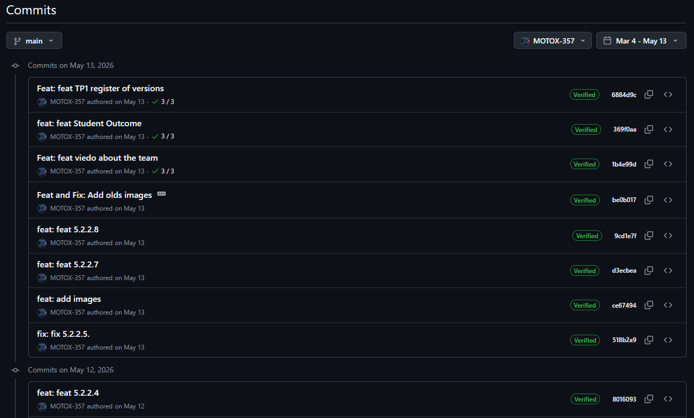
            </div><br>
        + **Jean Loa**
            <div style="display: flex; align-items: center;">
            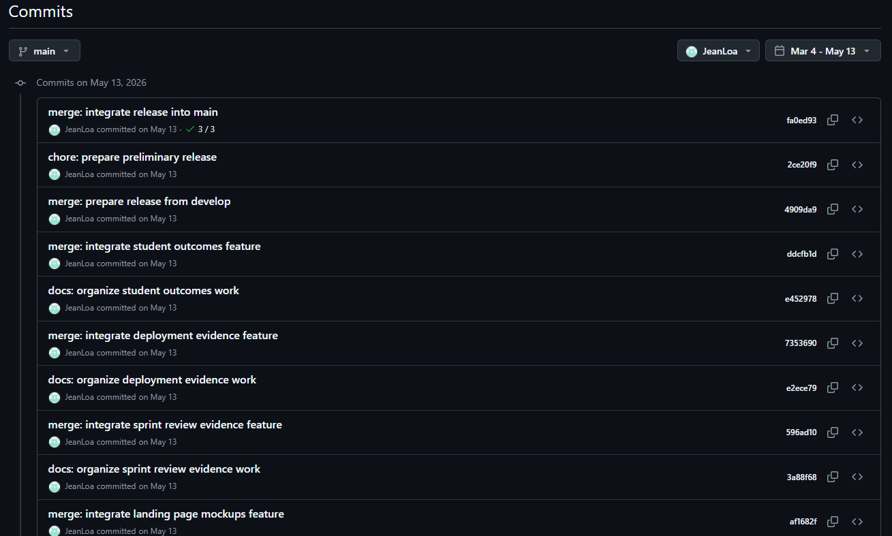
            </div><br>

### **Entrega AV2:**
Se hicieron las correcion a la parte del frontend y a la parte de la landing page, tambien se hicieron algunas correciones en el reporte ademas de agregar el nuevo sprint. Tambien se avanzo la parte del backend dejandolo completamente operativo.

##### Participación por integrante:

- Tavara Correa, Sebastian Oswaldo: Event Storming, Correciones en el report y parte del backend      <br>
- Santiago Atanacio, Jairo Mathias: Parte del backend y correcion del frontend
- Cabrejos Chocco, Diego Alexander: Correcion de la landing page y agregar el sprint 3
- Loa Rojas, Jean Franck: Desarrollo y despliegue del backend, ademas correcion del frontend

+ **Evidencias de colaboración y commits - Github:**
    * **Análiticos de colaboración** <br><br>
        + **Pulse Image of Github Insights**
        <div align="center"></div><br><br>


        + **Contributors Image of Github Insights**
        <div align="center">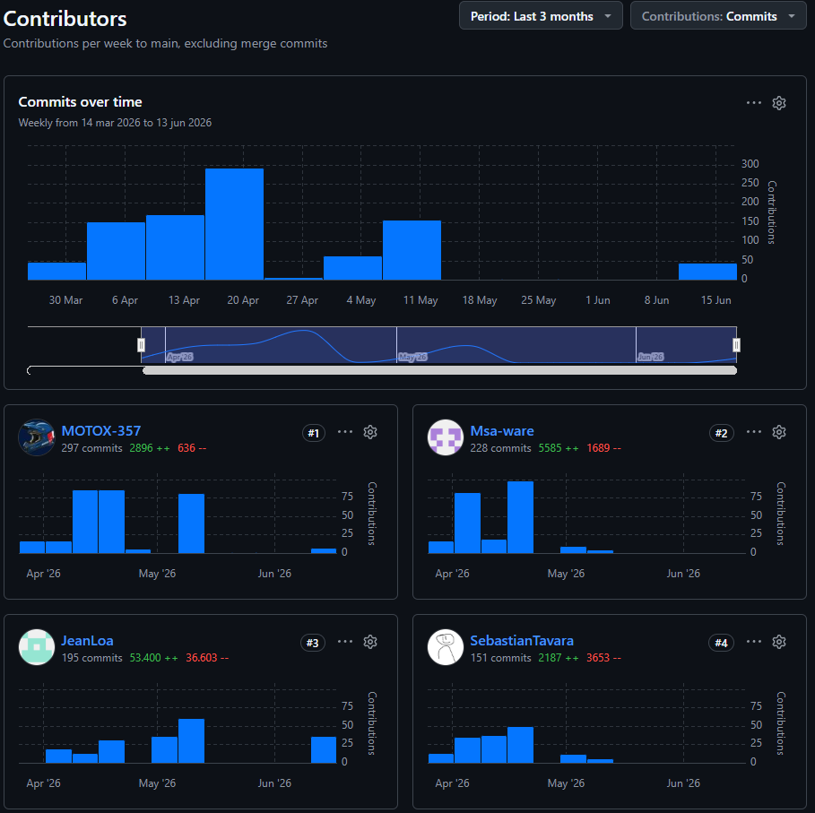</div><br><br>


    * **Commits**

         A continuación se muestran algunos commits realizados en este entrega de TB1.

        + **Sebastian Tavara**
            <div style="display: flex; align-items: center;">
            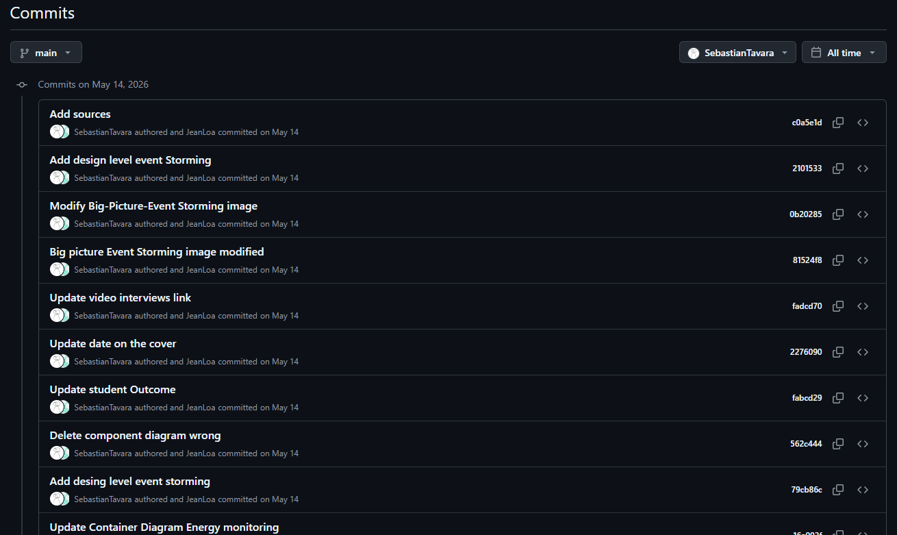
            </div><br>

        + **Jairo Santiago**
            <div style="display: flex; align-items: center;">
            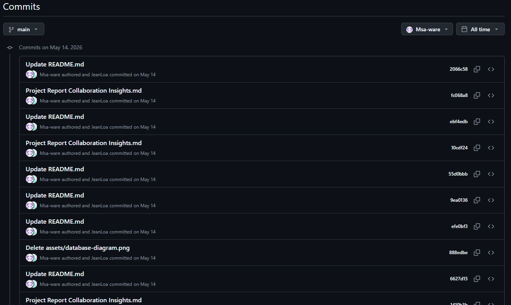
            </div><br>

        + **Diego Cabrejos**
            <div style="display: flex; align-items: center;">
            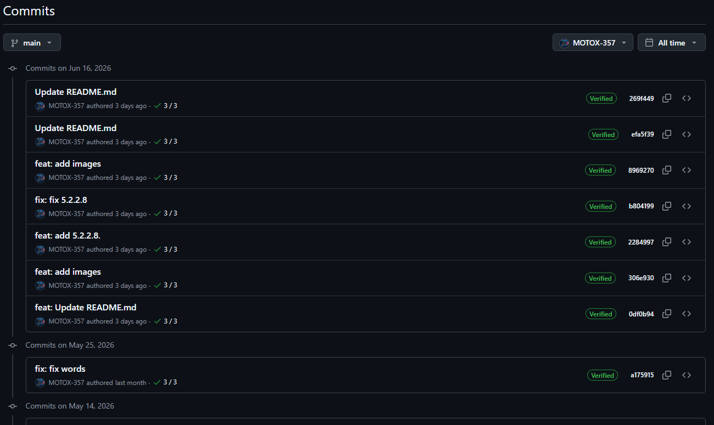
            </div><br>
        + **Jean Loa**
            <div style="display: flex; align-items: center;">
            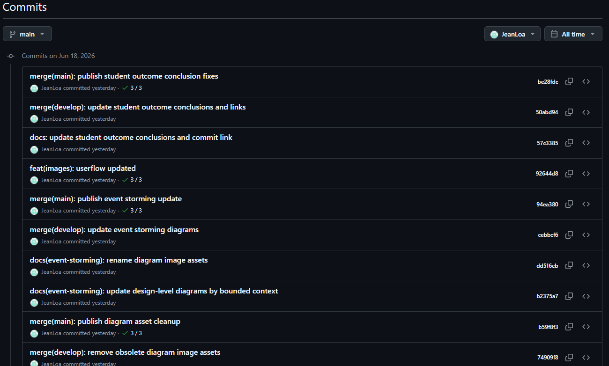
            </div><br>


# Contenido

## Índice

- [Registro de versiones del informe](#registro-de-versiones-del-informe)

- [Project Report Collaboration Insights](#project-report-collaboration-insights)

- [Contenido](#contenido)

- [Student Outcome](#student-outcome-1)

- [Capítulo I: Introducción](#capitulo-i-introduccion)
  - [1.1. StartUp Profile](#11-startup-profile)
    - [1.1.1. Descripción de la StartUp](#111-descripción-de-la-startup)
    - [1.1.2. Perfiles de Integrantes del equipo](#112-perfiles-de-integrantes-del-equipo)
  - [1.2. Solution Profile](#12-solution-profile)
    - [1.2.1. Antecedentes y Problemática](#121-antecedentes-y-problemática)
    - [1.2.2. Lean UX Process](#122-lean-ux-process)
      - [1.2.2.1. Lean UX Problem Statements](#1221-lean-ux-problem-statements)
      - [1.2.2.2. Lean UX Assumptions](#1222-lean-ux-assumptions)
      - [1.2.2.3. Lean UX Hypothesis Statements](#1223-lean-ux-hyphotesis-statements)
      - [1.2.2.4. Lean UX Canvas](#1224-lean-ux-canvas)
  - [1.3. Segmentos objetivo](#13-segmentos-objetivo)
- [Capítulo II: Requirements Elicitation & Analysis]()
  - [2.1. Competidores](#21-competidores)
    - [2.1.1. Análisis competitivo](#211-análisis-competitivo)
    - [2.1.2. Estrategias y tácticas frente a competidores](#212-estrategias-y-tácticas-frente-a-competidores)
  - [2.2. Entrevistas](#22-entrevistas)
    - [2.2.1. Diseño de entrevistas](#221-diseño-de-entrevistas)
    - [2.2.2. Registro de entrevistas](#222-registro-de-entrevistas)
    - [2.2.3. Análisis de entrevistas](#223-análisis-de-entrevistas)
  - [2.3. Needfinding](#23-needfinding)
    - [2.3.1. User Persona](#231-user-persona)
    - [2.3.2. User Task Matrix](#232-user-task-matrix)
    - [2.3.3. User Journey Mapping](#233-user-journey-mapping)
    - [2.3.4. Empathy Mapping](#234-empathy-mapping)
  - [2.4 Big Picture Event Storming](#24-big-picture-event-storming)
  - [2.5 Ubiquitous Language](#25-ubiquitous-language)
- [Capítulo III: Requirements Specification]()
  - [3.1. User Stories](#31-user-stories)
  - [3.2. Impact Mapping](#32-impact-mapping)
  - [3.3. Product Backlog](#33-product-backlog)
- [Capítulo IV: Product Design]()
  - [4.1. Style Guidelines](#41-style-guidelines)
    - [4.1.1. General Style Guidelines](#411-general-style-guidelines)
    - [4.1.2. Web Style Guidelines](#412-web-style-guidelines)
  - [4.2. Information Architecture](#42-information-architecture)
    - [4.2.1. Organization Systems](#421-organization-systems)
    - [4.2.2. Labeling Systems](#422-labeling-systems)
    - [4.2.3. SEO Tags and Meta Tags](#423-seo-tags-and-meta-tags)
    - [4.2.4. Searching Systems](#424-searching-systems)
    - [4.2.5. Navigation Systems](#425-navigation-systems)
  - [4.3. Landing Page UI Design](#43-landing-page-ui-design)
    - [4.3.1. Landing Page Wireframe](#431-landing-page-wireframe)
    - [4.3.2. Landing Page Mock-up](#432-landing-page-mock-up)
  - [4.4. Web Applications UX/UI Design](#44-web-applications-uxui-design)
    - [4.4.1. Web Applications Wireframes](#441-web-applications-wireframes)
    - [4.4.2. Web Applications Wireflow Diagrams](#442-web-applications-wireflow-diagrams)
    - [4.4.3. Web Applications Mock-ups](#443-web-applications-mock-ups)
    - [4.4.4. Web Applications User Flow Diagrams](#444-web-applications-user-flow-diagrams)
  - [4.5. Web Applications Prototyping](#45-web-applications-prototyping)
  - [4.6. Domain-Driven Software Architecture](#46-domain-driven-software-architecture)
    - [4.6.1. Design-Level Event Storming](#461-design-level-event-storming)
    - [4.6.2. Software Architecture Context Diagram](#462-software-architecture-context-diagram)
    - [4.6.3. Software Architecture Container Diagrams](#463-software-architecture-container-diagrams)
    - [4.6.4. Software Architecture Components Diagrams](#464-software-architecture-components-diagrams)
  - [4.7. Software Object-Oriented Design](#47-software-object-oriented-design)
    - [4.7.1. Class Diagrams](#471-class-diagrams)
  - [4.8. Database Design](#48-database-design)
    - [4.8.1. Database Diagram](#481-database-diagram)
- [Capítulo V: Product Implementation, Validation & Deployment]()
  - [5.1. Software Configuration Management](#51-software-configuration-management)
    - [5.1.1. Software Development Environment Configuration](#511-software-development-environment-configuration)
    - [5.1.2. Source Code Management](#512-source-code-management)
    - [5.1.3. Source Code Style Guide & Conventions](#513-source-code-style-guide--conventions)
    - [5.1.4. Software Deployment Configuration](#514-software-deployment-configuration)
  - [5.2. Landing Page, Services & Applications Implementation](#52-landing-page-services--applications-implementation)
    - [5.2.1. Sprint 1](#521-sprint-1)
      - [5.2.1.1. Sprint Planning 1](#5211-sprint-planning-1)
      - [5.2.1.2. Aspect Leaders and Collaborators](#5212-aspect-leaders-and-collaborators)
      - [5.2.1.3. Sprint Backlog 1](#5213-sprint-backlog-1)
      - [5.2.1.4. Development Evidence for Sprint Review](#5214-development-evidence-for-sprint-review)
      - [5.2.1.5. Execution Evidence for Sprint Review](#5215-execution-evidence-for-sprint-review)
      - [5.2.1.6. Services Documentation Evidence for Sprint Review](#5216-services-documentation-evidence-for-sprint-review)
      - [5.2.1.7. Software Deployment Evidence for Sprint Review](#5217-software-deployment-evidence-for-sprint-review)
      - [5.2.1.8. Team Collaboration Insights during Sprint](#5218-team-collaboration-insights-during-sprint)
    - [5.2.2. Sprint 2](#522-sprint-2)
      - [5.2.2.1. Sprint Planning 2](#5221-sprint-planning-2)
      - [5.2.2.2. Aspect Leaders and Collaborators](#5222-aspect-leaders-and-collaborators)
      - [5.2.2.3. Sprint Backlog 2](#5223-sprint-backlog-2)
      - [5.2.2.4. Development Evidence for Sprint Review](#5224-development-evidence-for-sprint-review)
      - [5.2.2.5. Execution Evidence for Sprint Review](#5225-execution-evidence-for-sprint-review)
      - [5.2.2.6. Services Documentation Evidence for Sprint Review](#5226-services-documentation-evidence-for-sprint-review)
      - [5.2.2.7. Software Deployment Evidence for Sprint Review](#5227-software-deployment-evidence-for-sprint-review)
      - [5.2.2.8. Team Collaboration Insights during Sprint](#5228-team-collaboration-insights-during-sprint)
    - [5.2.3. Sprint 3](#523-sprint-3)
      - [5.2.3.1. Sprint Planning 3](#5231-sprint-planning-3)
      - [5.2.3.2. Aspect Leaders and Collaborators](#5232-aspect-leaders-and-collaborators)
      - [5.2.3.3. Sprint Backlog 3](#5233-sprint-backlog-3)
      - [5.2.3.4. Development Evidence for Sprint Review](#5234-development-evidence-for-sprint-review)
      - [5.2.3.5. Execution Evidence for Sprint Review](#5235-execution-evidence-for-sprint-review)
      - [5.2.3.6. Services Documentation Evidence for Sprint Review](#5236-services-documentation-evidence-for-sprint-review)
      - [5.2.3.7. Software Deployment Evidence for Sprint Review](#5237-software-deployment-evidence-for-sprint-review)
      - [5.2.3.8. Team Collaboration Insights during Sprint](#5238-team-collaboration-insights-during-sprint)
    - [5.2.4. Sprint 4](#524-sprint-4)
      - [5.2.4.1. Sprint Planning 4](#5241-sprint-planning-4)
      - [5.2.4.2. Aspect Leaders and Collaborators](#5242-aspect-leaders-and-collaborators)
      - [5.2.4.3. Sprint Backlog 4](#5243-sprint-backlog-4)
      - [5.2.4.4. Development Evidence for Sprint Review](#5244-development-evidence-for-sprint-review)
      - [5.2.4.5. Execution Evidence for Sprint Review](#5245-execution-evidence-for-sprint-review)
      - [5.2.4.6. Services Documentation Evidence for Sprint Review](#5246-services-documentation-evidence-for-sprint-review)
      - [5.2.4.7. Software Deployment Evidence for Sprint Review](#5247-software-deployment-evidence-for-sprint-review)
      - [5.2.4.8. Team Collaboration Insights during Sprint](#5248-team-collaboration-insights-during-sprint)
  - [5.3. Validation Interviews]()
    - [5.3.1. Diseño de Entrevistas](#531-diseño-de-entrevistas)
    - [5.3.2. Registro de Entrevistas](#532-registro-de-entrevistas)
    - [5.3.3. Evaluaciones según heuristicas](#533-evaluaciones-segun-heuristicas)
  - [5.4. Video About-the-Product](#54-video-about-the-product)
- [Conclusiones](#conclusiones)
  - [Conclusiones y recomendaciones](#conclusiones-y-recomendaciones)
- [Bibliografía](#bibliografía)
- [Anexos](#anexos)
  - [Links importantes](#links-importantes)
  - [Credenciales de prueba](#credenciales-de-prueba)


<div style="page-break-after: always;"></div>

## Student Outcome

Objetivo general, ABET – EAC - Student Outcome 3: Capacidad de comunicarse efectivamente con un rango de audiencias.
| Criterio Especifico | Acciones realizadas | Conclusiones |
|--|--|--|
| Comunica oralmente con efectividad a diferentes rangos de audiencia. | Sebastian Tavara <br>AV1: Realizo entrevistas clave para poder entender al usuario<br> TP1: Comunicó al equipo los hallazgos de las pruebas iniciales sobre la App Web desplegada, sugiriendo ajustes desde la perspectiva del usuario final.<br> AV2: Presento los avances de integracion frontend-backend y explico al equipo como los flujos de sedes, dispositivos y dashboard debian validarse desde la experiencia del usuario.<br> TF1: <br> <br> Diego Cabrejos <br>AV1: Expuso la estructura y los avances del desarrollo de la Landing Page durante las reuniones del equipo<br> TP1: Expuso las actualizaciones implementadas en la Landing Page de ElectroCorp, explicando las correcciones de errores y las mejoras visuales realizadas para esta entrega.<br> AV2: Expuso el avance de monitoreo energetico, notificaciones y reporting, comunicando como estos modulos apoyan la toma de decisiones de consumo.<br> TF1: <br> <br> Jean Loa <br> AV1: Expuso la estructura general de la aplicación, explicó la función de los módulos principales del sistema y comunicó al equipo cómo se relacionaban las secciones del frontend con la lógica del backend durante el desarrollo inicial del proyecto.<br> TP1: Explicó el proceso y la configuración técnica requerida para realizar el primer despliegue de la App Web, asegurando que el equipo comprendiera el entorno de producción.<br> AV2: Explico la arquitectura del backend, el despliegue en Render y la habilitacion de rutas publicas, health check y Swagger/OpenAPI para la validacion tecnica.<br> TF1: <br> <br> Timothy Documet <br>AV1: Realizo entrevistas clave para el proyecto, así como las user stories, el product backlog y el ubiquitous language.<br> TP1: Comunicó el estado de avance de las historias de usuario durante la revisión del sprint, validando qué requerimientos se cumplieron con el despliegue.<br> AV2: Comunico los avances de Service Management y apoyo en la revision de evidencias del informe para mantener coherencia con los requerimientos de AV2.<br> <br> Jairo Santiago <br> AV1: Expuso en las reuniones de equipo la estructura de las historias de usuario y los criterios de aceptación para el proyecto ElectroCorp. Explicó detalladamente el diseño y las interacciones de los Diagramas de Contexto y Contenedores (Modelo C4) de la arquitectura del software. Además, comunicó oralmente las normativas de la Guía de Estilos de Código, asegurando que todos los miembros comprendieran las convenciones a seguir durante el desarrollo. <br> TP1: Sustentó los ajustes arquitectónicos necesarios durante el paso a producción de la App Web, guiando al equipo para mantener los estándares técnicos.<br> AV2: Sustento los avances de IAM y Billing, explicando la relacion entre registro, seleccion de plan y activacion de la cuenta dentro del flujo principal.<br> TF1: <br> <br>| AV1: Durante esta primera etapa, se establecio un canal de comunicacion oral constante para alinear la vision del proyecto, explicar el problema identificado y coordinar la estructura inicial de ElectroCorp.<br><br> TB1: El primer despliegue de la App Web y la actualizacion de la Landing Page exigieron una coordinacion oral precisa para resolver retos tecnicos de publicacion, navegacion y presentacion del producto.<br><br> AV2: En AV2, la comunicacion oral permitio explicar el avance integral de ElectroCorp, conectando backend, frontend, despliegue, validacion y documentacion tecnica para distintos tipos de audiencia.<br><br> TB2: <br><br> |
| Comunica por escrito con efectividad a diferentes rangos de audiencia | Sebastian Tavara <br>AV1: Analisis de entrevista, User Persona<br> TP1: Documentó los reportes de usabilidad y los posibles bugs encontrados al interactuar con el primer despliegue de la aplicación.<br> AV2: Documento los criterios de navegacion e integracion de la Web Application, dejando evidencia del rol de las pantallas en los flujos de usuario.<br> TF1: <br> <br> Diego Cabrejos <br>AV1: Redactó y estructuró la documentación técnica del Sprint 1 (Sprint Planning y Sprint Backlog) en el informe del proyecto. Además, comunicó el progreso del desarrollo a través de código semántico y descriptivo en la Landing Page, documentando los cambios mediante mensajes de commit claros en el repositorio de GitHub.<br> TB1: Documentó los cambios y correcciones de la Landing Page mediante mensajes de commit claros en el repositorio, y actualizó la documentación técnica de la interfaz.<br> AV2: Registro cambios relacionados con dashboard, notificaciones y reportes, manteniendo trazabilidad escrita en commits, tablas y evidencias del Sprint 3.<br> TF1: <br> <br> Jean Loa <br> AV1: Redactó contenido técnico relacionado con la estructura funcional de la aplicación, describió la organización inicial del sistema y documentó por escrito la lógica general de los módulos implementados en el proyecto.<br> TP1: Redactó la documentación técnica sobre el despliegue de la App Web, incluyendo las configuraciones de entorno y dependencias utilizadas en producción.<br> AV2: Documento configuraciones de backend, rutas publicas, despliegue en Render y contratos OpenAPI para facilitar la revision tecnica del proyecto.<br> TF1: <br> <br> Timothy Documet <br>AV1:<br> TP1: Actualizó el Sprint Backlog marcando las tareas completadas y redactó las notas de la versión (Release Notes) correspondientes a esta primera entrega.<br> AV2: Actualizo evidencias del informe y organizo informacion de soporte, servicios y diagramas para mantener continuidad con las entregas anteriores.<br> TF1:<br> <br> Jairo Santiago <br> AV1: Redactó y estructuró el Product Backlog y las historias de usuario (User Stories y Technical Stories) utilizando el lenguaje Gherkin para asegurar la claridad de los requisitos. Diseñó y documentó la arquitectura del sistema elaborando los Diagramas de Contexto y de Contenedores. También redactó la Guía de Estilos y Convenciones de Código para estandarizar el desarrollo del proyecto en HTML, CSS, JavaScript y Java dentro del informe técnico.<br> TP1: Actualizó los diagramas de arquitectura para reflejar el entorno de despliegue y registró las nuevas normativas de código adoptadas en esta fase.<br> AV2: Documento historias, criterios y componentes asociados a IAM y Billing, reforzando la claridad del flujo de registro y seleccion de plan.<br> TF1: <br> <br>| AV1: En el primer avance, la documentacion permitio organizar el problema, los segmentos objetivo, las historias de usuario, los criterios de aceptacion, la arquitectura inicial y las decisiones de estilo del proyecto.<br><br> TB1: La comunicacion escrita fue clave para registrar avances de versionamiento, despliegue, backlog y evidencias de la Landing Page y la Web Application, manteniendo trazabilidad tecnica del producto.<br><br> AV2: La documentacion de AV2 se fortalecio con Sprint 3, diagramas por bounded context, evidencias de despliegue, validacion, contratos de backend y actualizacion del README para revision tecnica y academica.<br><br> TB2: <br><br> |


# Capitulo I: Introducción

## 1.1. StartUp Profile

### 1.1.1. Descripción de la StartUp
Es una startup de tecnologia enfocada en democratizar la domótica y la eficiencia energética para los hogares peruanos. 
<br><br>
Actualmente, el convertir una casa tradicional en un "hogar inteligente" es percibido como un lujo costoso, que requiere modificar el cableado eléctrico, contratar técnicos especializados y lidiar con aplicaciones genéricas que no reflejan la realidad del consumo local o que simplemente son complicados de comprender. Además, los altos costos de energía eléctrica son una preocupación constante para las familias y negocios nuevos.
<br><br>
Hemos desarrollado un ecosistema IoT (Internet de las Cosas) plug-and-play que se instala en minutos sobre los interruptores y enchufes existentes, sin necesidad de romper paredes, quebrar techos, ni alterar la red eléctrica. A través de nuestra plataforma web y móvil, los usuarios pueden controlar sus electrodomésticos de forma remota, podran programar horarios de encendido y monitorear el consumo de energia de su hogar en tiempo real.

---

## Misión

Nuestra misión es brindar a las familias peruanas soluciones de domótica accesibles y de fácil instalación que les permitan tomar el control de su consumo eléctrico, optimizando su presupuesto mediante tecnología inteligente.

---

## Visión

Queremos que ElectroCorp sea el referente en el Perú en gestión energética residencial, transformando los hogares tradicionales en espacios eficientes y sostenibles que alivien la economía familiar y contribuyan al cuidado del medio ambiente.

### 1.1.2. Perfiles de integrantes del equipo
| **Nombre Completo del integrante**    | 	**Descripcion de la carrera**                                   | **Fotografia**                                                         | **Conocimientos y habilidades**
| :------------------------------------ |:-----------------------------------------------------------------|:-----------------------------------------------------------------------|:------------------------------------ |
| Tavara Correa, Sebastian Oswaldo      | Ingeniería de Software Universidad Peruana de Ciencias Aplicadas |  | Soy Sebastian Oswaldo Tavara Correa estudiante de la carrera de ingeniería de software, actualmente cursando el 5to ciclo, me considero una persona estudiosa y muy colaborativa al trabajar en grupo. Me adapto rápidamente a cualquier entorno. Me interesa desarrollar soluciones tecnológicas que tengan un impacto positivo. Creo que el desarrollo de software no debe limitarse en buscar la mayor funcionalidad, sino que también en generar bienestar en la sociedad.
| Santiago Atanacio, Jairo Mathias      | Ingeniería de Software Universidad Peruana de Ciencias Aplicadas |                | Soy Jairo Mathias Santiago Atanacio, estudiante de 5to ciclo de Ingeniería de Software. Cuento con una base sólida en el desarrollo de algoritmos en C++, la creación de interfaces web interactivas mediante HTML, CSS y JavaScript, y el dominio de bases de datos relacionales (MySQL) y no relacionales (MongoDB). Me apasiona transformar problemas complejos en soluciones de software eficientes, escalables y con una gestión de datos versátil. Mi enfoque combina la rigurosidad técnica con habilidades blandas como la proactividad y la empatía, lo que me permite integrarme fácilmente en equipos colaborativos bajo metodologías ágiles.
| Cabrejos Chocco, Diego Alexander      | Ingeniería de Software Universidad Peruana de Ciencias Aplicadas |                | Soy Diego Alexander Cabrejos Chocco estudiante de la carrera de ingeniería de software, actualmente cursando el 5to ciclo, soy una persona sociable, creativa, que trabaja bien en equipo y busco que todo el equipo participe en las actividades activamente. Me adapto rapidamente a la modalidad de trabajo. Mi meta es poder crear y desarrollar proyectos tecnologicos que tenga un impacto positivo y que sea entretenido. Lo mas interesante de la Software es que cada vez se va expandiendo, y las opciones para poder desarrollar algun proyecto por mas interesante o loco que paresca el tema, no es impedimento para desarrollar lo que desees. (claro que siempre siguiendo el tema legal)
| Loa Rojas, Jean Franck      | Ingeniería de Software Universidad Peruana de Ciencias Aplicadas |                      | Soy Jean Franck Loa Rojas, estudiante de 5to ciclo de la carrera de Ingeniería de Software. Actualmente estoy abierto a oportunidades laborales para emplear mis conocimientos en programación y obtener experiencia trabajando de la mano con conocedores y profesionales de mi rubro académico. Estoy emocionado por todo lo que puede venir en el futuro, y las colaboraciones tecnológicas entre países para compartir conocimiento y prosperar una nación unida y pacífica.
| Documet Romero, Timothy     | Ingeniería de software Universidad Peruana de Ciencias Aplicadas |              | Soy Timothy Documet Romero, estudiante de Ingeniería de Software, cuento con una base sólida en el desarrollo de algoritmos en C++, la creación de interfaces web interactivas mediante HTML, CSS y JavaScript, así como en el manejo de bases de datos relacionales (MySQL) y no relacionales (MongoDB). Me apasiona convertir problemas complejos en soluciones de software eficientes, escalables y con una gestión de datos versátil. Mi enfoque combina la rigurosidad técnica con habilidades blandas como la proactividad y la empatía, lo que le permite integrarse con facilidad en equipos colaborativos bajo metodologías ágiles.
| Navarro Aldoradin, Carolina Celeste | Ingeniería de software Universidad Peruana de Ciencias Aplicadas |  | Soy Carolina Navarro, estudiante de Ingeniería de Software, me encuentro cursando el 5to ciclo y cuento con una base sólida en el pensamiento de sistemas, lenguajes como C++, JavaScript, Java, Python, Assembler, CSS y HTML, bases relacionales y no relacionales, y experiencia en sistemas industrias, IoT y maquinaria pesada. Me apasiona entender sistemas que conectan elementos de diferentes disciplinas y convertir black boxes en puzzles por resolver y entender.
## 1.2 *Solution Profile*
### 1.2.1 Antecedentes y problemática
La energía eléctrica, es uno de los recursos más importantes de nuestra sociedad actual, ayudándonos a desarrollar multiplicidad de tareas, ya sea en hogares, instituciones educativas, espacios publicos, sector empresarial, etc.
En la última década, el ecosistema IoT ha experimentado un crecimiento exponencial, impulsado por la miniaturización de componentes, el abaratamiento de los sensores y la mejora en las infraestructuras de conectividad (como el Wi-Fi de alta velocidad y el 5G). Por ejemplo los enchufes inteligentes, que ayudan al gestionamiento de la energía eléctrica empleando sensores. 
Sin embargo, estas soluciones tecnológicas están diseñadas y comercializadas casi exclusivamente para sectores de alto poder adquisitivo. Los enchufes inteligentes y sistemas de gestión energética suelen encontrarse en residencias exclusivas, hoteles de lujo o infraestructuras corporativas. Pero qué sucede con aquellas personas o familias que quieren gestionar su electricidad o controlar su energía en casa, pero que no cuentan con los recursos necesarios para poder costearse estos lujos.

## "5W" & "2H"

| Elemento | Pregunta | Definición para ElectroCorp |
| :--- | :--- | :--- |
| ("Who") Quién | ¿A quién afecta el problema / Quién es el usuario? | Familias peruanas y dueños de negocios nuevos que buscan reducir sus gastos de luz y modernizar sus espacios, pero no cuentan con el presupuesto o el conocimiento técnico para domótica tradicional. |
| ("What") Qué | ¿Cuál es el problema / Qué se ofrece? | La barrera económica y técnica para tener un hogar inteligente. La solución es un ecosistema IoT *plug-and-play* controlado mediante una plataforma web y móvil para gestionar el consumo eléctrico. |
| ("Where") Dónde | ¿Dónde ocurre el problema / Dónde se usará? | En los hogares tradicionales y negocios (enfocado inicialmente en zonas urbanas del Perú), específicamente sobre los interruptores y enchufes eléctricos ya existentes. |
| ("When") Cuándo | ¿Cuándo ocurre / Cuándo se usará? | De forma continua (24/7). Los usuarios interactuarán con el sistema cada vez que necesiten encender/apagar dispositivos, programar horarios o revisar su facturación proyectada. |
| ("Why") Por qué | ¿Por qué es importante resolverlo? | Porque el alto costo de la energía eléctrica es una preocupación constante que afecta la economía familiar, y la domótica actual es inaccesible, invasiva y compleja. |
| ("How") Cómo | ¿Cómo se va a resolver? | Desarrollando dispositivos que se sobreponen a las instalaciones actuales sin romper paredes ni cables, conectados vía Wi-Fi a una aplicación intuitiva que centraliza el control y monitoreo de la energía. |
| ("How much") Cuánto | ¿Cuánto costará / Cuál es el impacto? | Se requiere mantener un costo de producción y venta significativamente menor al de la domótica invasiva tradicional, garantizando que el ahorro en la factura de luz justifique la inversión del usuario a corto plazo. |

## Objetivos
Objetivo General:
Nuestro objetivo general es el diseñar, desarrollar e implementar un ecosistema de Internet de las Cosas (IoT) de arquitectura plug-and-play de facil entendimiento que permita a las familias y nuevo negocios en el Perú gestionar su consumo eléctrico de manera eficiente, optimizando su gasto económico y fomentando la sostenibilidad a través de una plataforma de software: una app y/o sitio web.

Objetivos Específicos
Desarrollo Tecnológico: Implementar una arquitectura de software escalable que integre una plataforma web y móvil, permitiendo el control remoto y el monitoreo en tiempo real de los dispositivos conectados con una latencia menor a 5 segundos.
Impacto Económico: Desarrollar un algoritmo de análisis de datos que proporcione proyecciones de facturación mensual en soles, facilitando la identificación de hábitos de consumo ineficientes para reducir el gasto eléctrico del hogar.

## Restricciones
Restricciones de Alcance (Scope)
Integración de terceros: En su primera versión, el ecosistema IoT operará a través de la plataforma web propietaria de ElectroCorp. No se contempla la integración con asistentes de voz de terceros (como Amazon Alexa, Google Assistant o Apple HomeKit) para mantener el enfoque en la robustez de la interfaz nativa. Sí se contempla la integración con el servicio externo de terceros **OpenStreetMap / Nominatim**, utilizado por la Web Application para la geolocalización, la geocodificación de direcciones y la visualización de mapas en la gestión de sedes.

Restricciones de Tiempo y Costo
Cronograma de Desarrollo: El ciclo de vida del proyecto está estrictamente sujeto al calendario académico regular. Todas las fases de diseño, desarrollo, pruebas y despliegue deben completarse y documentarse para coincidir con los hitos de entrega programados (TB1, TP1, TB2 y TF1).

### 1.2.2 Lean UX Process
#### 1.2.2.1 Lean UX Problem Statements
Los hogares urbanos y pequeños negocios en el Perú enfrentan grandes dificultades para modernizar su infraestructura eléctrica y adoptar tecnologías de domótica. Actualmente, convertir una vivienda tradicional en un "hogar inteligente" es percibido como un lujo costoso que requiere modificaciones invasivas en el cableado, la ruptura de paredes y la contratación de técnicos especializados. Esta situación limita el acceso a la tecnología y mantiene una preocupación constante por los altos costos de energía eléctrica, los cuales afectan directamente la economía de las familias de clase media y la rentabilidad de los nuevos emprendimientos.

El problema central es que los propietarios y administradores carecen de una herramienta digital accesible y adaptada a la realidad de las viviendas con más de 10 años de antigüedad, que les permita monitorear y controlar el consumo de energía de manera sencilla. Las soluciones actuales en el mercado son complejas de configurar o utilizan aplicaciones genéricas que no reflejan el gasto real en moneda local (Soles). La ausencia de un control eficiente contribuye a desperdicios energéticos y sobrecostos significativos en los recibos de luz, representando una carga económica que impacta el presupuesto mensual de los usuarios.

ElectroCorp responde a esta necesidad con un ecosistema IoT plug-and-play diseñado para instalarse en minutos sobre interruptores y enchufes existentes, sin necesidad de alterar la red eléctrica ni realizar obras civiles. A través de nuestra plataforma web y móvil intuitiva, facilitamos el control remoto de dispositivos, la programación de horarios y el monitoreo del consumo en tiempo real. Esto no solo democratiza el acceso a la domótica en el Perú, sino que empodera al usuario para optimizar su gasto energético y transformar su entorno en un espacio eficiente y sostenible.

#### 1.2.2.1 Lean UX Assumptions

 + **User Assumptions:** 

###### ¿Quién es el usuario?

Los usuarios de ElectroCorp se dividen en dos grupos principales. Primero, los usuarios residenciales, conformados por familias de clase media que viven en zonas urbanas con viviendas de infraestructura antigua y buscan reducir su gasto mensual de luz sin realizar obras civiles. Segundo, los usuarios comerciales, que incluyen dueños y administradores de pequeños negocios (talleres, oficinas y restaurantes) que necesitan optimizar sus costos operativos y asegurar que sus equipos eléctricos funcionen de manera eficiente y segura.

###### ¿Dónde encaja nuestro producto, en su trabajo o en su vida?

En el ámbito residencial, ElectroCorp se integra en la vida diaria y en la planificación financiera del hogar, permitiendo a los usuarios gestionar su entorno de manera remota y consciente. En el ámbito comercial, se convierte en una herramienta estratégica de gestión operativa que ayuda a los dueños de negocios a controlar el gasto energético de sus locales y mejorar la seguridad al finalizar la jornada laboral.

###### ¿Qué problema resuelve nuestro producto?

ElectroCorp soluciona la alta barrera de entrada a la domótica en el Perú, eliminando la necesidad de modificar el cableado eléctrico o realizar costosas remodelaciones. Resuelve la falta de visibilidad sobre el consumo energético real, permitiendo a los usuarios identificar qué dispositivos generan un gasto excesivo y tomar medidas preventivas para reducir el monto de sus recibos de luz en moneda local.

###### ¿Cuándo y cómo se utiliza nuestro producto?

La plataforma se utiliza de forma continua mediante el monitoreo en tiempo real desde dispositivos móviles o web. Los usuarios interactúan con ella principalmente al salir de casa o del negocio para verificar que todo esté apagado, al programar horarios automáticos para electrodomésticos de alto consumo (como termas o maquinaria) y al recibir notificaciones de alerta cuando se detectan picos de consumo inusuales.

###### ¿Qué características son importantes?

- Instalación física no invasiva (Plug & Play) sobre interruptores y enchufes existentes.

- Monitoreo del consumo eléctrico traducido directamente a Soles (S/).

- Control remoto y programación de horarios desde una interfaz web y móvil sencilla.

- Sistema de alertas preventivas ante consumos elevados o dispositivos encendidos innecesariamente.

- Interfaz en español diseñada para ser comprendida por usuarios sin conocimientos técnicos avanzados.

###### ¿Cómo debe verse y comportarse nuestro producto?

ElectroCorp debe proyectar una imagen de modernidad, eficiencia y simplicidad. La interfaz debe ser intuitiva y fluida, con indicadores visuales claros (gráficos de consumo) que faciliten la interpretación de los datos financieros. El comportamiento del sistema debe ser altamente confiable y seguro, transmitiendo al usuario la tranquilidad de tener el control total de su infraestructura eléctrica en la palma de su mano.

 + **Business Outcomes:**

1. **Creo que mis clientes necesitan:** Una forma económica y sencilla de automatizar su hogar y controlar su gasto eléctrico sin hacer obras.

2. **Estas necesidades se pueden resolver con:** Un ecosistema IoT plug-and-play que se instala sobre la infraestructura eléctrica existente.

3. **Mis clientes iniciales son (o serán):** Familias de clase media en zonas urbanas con viviendas de más de 10 años e inquilinos de departamentos.

4. **El valor #1 que un cliente quiere de mi servicio es:** Ahorro de dinero en el recibo de luz y comodidad en el control de sus dispositivos.

5. **El cliente también puede obtener estos beneficios adicionales:** Mayor seguridad al evitar cortocircuitos por equipos encendidos y reportes de consumo detallados.

6. **Voy a adquirir la mayoría de mis clientes a través de:** Publicidad segmentada en redes sociales (Facebook/Instagram) y alianzas con ferreterías locales.

7. **Haré dinero a través de:** La venta directa del hardware (kits) y un modelo de suscripción opcional para funciones avanzadas de análisis de energía.

8. **Mi competencia principal en el mercado será:** Marcas globales como Xiaomi y Sonoff, además de enchufes genéricos en retail.

9. **Los venceremos debido a:** Nuestra instalación no invasiva (sin cables) y la visualización de costos directamente en Soles (S/).

10. **Mi mayor riesgo de producto es:** Que el hardware no encaje físicamente en algunos modelos de interruptores antiguos muy específicos.

11. **Resolveremos esto a través de:** Pruebas piloto con usuarios reales y el diseño de adaptadores universales ajustables.

12. **¿Qué otras suposiciones tenemos?:** Suponemos que la conexión Wi-Fi en los hogares peruanos es lo suficientemente estable para el control remoto.


#### 1.2.2.1 Lean UX Hypothesis Statements

###### Hipótesis 1:

Nosotros creemos que la alta penetración en el mercado de viviendas antiguas y la reducción de barreras de entrada para nuevos clientes se realizara si las familias de clase media en viviendas urbanas antiguas e inquilinos que no pueden modificar su infraestructura attains automatización inmediata del hogar sin costos de instalación profesional ni daños a la propiedad con hardware IoT plug-and-play adaptable a interruptores y enchufes tradicionales en aproximadamente 1 mes.

**Business Outcome:** Alta penetración en el mercado de viviendas antiguas y reducción de barreras de entrada para nuevos clientes.  
**Users:** Familias de clase media en viviendas urbanas antiguas e inquilinos que no pueden modificar su infraestructura.  
**User Outcome:** Automatización inmediata del hogar sin costos de instalación profesional ni daños a la propiedad.  
**Feature:** Hardware IoT plug-and-play adaptable a interruptores y enchufes tradicionales.

###### Hipótesis 2:

Nosotros creemos que el incremento en la retención de usuarios activos y la fidelización de marca mediante una experiencia de uso simplificada se realizara si los usuarios residenciales y dueños de pequeños negocios con diversos niveles de habilidades tecnológicas attains acceso sencillo y seguro al control de dispositivos eléctricos sin barreras de idioma o complejidad técnica con una interfaz de usuario intuitiva con guías de configuración integradas en español en aproximadamente 1 mes.

**Business Outcome:** Incremento en la retención de usuarios activos y fidelización de marca mediante una experiencia de uso simplificada.  
**Users:** Usuarios residenciales y dueños de pequeños negocios con diversos niveles de habilidades tecnológicas.  
**User Outcome:** Acceso sencillo y seguro al control de dispositivos eléctricos sin barreras de idioma o complejidad técnica.  
**Feature:** Interfaz de usuario (UI) intuitiva con guías de configuración integradas en español.

###### Hipótesis 3:

Nosotros creemos que el crecimiento sostenido de ventas basado en un retorno de inversión positivo para el cliente y recomendaciones boca a boca se realizara si los jefes de hogar y administradores de pequeños negocios preocupados por los altos costos fijos de energía attains reducción del gasto mensual de energía y optimización del presupuesto familiar o comercial con un panel de monitoreo de consumo en tiempo real con conversión automática de Watts a Soles (S/) en aproximadamente 2 meses.

**Business Outcome:** Crecimiento sostenido de ventas basado en el retorno de inversión (ROI) positivo para el cliente y recomendaciones boca a boca.  
**Users:** Jefes de hogar y administradores de pequeños negocios preocupados por los altos costos fijos de energía.  
**User Outcome:** Reducción del gasto mensual de energía y optimización del presupuesto familiar o comercial. 
**Feature:** Panel de monitoreo de consumo en tiempo real con conversión automática de Watts a Soles (S/).

#### 1.2.2.1 Lean UX Canvas


<table>  
<tr>  
<td>  
<h2>Business Problem</h2>  
- La mayoría de las soluciones de domótica requieren modificar la infraestructura eléctrica, lo que encarece su implementación.  <br>
- Los hogares en el Perú no están diseñados para la automatización, generando barreras técnicas.  <br>
- Existe poca accesibilidad a soluciones IoT económicas para familias de ingresos medios y bajos.
</td>  
<td>  
<h2>Solutions</h2>  
-   Módulo IoT "No-Neutro" ultracompacto: Un dispositivo basado en ESP32 y relé que sea lo suficientemente pequeño para caber en las cajas eléctricas estándar de las paredes peruanas sin requerir el cable neutro. <br>
-   Interruptores _Plug & Play_: Placas de interruptores táctiles o físicos que ya traigan el módulo inteligente integrado y se instalen exactamente igual que un interruptor tradicional. <br>
-  Kits de inicio pre-configurados:** Paquetes como "Kit Habitación" o "Kit Sala" donde los dispositivos ya vienen emparejados entre sí, listos para instalar sin configuraciones complejas.
</td>  
<td>  
<h2>Business Outcomes</h2>  
- Incrementar la adopción de hogares inteligentes en sectores urbanos y semiurbanos.  <br>
- Reducir los costos energéticos en hogares y pequeños negocios mediante control eficiente. <br>  
- Posicionar a SmartHome Control como solución peruana innovadora y accesible.
</td>  
</tr>  
<tr>  
<td>  
<h2>Users</h2>  
- Familias de clase media en zonas urbanas que buscan comodidad y ahorro energético. <br>
- Propietarios de pequeños negocios y oficinas que desean optimizar consumo eléctrico.
</td>  
<td></td>  
<td>  
<h2>User Outcomes & Benefits</h2>  
- Automatizar el control de luces y dispositivos sin hacer modificaciones costosas.  <br>
- Gestionar sus electrodomésticos desde el celular o la computadora, en tiempo real.  <br>
- Obtener reportes o alertas sobre el estado de los dispositivos para mayor seguridad y eficiencia.
</td>  
</tr>  
<tr>  
<td>  
<h2>Hypotheses</h2>  
- Dispositivos sin obras facilitarán la adopción masiva en viviendas antiguas. <br>
- Una app intuitiva en español generará mayor confianza y uso regular. <br>
- Visualizar el ahorro económico en soles (S/) mediante el monitoreo en tiempo real motivará la compra.
</td>  
<td>  
<h2>What’s the most important thing we need to learn first?</h2>  
- Validar la confianza del usuario en la seguridad del hardware no invasivo. <br>
- Confirmar si el monitoreo en Soles (S/) es un factor decisivo de compra. <br>
- Verificar la estabilidad de la conexión Wi-Fi en viviendas de infraestructura antigua.
</td>  
<td>  
<h2>What’s the least amount of work we need to do to learn the next most important thing?</h2>  
- Lanzar una Landing Page con video demostrativo y lista de espera.  <br>
- Realizar entrevistas a profundidad con dueños de hogares y pequeñas empresas.  <br>
- Crear un Mock-up interactivo del panel de control de ahorro en Soles.
</td>  
</tr>  
</table>

## 1.3 Segmentos objetivo
El proyecto busca atender a usuarios que requieren soluciones de automatización accesibles y no invasivas, con un enfoque en dos segmentos principales:

- Hogares urbanos con viviendas antiguas (más de 10 años de construcción).  
Este segmento comprende familias de clase media que residen en departamentos y casas en zonas urbanas, donde la infraestructura eléctrica fue instalada hace más de una década y no está diseñada para la domótica. Según el Censo Nacional 2017 del INEI, aproximadamente 79,3 % de la población peruana vive en áreas urbanas (INEI, 2017). Dada la antigüedad de gran parte de estas viviendas, existe una alta necesidad de modernización mediante soluciones que no requieran remodelaciones eléctricas costosas. Nuestro producto responde directamente a esta problemática al ofrecer automatización sin modificaciones en el cableado.
- Pequeños negocios y talleres en zonas urbanas.  
Este segmento incluye comercios, oficinas, talleres y restaurantes que buscan optimizar el uso de sus dispositivos eléctricos, reducir costos operativos y mejorar la seguridad. En el Perú, las micro y pequeñas empresas representan el 99,2 % del tejido empresarial nacional (Ministerio de la Producción, 2023) y más del 91 % de ellas operan en zonas urbanas (ComexPerú, 2022). Estos negocios generalmente se establecen en locales con instalaciones tradicionales, lo que dificulta la implementación de domótica. SmartHome Control ofrece una solución práctica y económica, adaptada a su infraestructura y a sus necesidades de ahorro energético.
# Capitulo II: Requirements Elicitation & Analysis
## 2.1 Competidores
En este apartado, examinamos el ecosistema de soluciones existentes en el mercado peruano que ofrecen servicios de automatización residencial y gestión de dispositivos eléctricos. 
### 2.1.1 Análisis Competitivo
A través de esta comparativa, buscamos determinar el valor diferencial de ElectroCorp frente a las alternativas globales. El análisis se enfoca en detectar necesidades no resueltas por las grandes marcas, especialmente en lo que respecta a la adaptabilidad a la infraestructura eléctrica peruana (instalación sin obra civil) y la interpretación financiera del consumo energético en moneda local.

<table border="1" cellpadding="5" cellspacing="0">
  <tr>
    <th colspan="6"><b>Competitive Analysis Landscape</b></th>
  </tr>
  <tr>
    <td>¿Por qué llevar a cabo este análisis?</td>
    <td colspan="5"> Queremos saber cómo está posicionado cada posible competidor con nuestro producto, así podemos detectar ventajas competitivas y diferenciar nuestra propuesta de valor.</td>
  </tr>
  <tr>
    <td colspan="2">Nombre y logo de competidor</td>
    <td><b>ElectroCorp  </b></td>
    <td><b> Sonoff Peru</b>  </td>
    <td><b>Xiaomi Mi Smart Plug</b>  </td>
    <td><b>Smart Plugs</b>  </td>
  </tr>
  <tr>
    <td rowspan="2"><b>Perfil</b></td>
    <td><b>Overview</b></td>
    <td> Startup peruana de tecnología enfocada en democratizar la domótica mediante un ecosistema IoT plug-and-play que se instala sobre interruptores y enchufes existentes sin modificar el cableado eléctrico. </td>
    <td> Ofrece variedad en enchufes, interruptores, relés WIFI y dispositivos para automatización del hogar. Su funcionamiento es simple, se conecta directamente a la red electrica y se controla mediante la app eWeLink.</td>
    <td>Es un enchufre inteligente que convierte cualquier dispositivo electrico en un aparato “inteligente”. Permitiendo asi: encender/apagar remotamente, programar horarios y controlar el consumo electrico desde la app llamada “Xiaomi Home”.</td>
    <td>Promart entre muchos otros productos comercializa enchufes inteligentes (Smart Plugs) Con la funcion de poder encender/apagar remotamente, temporizador, conexion WIFI y control mediante la app.</td>
  </tr>
  <tr>
    <td><b>Ventaja competitiva ¿Qué valor ofrece a los clientes?</b></td>
    <td> - Instalación no invasiva (sin técnicos ni obras civiles).<br> - Monitoreo de consumo en Soles (S/) en tiempo real<br>- Una plataforma diseñada específicamente para la realidad del consumo eléctrico en Perú. </td>
    <td> - Variedad en productos que se adaptan a distintos aparatos y situaciones (no solo enchufes, también interruptores y relés). <br> -Precio accesible <br> -Soporte local y venta directa en Perú.</td>
    <td> -Marca reconocida a nivel mundial por su calidad y confiabilidad<br>-Integración directa con el ecosistema Xiaomi (atractivo para personas que cuenten con dispositivos Xiaomi).</td>
    <td> -Disponibilidad, hay tiendas fisicas a nivel nacional<br>-Facilidad de compra y confianza al ser una cadena de empresas conocida en Peru.<br>-Precios competitivos en relacion a productos similares</td>
  </tr>
  <tr>
    <td rowspan="2"><b>Perfil de Marketing</b></td>
    <td><b>Mercado objetivo</b></td>
    <td>- Familias de clase media en zonas urbanas con viviendas de más de 10 años de antigüedad.<br>- Micro/pequeñas empresas (talleres, restaurantes) que buscan reducir costos operativos.</td>
    <td>-Personas interesadas en automatizar su vivienda a bajo precio y sin necesidad de conocimientos tecnicos.<br>- Personas jovenes y familias que buscan comodidad (encender/apagar)<br>- Emprendedores pequeños (restaurantes, oficinas, talleres).</td>
    <td>-Consumidores que ya tengan productos xiami, ya sea celulares, camaras, aspiradoras)<br>-Jovenes y familias que tengan alto uso de tecnologia y preferencia por marcas reconocidas<br>- Personas que valoran la calidad y seguridad certificada.</td>
    <td>-Familias que son clientes recurrentes de Promart ya se para compras del hogar.<br>- Personas que no tienen conocimiento en tecnologia y buscan algo facil de instalar.</td>
  </tr>
  <tr>
    <td><b>Estrategias de marketing</b></td>
    <td>- Marketing de contenidos sobre ahorro energético.<br>- Enfoque en la facilidad de autoinstalación ("Hazlo tú mismo").<br>- Presencia activa en canales digitales dirigidos a emprendedores y jefes de hogar.</td>
    <td>-Venta directa online en su tienda web.<br>- Marketing digital por medio de redes sociales (Facebook, Instagram).<br>- Estrategia de precios accesibles al consumidor.</td>
    <td>-Integracion de un dispositivo mas al ecosistema de Xiaomi<br>
- Branding Fuerte, Xiaomi al ser una marca con reconocimiento global, hace transmitir confianza al cliente.</td>
    <td>
-Presencia de tiendas Promart a nivel nacional, lo que da confianza al cliente.<br>
- Promociones y descuentos por temporadas.<br>
- Estrategia de Conveniencia: facil de conseguir, comprar y devolver en casos de problemas.</td>
  </tr>
  <tr>
    <td rowspan="3"><b>Perfil de Producto</b></td>
    <td><b>Productos y Servicios</b></td>
    <td>- Adaptadores IoT para interruptores y enchufes, aplicación móvil en español y plataforma web para programación de horarios y gestión de eficiencia energética. </td>
    <td>-Ofrece enchufes inteligentes, interruptores WIFI, relés, sensores, etc. También ofrece soporte técnico local, tutorías y asesoría de uso básico.</td>
    <td>Su producto principal es el enchufe inteligente compacto, se integra con la app “Xiaomi Home” y con el ecosistema Xiaomi</td>
    <td>-Encufhes inteligentes importados (marcas genéricas).</td>
  </tr>
  <tr>
    <td><b>Precios y Costos</b></td>
    <td> Rango de precios accesible para la clase media (aprox. S/ 70 - S/ 120), posicionándose como una inversión de rápido retorno mediante el ahorro de luz.</td>
    <td> Enchufes desde S/ 60 – S/ 100</td>
    <td>Desde S/ 90 a S/ 130.</td>
    <td>Desde S/ 60  a S/ 100</td>
  </tr>
  <tr>
    <td><b>Canales de distribución (Web y/o móvil)</b></td>
    <td>- Plataforma web oficial.<br>- Aplicación móvil propia y posibles alianzas estratégicas con ferreterías locales.</td>
    <td>-Web Principal (sonoffperu.com)<br>
- Distribución en redes sociales y Marketplace peruano</td>
    <td>
-Tiendas Online Oficiales (ShopMi.pe, Linio, MercadoLibre)<br>
-Tiendas fisicas (malls).</td>
    <td>
-Tiendas fisicas Promart. <br>
-Tienda online Promart.pe<br>
- App movil de Promart.</td>
  </tr>
  <tr>
    <td rowspan="5"><b>Análisis SWOT</b></td>
    <td colspan="5">Realice esto para su startup y sus competidores. Sus fortalezas deberían apoyar sus oportunidades y contribuir a lo que ustedes definen como su posible ventaja competitiva.</td>
  </tr>
  <tr>
    <td><b>Fortalezas</b></td>
    <td>- Instalación simple sin obra civil.<br>- Conocimiento profundo del mercado local (tarifas en Soles).<br> - Solución adaptada a infraestructura antigua.</td>
    <td>- Variedad de productos. <br>
    - Precios accesibles<br>
- Soporte tecnico y garantia local<br>
- Compatibilidad con ecosistemas como Google y Alexa</td>
    <td>
- Marca reconocida globalmente.<br>
- Ecosistema bien consolidado<br>
- Fuerte presencia en retail y e-commerce peruanos.</td>
    <td>
- Muchas tiendas fisicas en Peru.<br>
- Disponibilidad inmediata y confianza en la compra.</td>
  </tr>
  <tr>
    <td><b>Debilidades</b></td>
    <td>- Marca nueva con presupuesto limitado para publicidad masiva frente a gigantes globales.</td>
    <td>- Depende de importacion (no produce localmente)</td>
    <td>
- Precios más altos que competidores locales.<br>
- Dependencia del ecosistema Xiaomi.</td>
    <td>
- Productos genericos con poca diferenciacion.<br>
- Sin ecosistema propio.<br>
- Dependencia de proveedores externos.</td>
  </tr>
  <tr>
    <td><b>Oportunidades</b></td>
    <td>- Incremento constante de las tarifas eléctricas en el mercado peruano.<br> - Gran volumen de viviendas urbanas que necesitan modernización.</td>
    <td>
- Mercado local con poca competencia especializada.<br>
- Posibilidad de diferenciarse ofreciendo instalación y soporte.</td>
    <td>
- Posibilidad de cross-selling para maximizar ganancias.<br>
- Tendencia global hacia la domótica segura y certificada.</td>
  <td>
- Captar al consumidor no especializado que busca soluciones rápidas.<br>
- Posibilidad de aliarse con marcas reconocidas para diferenciar su oferta.</td>
  </tr>
  <tr>
    <td><b>Amenazas</b></td>
    <td>- Ingreso de nuevos dispositivos genéricos de bajo costo.<br> - Inestabilidad en los precios de componentes electrónicos y módulos Wi-Fi importados.</td>
    <td>
- Competencia de marcas globales con mayor presupuesto de marketing<br>
- Cambios en regulaciones eléctricas o certificaciones necesarias.</td>
    <td>
- Productos genéricos más baratos que cumplen funciones similares<br>
- Cambios en restricciones de importación o alzas en costos logísticos.</td>
    <td>
- Competidores Online que ofrecen más variedad.<br>
- Clientes que buscan marcas con ecosistemas establecidos.</td>
  </tr>
</table>

### **2.1.2 Estrategias y tácticas frente a competidores**
A partir del análisis competitivo realizado, se han definido las siguientes estrategias y tácticas para posicionar a ElectroCorp en el mercado peruano y afrontar las fortalezas de la competencia.

##### **1. Aprovechar la Fortaleza: Instalación No Invasiva y Enfoque en Hogares Peruanos**
**Estrategia**

Posicionarse como la única alternativa de automatización que no requiere modificaciones en el cableado eléctrico ni contratar técnicos especializados, diferenciándose de competidores como Sonoff que exigen instalaciones complejas.

**Tácticas**

- **Guías de Autoinstalación:** Producción de tutoriales en video enfocados en la instalación del sistema sobre interruptores y enchufes estándar de viviendas peruanas.
- **Kits para Departamentos Alquilados:** Desarrollo de paquetes de dispositivos diseñados específicamente para usuarios que no tienen permiso para romper paredes o techos.
- **Demostraciones en Tiendas Locales:** Realización de exhibiciones en ferreterías para mostrar que el hardware se instala en minutos sobre la red eléctrica existente.

**Valor Añadido**

- Eliminación de costos adicionales por contratación de electricistas o técnicos externos.
- Facilidad para retirar los dispositivos y llevarlos a una nueva vivienda sin dejar daños en la infraestructura.

##### **2.  Aprovechar la Oportunidad: Incremento de Tarifas Eléctricas y Necesidad de Ahorro**
**Estrategia**

Centrar la propuesta de valor en el control del presupuesto familiar mediante el monitoreo del consumo de energía en tiempo real y en moneda local (Soles).

**Tácticas**

- **Panel de Control en Soles:** Implementación de una interfaz en la aplicación que traduzca el consumo de Watts a Soles basándose en el pliego tarifario local.
- **Sistema de Alertas de Presupuesto:** Configuración de notificaciones móviles que avisen al usuario cuando el consumo se acerque a un límite de gasto mensual establecido.
- **Reportes de Consumo Real:** Generación de resúmenes semanales que identifiquen qué electrodomésticos generan el mayor gasto energético en el hogar.

**Valor Añadido**

- Gestión eficiente de la economía del hogar mediante información financiera clara y directa.
- Capacidad de tomar acciones preventivas para reducir el monto del recibo de luz antes de que termine el mes.

##### **3.  Afrontar la Amenaza: Presencia de Marcas Globales y Soluciones Genéricas**
**Estrategia**

Mitigar la desconfianza hacia los productos importados mediante la oferta de soporte técnico local y una plataforma adaptada a la realidad del consumo peruano.

**Tácticas**

- **Soporte Técnico por WhatsApp:** Establecimiento de un canal de atención directa en español para resolver dudas sobre la configuración inicial de la plataforma.
- **Garantía de Reemplazo Inmediato:** Implementación de un servicio de cambio de hardware rápido en Lima ante cualquier falla de fábrica, evitando esperas de importación.
- **Actualizaciones Basadas en el Usuario:** Desarrollo de nuevas funcionalidades en la plataforma web y móvil a partir de las sugerencias de los clientes locales.

**Valor Añadido**

- Respaldo y seguridad de una marca con presencia física y técnica en el país.
- Reducción de la incertidumbre al configurar dispositivos inteligentes gracias al acompañamiento personalizado.
## 2.2 Entrevistas
### 2.2.1. Diseño de entrevistas

##### Preguntas Generales

- ¿Cuál es su nombre?
- ¿Cuántos años tiene usted?
- ¿En qué ciudad y distrito reside?
- ¿A qué se dedica y cuál es su formación académica?

##### Preguntas Específicas

###### Segmento 1: Hogares urbanos con viviendas antiguas (mayor a 10 años de construcción)

1. ¿Cómo es el estado de las instalaciones eléctricas en su hogar actualmente?
2. ¿Qué tan seguido revisa su recibo de luz y qué siente al ver el monto final?
3. ¿Ha intentado implementar soluciones de "hogar inteligente"?
4. ¿Cuál es su mayor temor al pensar en contratar a un técnico para remodelar su casa?
5. ¿Qué electrodoméstico le gustaría poder apagar desde su celular si olvida hacerlo al salir?
6. ¿Cuánto tiempo estaría dispuesto a invertir en instalar una solución por su cuenta si no requiere herramientas?
7. ¿Le interesaría ver su consumo de energía traducido a Soles en tiempo real?
8. ¿Qué características buscaría en una aplicación para que sea fácil de usar para toda su familia?

###### Segmento 2: Pequeños negocios y talleres en zonas urbanas

1. ¿Qué equipos eléctricos son críticos para la operación diaria de su negocio o taller?
2. ¿Cómo asegura que todos los equipos queden apagados al cerrar el local?
3. ¿Qué impacto económico tiene el recibo de luz en la rentabilidad de su negocio o taller (bajo, moderado, crítico)?
4. ¿Ha tenido problemas por dejar equipos encendidos accidentalmente después del horario de cierre?
5. ¿Qué canales digitales utiliza para gestionar o promover su negocio actualmente?
6. ¿Qué funciones le darían más tranquilidad: programar horarios de encendido o recibir alertas de sobrecosto?
7. ¿Estaría dispuesto a invertir en una solución tecnológica que no requiera detener sus actividades para su instalación?
8. ¿Cuánto valoraría contar con un reporte que identifique los puntos críticos de desperdicio de energía en su local?


### 2.2.2. Registro de entrevistas 
URL del video: [https://upcedupe-my.sharepoint.com/:v:/g/personal/u202318828_upc_edu_pe/IQDU3UeTO_ZpS4S1jz04v8u-Ac14TANhydUiktFWcX_VEck?nav=eyJyZWZlcnJhbEluZm8iOnsicmVmZXJyYWxBcHAiOiJPbmVEcml2ZUZvckJ1c2luZXNzIiwicmVmZXJyYWxBcHBQbGF0Zm9ybSI6IldlYiIsInJlZmVycmFsTW9kZSI6InZpZXciLCJyZWZlcnJhbFZpZXciOiJNeUZpbGVzTGlua0NvcHkifX0&e=BmEX0t](https://upcedupe-my.sharepoint.com/:v:/g/personal/u20241e179_upc_edu_pe/IQDqFhKvmWPjTaD9o5B1WZKpAbqMxXwnXlRLJkqneWyPcoo?e=EHoJjH&nav=eyJyZWZlcnJhbEluZm8iOnsicmVmZXJyYWxBcHAiOiJTdHJlYW1XZWJBcHAiLCJyZWZlcnJhbFZpZXciOiJTaGFyZURpYWxvZy1MaW5rIiwicmVmZXJyYWxBcHBQbGF0Zm9ybSI6IldlYiIsInJlZmVycmFsTW9kZSI6InZpZXcifX0%3D)

Segmento 1: Hogares urbanos con viviendas antiguas

| N | Datos |Descripción |Imagen referencial
|--|--|--|--|
|1  | Nombre: Sonia<br>Apellido: Rojas <br>Edad: 48<br>Distrito: Ate | Sonia Rojas, es una mujer de 48 años que reside en Lima, distrito de Vitarte. Cuenta con educación secundaria completa y se desempeña en un negocio dependiente, lo que sugiere ingresos relativamente estables pero limitados.<br><br>Se percibe como una persona:<br>- Práctica y conservadora, prioriza lo funcional sobre la innovación<br>- Confiada en el estado actual de su hogar, ya que considera que sus instalaciones eléctricas cumplen con los estándares.<br>- Poco exploradora en tecnología, no ha implementado soluciones de hogar inteligente.<br><br>Contexto del hogar y uso de la energía<br>- Considera que sus instalaciones eléctricas están en buen estado y cumplen con lo requerido por la empresa proveedora <br>- Tiene un hábito de revisión mensual del recibo de luz<br>Es de denotar que no existe una preocupación activa por el consumo energético, sin embargo, si hay una oportunidad de mejora.<br><br>Necesidades y Motivaciones<br>- Interés en control remoto de dispositivos (TV, lavadora)<br>- Interés en visualizar consumo en soles en tiempo real.<br>- Necesidad de facilidad de uso para toda la familia. |
|2  | Nombre: Victor<br>Apellido: Loa <br>Edad: 59<br>Distrito: Ate | Víctor Loa, es un hombre de 59 años que reside en Lima, distrito de Ate Vitarte. Cuenta con educación secundaria completa y se desempeña como trabajador independiente.<br><br>Se percibe como una persona<br>- Tranquila y conservadora, no muestra preocupación por su consumo actual.<br>- Confiada en su entorno, considera que sus instalaciones funcionan correctamente.<br>- Precavida, especialmente frente a desconocidos (técnicos).<br>Se denota que no busca implementar tecnología, sin embargo puede adoptarla si percibe utilidad clara.<br><br>Contexto del hogar y uso de energía<br>- Considera que sus instalaciones eléctricas están en buen estado.<br>- Revisa su recibo de luz mensualmente <br>- Percibe que el consumo es estable y no varía mucho<br><br>Necesidades y Motivaciones<br>- Control remoto de dispositivos(principalmente TV).<br>- Visualización del consumo en dinero.<br>Se puede ver que su motivación principal es la comodidad, orientación y simplicidad.|
|3  | Nombre: Margarita<br>Apellido: Espinoza <br>Edad: 49<br>Distrito: Cieneguilla |Margarita representa a una ama de casa:<br>- Tener conectados los artefactos y servicios de cableado "normales"<br>- Controlar la energía empleada en ciertos artefactos<br>- Conocer técnicos especializados en mejorar experiencias de usuario|
|4  | Nombre: Victor<br>Apellido: Documet <br>Edad: 52<br>Distrito: surco |Víctor Documet, es un hombre adulto (edad no especificada, pero inferida como adulto medio) que reside en un edificio con varios años de antigüedad.<br><br>Se percibe como una persona:<br>- Preocupado por los costos, espacialmente el consumo eléctrico.<br>- Realista y crítica, reconoce limitaciones en su vivienda (requiere mantenimiento).<br>- Interesada en la tecnología, pero con dificultades prácticas. <br><br>Contexto del hogar y uso de la energía<br>- Considera que sus instalaciones eléctricas son buenas en general, aunque requieren mantenimiento. <br>- Revisa su recibo de luz mensualmente.<br>- Percibe que el consumo aumenta constantemente.<br>Se percibe una preocupación activa y creciente por el gasto energético.<br><br>Necesidades y Motivaciones<br>- Control remoto de dispositivos (Microondas, Olla arrocera).<br>- Visualización del consumo.<br>- Conocer como mejorar la interfaz de usuario|


Segmento 2: Pequeños negocios y talleres en zonas urbanas.


| N | Datos |Descripción |Imagen referencial
|--|--|--|--|
|1  | Nombre: Orlando<br>Apellido: Trinidad <br>Edad: 48<br>Distrito: La Victoria |El entrevistado Orlando Trinidad Parra, es un hombre de 48 años que reside en La Victoria. Se desempeña como microempresario del rubro textil, específicamente en la confección, operando un taller con varias máquinas industriales. Su negocio se encuentra dentro del segmento de pequeñas y medianas empresas (PYME), lo que implica recursos limitados y alta sensibilidad a los costos operativos.<br><br>Se percibe como una persona:<br>- Responsable y organizada ya que tiene trabajadores que limpian y apagan la maquina que trabajan.<br>- Abierta al cambio tecnológico, pero con criterio económico.<br><br>El taller usa diferentes equipos eléctricos tales como:<br>- Maquinas remalladoras.<br>- Maquinas rectas.<br>- Cortadora.<br>Se puede denotar que el consumo energético es alto y critico, impactando directamente la rentabilidad del negocio<br><br>Problemas detectados:<br>- Errores humanos frecuentes, especialmente en personal nuevo.<br>- Equipos que quedan encendidos o conectados innecesariamente.<br>- Desconocimiento del costo exacto por máquina, solo percibe el gasto total.<br><br>El entrevistado muestra interes en soluciones tecnologicas que le permitan:<br>- Medir el costo real por máquina (no solo consumo)<br>- Automatizar encendido/apagado<br>- Obtener reportes de desperdicio energético|
|2  | Nombre: Catherine<br>Apellido: Tejada <br>Edad: 39<br>Distrito: Villa el Salvador |La entrevistada, Katherine, es una mujer de 39 años que reside en Villa El Salvador. Es dueña de dos tiendas de vestidos de quinceañera, donde no solo comercializa, sino que también diseña y confecciona los productos.<br><br>Se percibe como una persona: <br>- Proactiva y emprendedora, al manejar dos tiendas y participar directamente en el diseño y confección.<br>- Organizada y preventiva, utiliza un sistema central (palanca general) para apagar todos los equipos.<br>- Digitalmente activa, aprovecha redes sociales para promoción.<br><br>Equipos electrónicos identificados:<br>- Remalladoras<br>- Maquina recta<br>- Maquina urbanera.<br>Equipos complementarios:<br>- Cámaras de seguridad.<br>- Ventiladores<br>- Reflectores y focos<br>Es de denotar que el negocio combina producción y exhibición de productos por lo que incrementa la variedad de consumo energético.<br><br>Problemas detectados:<br>- Ha tenido incidentes leves relacionados con el apagado (aunque sin consecuencias graves).<br>- Existe dependencia de un sistema manual (palanca general).<br>- No cuenta con monitoreo detallado del consumo energético.<br><br>Necesidades y motivaciones:<br>- Programación de encendido/apagado<br>- Alertas de actividad (saber cuándo se encienden equipos).<br>- Monitoreo de costos y consumo energético.|
|3  | Nombre: Lourdes<br>Apellido: Saldarriaga <br>Edad: 46<br>Distrito: La Victoria |Lourdes Saldarriaga, es una mujer de 46 años que reside en La Victoria. Es propietaria de una pequeña tintorería, lo que la ubica dentro del segmento de microempresas o negocios pequeños con operaciones intensivas en uso de equipos eléctricos.<br><br>Se percibe como una persona:<br>- Practica y operativa, enfocada en el funcionamiento diario del negocio más que en análisis detallados<br>- Consciente de riesgos, especialmente después de haber experimentado incidentes (recalentamiento de equipos).<br>- Precavida en inversión, muestra interés condicionado al costo.<br><br>El taller usa diferentes equipos eléctricos tales como:<br>- Lavadoras industriales<br>- Posibles secadoras<br>El negocio tiene dependencia directa de maquinaria eléctrica continua, lo que hace critico el control energético<br><br>Problemas detectados:<br>-Errores humanos: un trabajador olvidó apagar un equipo.<br>- Consecuencia directa: recalentamiento de maquinaria, lo que implica riesgo operativo y económico.<br>- Dependencia del personal para tareas críticas.<br><br>Necesidades detectadas:<br>- Programación automática de encendido y apagado (su prioridad principal)<br>- Monitoreo del consumo energético por máquina y horario<br>- Identificación de picos de consumo| 


### 2.2.3. Análisis de entrevistas 

#### Segmento 1: Hogares urbanos con viviendas antiguas

Características objetivas del segmento

- Rango de edad: 48 - 59 años.
- Ubicacion: 100% Lima
- Nivel educativo: 100% secundaria completa
- Ocupación: 
-- 75% independientes
-- 25% dependiente
- El segmento esta compuesto por adultos de mediana a mayor edad, con nivel educativo y estabilidad laboral modera.
<br>

Infraestructura del hogar
- 100% viviendas con mas de 10 años 
- 100% consideran que sus instalaciones eléctricas están en buen estado.
-- 25% menciona necesidad de mantenimiento
- Existe una percepción de seguridad y conformidad con la infraestructura actual.

Percepción del consumo
- 25% percepción negativa (preocupados)
- 75% percepción neutral/positiva

Características subjetivas del segmento
- 100% prácticos y orientados a lo funcional.
- 100% conservadores en adopción tecnológica.
- 75% confiados en su situación actual.
- 25 % preocupados activamente por el consumo.

Necesidades y motivaciones
- Control remoto de dispositivos (100%)
- Visualización del consumo en dinero (25%)

Insights clave
- Conformidad
-- 75% esta conforme
-- 25% esta preocupado.
- Interés sin accion.
-- 100% no usa la tecnología pero muestra interés en funciones.
- Simplicidad ante todo
-- el 100% pide facilidad de uso
-- el 75% desconfía de técnicos	
- Valor percibido en dinero
-- El 100% quiere ver el consumo eléctrico en soles.
#### Segmento 2: Pequeños negocios y talleres en zonas urbanas.
Características objetivas del segmento
- Rango edad: 39 -48 anios
- Ubicacion: zonas urbanas (La Vcitoria y Villa el Salvador)
- Tipo de negocio:
-- 33% confecction textil.
-- 33% lavanderia/tintereria
-- 33% moda (vestidos de Quinceaniera)

Infraestructura y equipos electricos

- 100% dependen de maquinaria electrica critica
- Tipos de equipos mas comunes:
-- 66% Maquinas de confeccion.
-- 33% Lavadoras.
-- 100% Equipos complementarios (planchas, secadoras, iluminacion, ventilacion).
- El consumo energetico es estructural, el negocio no puede operar sin electricidad.

Impacto economico del uso de la energia

- 100 % considera el costo electrico como "alto" o "critico"
-- Orlando: "bastante critico"
-- Katherine: "critico"
-- Lourdes: aunque no lo dice explicito, su preocupación por incidentes y control lo respalda.

Características subjetivas del segmento

- 100% utiliza metodos manuales de control energetico
-- Apagador por personal (66%)
-- Uso de llave/palanca general (33%)
- Consecuencia:
-- 67% ha tenido problemas por descuidos
-- Olvidos por personal (66%)
-- Incidentes menores o riesgos (recalentamiento, consumo innecesario)

Necesidades y motivaciones comunes:

- Programacion automatica (67%)
- Alertas (uso/consumo) (67%)
- Reportes de consumo (100%)
- Visualización del gasto energético en dinero (33%)

Insights clave

- Control vs Desorden
el 100% necesita control energetico, pero actualmente depende de procesos manuales vulnerables.
- Costo como driver principal
el 100% toma decisiones basado en impacto económico, no en métricas técnicas.
- Tecnologia pero simple
el 100% acepta tecnología siempre que sea fácil de implementar, económica y no invasiva.
- Segmento en transición
-- El 67% es tradicional (operativo)
-- El 33% es moderno
  
## 2.3. Needfinding
### 2.3.1. User Personas 

Segmento 1: Hogares urbanos con viviendas antiguas

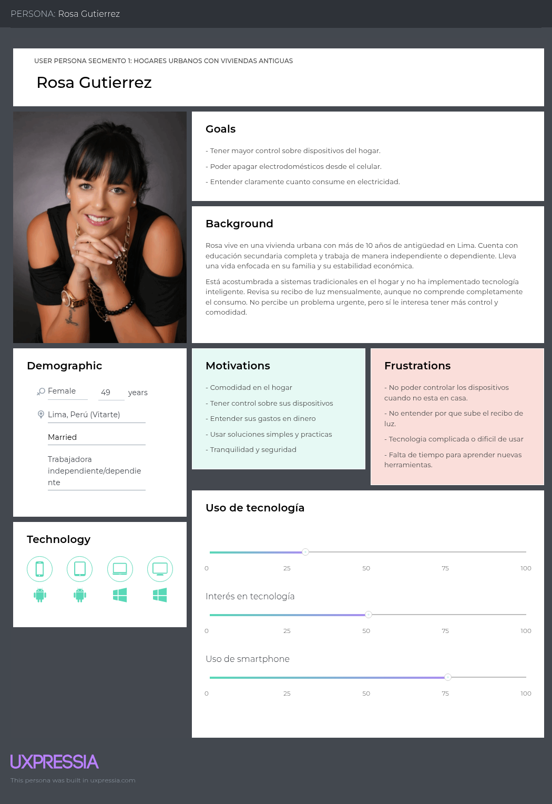

Segmento 2: Pequeños negocios y talleres en zonas urbanas.

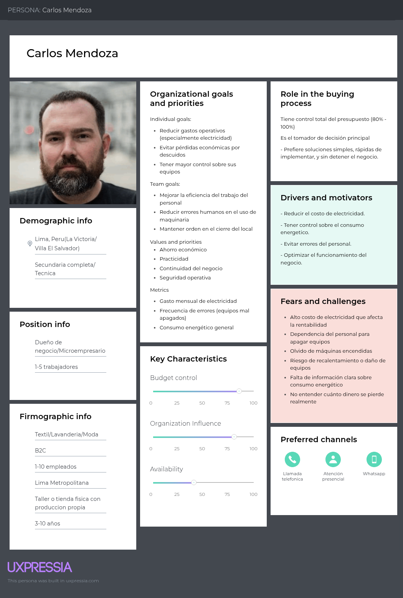

### 2.3.2. User Task Matrix 

Segmento 1: Hogares urbanos con viviendas antiguas

| Tareas del usuario | Frecuencia | Importancia |
|--|--|--|
| Encender manualmente los dispositivos del hogar | Diario | Alta |
| Apagar manualmente los dispositivos antes de salir o dormir | Diario | Alta |
| Revisar el recibo de luz | Mensual | Alta |
| Supervisar el uso de electrodomésticos en casa | Semanal | Media |
| Ajustar el uso de aparatos según necesidad (uso básico) | Diario | Media |
| Consultar sobre el consumo eléctrico | Mensual/semanal | Media |
| Entender el monto de recibo de luz | Semanal | Alta |

Segmento 2:  Pequeños negocios y talleres en zonas urbanas.

| Tareas (Tasks) | Frecuencia | Importancia |
|--|--|--|
| Encender equipos al iniciar la jornada | Diario | Alta |
| Operar maquinaria durante la producción | Diario | Alta |
| Supervisar el uso correcto de equipos por el personal | Diario | Alta |
| Apagar equipos al finalizar la jornada | Diario | Alta |
| Verificar que todos los equipos estén apagados | Interdiario | Alta |
| Coordinar con el personal sobre el uso de máquinas | Diario | Media |
| Pagar el recibo de electricidad | Mensual | Alta |
| Revisar el gasto eléctrico del negocio | Mensual | Alta |
| Intentar identificar causas de alto consumo eléctrico | Mensual (baja) | Alta |
| Detectar errores o descuidos (equipos encendidos, fallas) | Mensual (baja) | Alta |

### 2.3.3. User Journey Mapping 

Segmento 1: Hogares urbanos con viviendas antiguas

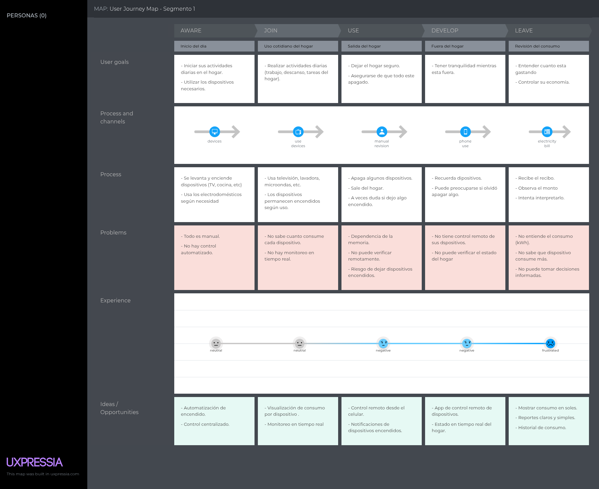

Segmento 2: Pequeños negocios y talleres en zonas urbanas.

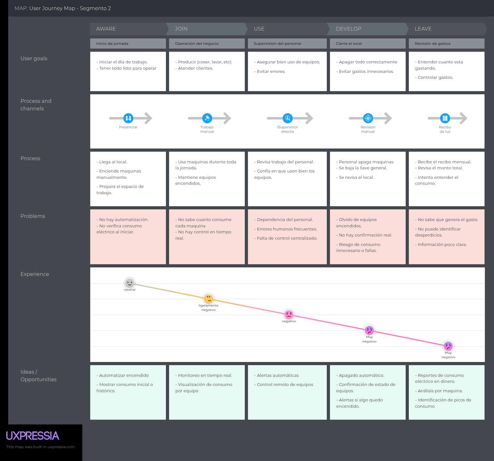

### 2.3.4. Empathy Mapping

Segmento 1: Hogares urbanos con viviendas antiguas

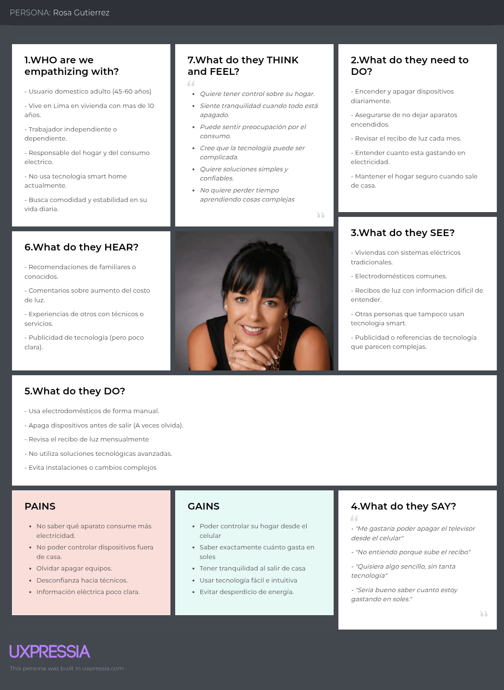

Segmento 2: Pequeños negocios y talleres en zonas urbanas.

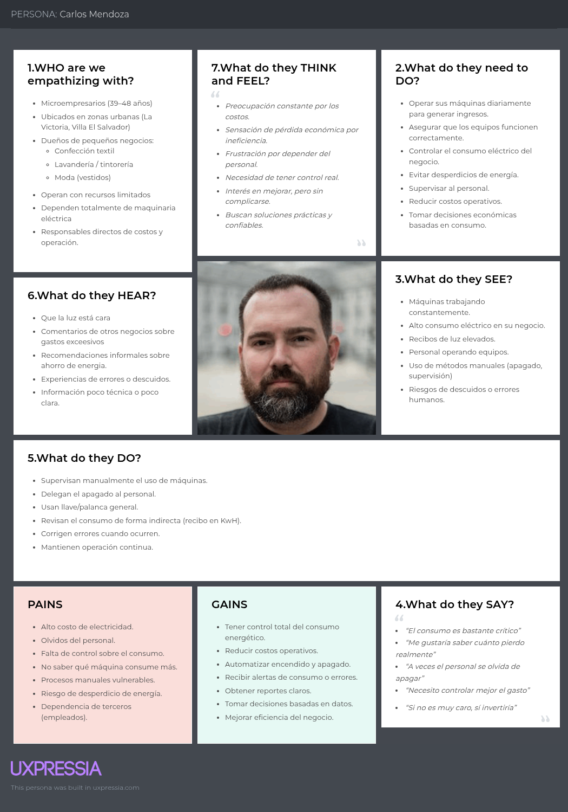

## 2.4. Big Picture Event Storming


## 2.5. Ubiquitous Language

El "Ubiquitous Language" será una herramienta esencial en nuestro trabajo, ya que nos permitirá establecer un lenguaje
común y compartido entre todos los miembros del equipo, facilitando la comunicación y la comprensión de los conceptos
clave en nuestro proyecto.

**Home User** :  A person who uses the platform to control and monitor the electricity consumption of their home through the mobile app or website.

**Business Owner**: A user who manages electrical devices in a commercial establishment and uses the platform to optimize energy usage, schedules, and access permissions.

**IoT Device**: A smart device connected to the system, such as a smart plug, switch, or meter, that can be monitored and controlled remotely.

**Pairing**: The process through which an IoT device is successfully linked to the user’s account within the platform.

**Guided Installation**: A step-by-step setup process that helps users configure the system easily without requiring technical assistance.

**Custom Device Name**: A personalized label assigned by the user to easily identify each device within the platform.

**Device Status**: The current condition of a device, such as turned on or turned off, displayed in real time.

**Remote Control**: A feature that allows users to turn devices on, turn them off, or manage them through the mobile app or website.

**Automation Routine**: A sequence of scheduled actions executed automatically at specific times, such as turning off devices at night.

**Scheduled Time**: A configured time that determines when a device or routine should start or stop.

**Energy Consumption**: The amount of electricity used by one or more devices during a specific period.

**Consumption History**: A record of energy usage data accumulated daily, weekly, or monthly.

**Consumption Alert**: A notification sent to the user when electricity usage exceeds a defined threshold.

**Saving Recommendation**: A suggestion generated by the system to reduce electricity usage and optimize costs.

**Access Profile**: A secondary or limited account created by the administrator to allow partial control of selected devices.

**Permissions**: Rules that define what actions each user is allowed to perform within the platform.

**Traceability**: A record of actions performed in the system, including who made the change, when it happened, and which device was affected.

**Billing Forecast**: An estimated monthly electricity cost in Peruvian soles, calculated using historical consumption and the current tariff.

# Capitulo III: Requirements Specification


## 3.2. User Stories.
En esta sección, profundizaremos en la definición y elaboración de las User Stories relacionadas con nuestro proyecto ElectroCorp.

**EPICS**

|**Epic ID**|**Título**|**Descripción**|**Criterio de aceptación**|**Relación (EPIC ID)**|
| - | - | - | - | - |
|**EP-01**|**Instalación y configuración inicial**|Como usuario de un hogar o pequeño negocio, quiero instalar y configurar mis dispositivos inteligentes de forma guiada para comenzar a usar la solución rápidamente.|<p>**Escenario 1: Registro de usuario**</p><p>Dado que el usuario accede a la plataforma,</p><p>Cuando completa sus datos de registro,</p><p>Entonces el sistema crea su cuenta y le permite iniciar sesión.</p><br><p>**Escenario 2: Vinculación de dispositivo**</p><p>Dado que el usuario ha iniciado sesión,</p><p>Cuando ingresa el código del dispositivo,</p><p>Entonces el sistema vincula el equipo a su cuenta.</p>||
|**EP-02**|**Control y automatización de dispositivos**|Como usuario, quiero controlar y automatizar mis dispositivos eléctricos desde la plataforma para mejorar la comodidad y optimizar energía.|<p>**Escenario 1: Control Remoto**</p><p>Dado que el usuario está en su panel principal,</p><p>Cuando presiona el botón de encendido/apagado,</p><p>Entonces el estado del dispositivo cambia en la base de datos.</p><br><p>**Escenario 2: Programación**</p><p>Dado que el usuario selecciona un dispositivo,</p><p>Cuando define una hora de encendido automático,</p><p>Entonces el sistema guarda la rutina y la ejecuta.</p>||
|**EP-03**|**Monitoreo y ahorro de energía**|Como usuario, quiero visualizar y comparar el consumo de mis dispositivos en tiempo real e histórico para identificar oportunidades de ahorro.|<p>**Escenario 1: Ver consumo actual**</p><p>Dado que el usuario accede al dashboard,</p><p>Cuando selecciona la pestaña de métricas,</p><p>Entonces el sistema muestra los Watts consumidos.</p><br><p>**Escenario 2: Reporte Histórico**</p><p>Dado que el usuario solicita el reporte,</p><p>Cuando selecciona el mes de interés,</p><p>Entonces se genera un gráfico comparativo.</p>||
|**EP-04**|**Seguridad, accesos y gestión de usuarios**|Como usuario administrador, quiero controlar los accesos y permisos de quienes usan la plataforma para mantener la seguridad y trazabilidad.|<p>**Escenario 1: Creación de perfiles**</p><p>Dado que el administrador accede a la sección de accesos,</p><p>Cuando invita a un nuevo correo,</p><p>Entonces se crea un perfil con permisos restringidos.</p><br><p>**Escenario 2: Trazabilidad**</p><p>Dado que un empleado realiza una acción,</p><p>Cuando el administrador revisa el historial,</p><p>Entonces ve quién realizó el cambio.</p>||
|**EP-05**|**Información y Navegación de Landing Page**|Como usuario visitante, deseo acceder a información, cambiar el idioma y navegar dinámicamente por la landing page mediante búsquedas inteligentes.|<p>**Escenario 1: Navegación por Búsqueda**</p><p>Dado que el visitante busca un tema específico,</p><p>Cuando usa la barra de búsqueda,</p><p>Entonces la vista se desplaza a la sección correspondiente.</p><br><p>**Escenario 2: Traducción**</p><p>Dado que el visitante prefiere otro idioma,</p><p>Cuando interactúa con el botón de idioma,</p><p>Entonces el texto cambia inmediatamente entre ES/EN.</p>||
|**EP-06**|**Gestión de Suscripciones y Pagos**|Como usuario, quiero gestionar mi plan de suscripción mediante un proceso de checkout con validación de pago para acceder a funciones avanzadas.|<p>**Escenario 1: Checkout exitoso**</p><p>Dado que el usuario elige el Plan Enterprise,</p><p>Cuando completa el checkout con datos de tarjeta válidos,</p><p>Entonces el sistema valida el pago y activa su suscripción.</p><br><p>**Escenario 2: Cancelación**</p><p>Dado que el usuario tiene una suscripción activa,</p><p>Cuando cancela su suscripción,</p><p>Entonces su plan se marca como cancelado.</p>||
|**EP-07**|**Notificaciones y Soporte**|Como usuario, quiero recibir alertas dentro de la aplicación y acceder a soporte técnico para resolver problemas o ver picos de consumo.|<p>**Escenario 1: Alerta de alto consumo**</p><p>Dado que un dispositivo supera el umbral configurado,</p><p>Cuando el sistema evalúa las reglas de alerta,</p><p>Entonces se genera una alerta visible en el centro de notificaciones de la aplicación.</p><br><p>**Escenario 2: Soporte**</p><p>Dado que el usuario tiene dudas,</p><p>Cuando registra un ticket de soporte,</p><p>Entonces el sistema crea el ticket y le da seguimiento.</p>||

<br><br>

**USER STORIES**

|**Epic/User Story ID**|**Título**|**Descripción**|**Criterio de aceptación**|**Relación (EPIC ID)**|
| - | - | - | - | - |
|**US-01**|Visualizar información de la startup y testimonios|<p>Como usuario visitante, quiero acceder a la descripción de la empresa y leer opiniones de usuarios para confirmar la calidad del servicio.</p>|<p>**Escenario 1:** Información consolidada</p><p>Dado que navego en la página,</p><p>Cuando hago scroll por el contenido,</p><p>Entonces leo sobre la democratización de la domótica y los testimonios de clientes reales.</p>|**EP-05**|
|**US-02**|Motor de búsqueda inteligente|<p>Como usuario visitante, quiero usar una barra de búsqueda para encontrar secciones de la página rápidamente.</p>|<p>**Escenario 1:** Búsqueda exitosa</p><p>Dado que busco información de costos,</p><p>Cuando escribo "precios" y doy clic a la lupa,</p><p>Entonces la página hace un scroll suave hacia "Our Plans".</p>|**EP-05**|
|**US-03**|Cambio de idioma (ES/EN)|<p>Como usuario visitante, quiero poder cambiar el idioma de la página web para leerla en mi idioma nativo.</p>|<p>**Escenario 1:** Traducción dinámica</p><p>Dado que la página está en inglés,</p><p>Cuando doy clic al ícono del mundo (ES),</p><p>Entonces todos los textos cambian instantáneamente al español.</p>|**EP-05**|
|**US-04**|Suscripción al boletín de noticias|<p>Como usuario visitante, quiero suscribirme al boletín en un formulario para recibir consejos de ahorro y ofertas.</p>|<p>**Escenario 1:** Envío de formulario</p><p>Dado que ingreso mi email en la sección de contacto,</p><p>Cuando presiono "Submit",</p><p>Entonces aparece un mensaje de agradecimiento temporal y la caja se limpia.</p>|**EP-05**|
|**US-05**|Interfaz interactiva (Menú y Audio)|<p>Como usuario visitante, quiero interactuar con un menú fluido y pausar/reproducir la música de fondo a mi gusto.</p>|<p>**Escenario 1:** Navegación y control</p><p>Dado que estoy en la web,</p><p>Cuando uso el Navbar dinámico o presiono el botón flotante de audio,</p><p>Entonces la página me redirige a la sección deseada o pausa la música (ElectroCorp.mp3).</p>|**EP-05**|
|**US-06**|Comparar planes de servicio|<p>Como usuario visitante, quiero ver las diferencias entre el plan Free y Enterprise para elegir el adecuado.</p>|<p>**Escenario 1:** Tarjetas de precio</p><p>Dado que bajo a la sección "Pricing",</p><p>Cuando visualizo las tarjetas,</p><p>Entonces noto que el plan Enterprise está resaltado como premium.</p>|**EP-05**|
|**US-07**|Registro inicial del usuario|<p>Como usuario del hogar, quiero crear una cuenta en la plataforma para vincular mis dispositivos.</p>|<p>**Escenario 1:** Registro Exitoso</p><p>Dado que el usuario no tiene cuenta,</p><p>Cuando ingresa su email y contraseña,</p><p>Entonces el sistema crea la cuenta.</p>|**EP-01**|
|**US-08**|Emparejar dispositivo|<p>Como usuario, quiero vincular un enchufe inteligente desde la app.</p>|<p>**Escenario 1:** Vinculación exitosa</p><p>Dado que el usuario está en "Agregar",</p><p>Cuando ingresa el código del equipo,</p><p>Entonces el equipo aparece en su lista.</p>|**EP-01**|
|**US-09**|Asistente de instalación|<p>Como usuario nuevo, quiero seguir una guía paso a paso para instalar el sistema.</p>|<p>**Escenario 1:** Tutorial de inicio</p><p>Dado que es el primer inicio de sesión,</p><p>Cuando el usuario entra a la app,</p><p>Entonces se muestra un tutorial de pasos básicos.</p>|**EP-01**|
|**US-10**|Nombrar dispositivos|<p>Como usuario, quiero asignar nombres personalizados a mis dispositivos.</p>|<p>**Escenario 1:** Edición de nombre</p><p>Dado que el equipo fue vinculado,</p><p>Cuando el usuario edita el nombre a "Lámpara",</p><p>Entonces el nuevo nombre se guarda en la base de datos.</p>|**EP-01**|
|**US-11**|Ver estado en tiempo real|<p>Como usuario, quiero ver si un dispositivo está encendido o apagado.</p>|<p>**Escenario 1:** Feedback visual</p><p>Dado que el usuario observa el dashboard,</p><p>Cuando un equipo cambia de estado físico,</p><p>Entonces el icono se actualiza en la app.</p>|**EP-02**|
|**US-12**|Encender y apagar remotamente|<p>Como usuario, quiero controlar mis dispositivos desde el celular.</p>|<p>**Escenario 1:** Acción remota</p><p>Dado que el equipo está apagado,</p><p>Cuando el usuario hace clic en encender,</p><p>Entonces el dispositivo cambia a ON.</p>|**EP-02**|
|**US-13**|Programar horarios de encendido|<p>Como usuario, quiero programar horarios automáticos.</p>|<p>**Escenario 1:** Creación de horario</p><p>Dado que el usuario selecciona un enchufe,</p><p>Cuando configura la hora de encendido,</p><p>Entonces el sistema respeta el horario diariamente.</p>|**EP-02**|
|**US-14**|Crear rutinas automáticas|<p>Como usuario, quiero definir rutinas de automatización general.</p>|<p>**Escenario 1:** Rutina nocturna</p><p>Dado que el usuario crea una rutina "Dormir",</p><p>Cuando llega la hora programada,</p><p>Entonces todos los dispositivos seleccionados se apagan a la vez.</p>|**EP-02**|
|**US-15**|Ver consumo en tiempo real|<p>Como usuario, quiero monitorear el consumo energético en vivo.</p>|<p>**Escenario 1:** Monitor de Watts</p><p>Dado que el enchufe está activo,</p><p>Cuando el usuario abre la gráfica,</p><p>Entonces visualiza los Watts consumidos actualizados.</p>|**EP-03**|
|**US-16**|Consultar historial de consumo|<p>Como usuario, quiero revisar el historial de consumo por día o semana.</p>|<p>**Escenario 1:** Filtro de historial</p><p>Dado que el usuario está en reportes,</p><p>Cuando selecciona "Últimos 7 días",</p><p>Entonces se muestra un gráfico diario.</p>|**EP-03**|
|**US-17**|Recibir alertas por alto consumo|<p>Como usuario, quiero recibir alertas por consumos inusuales de energía.</p>|<p>**Escenario 1:** Alerta en app</p><p>Dado que el límite es 500W,</p><p>Cuando se supera la cifra de manera sostenida,</p><p>Entonces aparece una notificación push.</p>|**EP-03**|
|**US-18**|Ver recomendaciones de ahorro|<p>Como usuario, quiero recibir sugerencias para ahorrar energía.</p>|<p>**Escenario 1:** Tips inteligentes</p><p>Dado que el consumo es ineficiente en cierto horario,</p><p>Cuando revisa el panel de sugerencias,</p><p>Entonces el sistema recomienda crear nuevas rutinas.</p>|**EP-03**|
|**US-19**|Administrar múltiples dispositivos|<p>Como usuario, quiero visualizar todos mis dispositivos en una sola pantalla.</p>|<p>**Escenario 1:** Vista general</p><p>Dado que el usuario tiene 5 equipos,</p><p>Cuando ingresa al inicio,</p><p>Entonces visualiza las 5 tarjetas operables.</p>|**EP-04**|
|**US-20**|Gestionar perfiles de acceso|<p>Como administrador, quiero asignar perfiles con permisos diferenciados a los usuarios registrados.</p>|<p>**Escenario 1:** Asignación de perfil</p><p>Dado que el administrador entra a la sección de accesos,</p><p>Cuando selecciona un usuario activo y cambia su perfil,</p><p>Entonces el sistema guarda el nuevo perfil y actualiza sus permisos.</p>|**EP-04**|
|**US-21**|Bloquear acceso no autorizado|<p>Como usuario, quiero proteger mi cuenta y mis módulos para que solo entren personas autenticadas y con permiso.</p>|<p>**Escenario 1:** Acceso protegido</p><p>Dado que una persona intenta abrir una ruta privada,</p><p>Cuando no tiene token válido o permiso suficiente,</p><p>Entonces la aplicación redirige o bloquea la navegación.</p>|**EP-04**|
|**US-22**|Registrar actividad relevante|<p>Como administrador, quiero consultar eventos importantes del sistema para revisar trazabilidad operativa.</p>|<p>**Escenario 1:** Historial de actividad</p><p>Dado que ocurre una acción relevante del producto,</p><p>Cuando el sistema publica el evento correspondiente,</p><p>Entonces Reporting lo conserva para consulta desde la sección de actividad.</p>|**EP-04**|
|**US-23**|Controlar equipos del negocio|<p>Como dueño de negocio, quiero controlar equipos del local desde mi móvil.</p>|<p>**Escenario 1:** Control comercial</p><p>Dado que el dueño está en su domicilio,</p><p>Cuando apaga el grupo de luz del local,</p><p>Entonces se refleja instantáneamente en el negocio.</p>|**EP-02**|
|**US-24**|Programar equipos por horario comercial|<p>Como dueño, quiero automatizar el local según el horario de atención.</p>|<p>**Escenario 1:** Automatización de horario</p><p>Dado que el horario es de 9am a 6pm,</p><p>Cuando se activa la rutina comercial,</p><p>Entonces los equipos siguen automáticamente el horario.</p>|**EP-02**|
|**US-25**|Revisar consumo por área o equipo|<p>Como dueño, quiero identificar qué áreas consumen más.</p>|<p>**Escenario 1:** Desglose por zona</p><p>Dado que hay varios equipos registrados,</p><p>Cuando revisa el reporte corporativo,</p><p>Entonces visualiza un gráfico detallado por zonas.</p>|**EP-03**|
|**US-26**|Compartir acceso con personal|<p>Como dueño, quiero permitir que empleados controlen ciertos equipos.</p>|<p>**Escenario 1:** Control limitado</p><p>Dado que un empleado de almacén entra a la app,</p><p>Cuando visualiza el dashboard principal,</p><p>Entonces solo ve el control de su área correspondiente.</p>|**EP-04**|
|**US-27**|Contratar suscripción con checkout|<p>Como usuario, quiero completar un checkout con mis datos de tarjeta para contratar el plan Enterprise.</p>|<p>**Escenario 1:** Checkout interno</p><p>Dado que el usuario elige el plan Enterprise,</p><p>Cuando ingresa datos de tarjeta válidos en el checkout,</p><p>Entonces el sistema valida el pago internamente y activa la suscripción.</p>|**EP-06**|
|**US-28**|Cancelar suscripción Premium|<p>Como usuario, quiero anular mi suscripción para detener cobros.</p>|<p>**Escenario 1:** Detención de cobros</p><p>Dado que el usuario accede a configuración de facturación,</p><p>Cuando confirma la cancelación del servicio,</p><p>Entonces el plan se degrada a final de mes.</p>|**EP-06**|
|**US-29**|Recibir alertas por correo|<p>Como usuario, quiero que el sistema me notifique a mi correo si algo inusual pasa con mi consumo.</p>|<p>**Escenario 1:** Despacho vía Mailchimp</p><p>Dado que hay un evento crítico registrado,</p><p>Cuando el backend lo procesa,</p><p>Entonces recibo un email de alerta inmediata.</p>|**EP-07**|
|**US-30**|Recibir reporte mensual|<p>Como usuario, quiero recibir un resumen mensual en mi email para saber cuánto ahorré.</p>|<p>**Escenario 1:** Envío automatizado</p><p>Dado que es el último día del mes,</p><p>Cuando el cronjob se activa,</p><p>Entonces me envía un correo con mis estadísticas.</p>|**EP-07**|
|**US-31**|Recuperar contraseña|<p>Como usuario, quiero poder restablecer mi contraseña si la olvido.</p>|<p>**Escenario 1:** Enlace seguro de recuperación</p><p>Dado que el usuario hace clic en "Olvidé mi contraseña",</p><p>Cuando ingresa su email registrado,</p><p>Entonces el sistema genera un token seguro, limitado por tiempo, y habilita el cambio de clave.</p>|**EP-04**|
|**US-32**|Editar perfil de usuario|<p>Como usuario, quiero cambiar mis datos personales de perfil.</p>|<p>**Escenario 1:** Guardado de cambios</p><p>Dado que el usuario edita su nombre o correo,</p><p>Cuando da clic en guardar,</p><p>Entonces la información se actualiza en PostgreSQL y se refleja en la sesión activa.</p>|**EP-04**|
|**US-33**|Desactivar cuenta|<p>Como usuario, quiero cerrar mi cuenta para impedir nuevos accesos.</p>|<p>**Escenario 1:** Desactivación segura</p><p>Dado que el usuario confirma la acción,</p><p>Cuando el sistema procesa la solicitud,</p><p>Entonces la cuenta queda inactiva y ya no puede iniciar sesión.</p>|**EP-04**|
|**US-34**|Configurar preferencias|<p>Como usuario, quiero elegir qué tipo de alertas me llegan.</p>|<p>**Escenario 1:** Preferencias de notificación</p><p>Dado que el usuario cambia canales, horarios silenciosos o niveles permitidos,</p><p>Cuando se guarda la preferencia,</p><p>Entonces las alertas posteriores respetan esa configuración.</p>|**EP-07**|
|**US-35**|Registrar telemetría energética|<p>Como desarrollador, quiero que la plataforma registre lecturas energéticas para alimentar monitoreo, alertas y reportes.</p>|<p>**Escenario 1:** Lectura disponible</p><p>Dado que existe un dispositivo asociado a la cuenta,</p><p>Cuando se registra una lectura de consumo,</p><p>Entonces la información queda disponible para gráficos, reglas y reportes.</p>|**EP-03**|
|**US-36**|Filtrar historial por fechas|<p>Como usuario, quiero establecer un rango de fechas para ver consumos pasados.</p>|<p>**Escenario 1:** Filtro de calendario</p><p>Dado que el usuario abre la herramienta de fechas,</p><p>Cuando selecciona desde y hasta,</p><p>Entonces la gráfica se redibuja excluyendo el resto de días.</p>|**EP-03**|
|**US-37**|Exportar historial a Excel|<p>Como usuario corporativo, quiero descargar mis datos de consumo.</p>|<p>**Escenario 1:** Generación de CSV</p><p>Dado que se visualiza la tabla en pantalla,</p><p>Cuando se hace clic en Exportar,</p><p>Entonces el navegador descarga un archivo CSV estructurado.</p>|**EP-03**|
|**US-38**|Agrupar dispositivos|<p>Como usuario, quiero agrupar mis enchufes por habitaciones.</p>|<p>**Escenario 1:** Operación masiva por grupo</p><p>Dado que el usuario ha creado el grupo "Iluminación Sala",</p><p>Cuando apaga el grupo,</p><p>Entonces todos los enchufes asignados a la sala se apagan simultáneamente.</p>|**EP-02**|
|**US-39**|Activar Modo Oscuro|<p>Como usuario, quiero activar un tema oscuro en mi dashboard para evitar la fatiga visual nocturna.</p>|<p>**Escenario 1:** Toggle Dark Mode</p><p>Dado que el usuario entra a configuraciones de UI,</p><p>Cuando activa el switch de Modo Oscuro,</p><p>Entonces los colores de la aplicación SPA cambian a la paleta Dark.</p>|**EP-05**|
|**US-40**|Gestionar múltiples locales|<p>Como dueño de negocio, quiero gestionar distintas sucursales desde una sola cuenta centralizada.</p>|<p>**Escenario 1:** Selector de Sucursal</p><p>Dado que el usuario posee el plan Enterprise,</p><p>Cuando despliega el menú de ubicaciones superior,</p><p>Entonces puede saltar del "Local A" al "Local B" cambiando el dashboard.</p>|**EP-04**|

<br><br>

**TECHNICAL STORIES**

|**Technical story ID**|**Título**|**Descripción**|**Criterios de Aceptación**|**Epica**|
| - | - | - | - | - |
|**TS-01**|Frontend por bounded contexts|<p>**Como** desarrollador frontend</p><p>**Quiero** organizar la Web Application por capas de presentación, aplicación, dominio e infraestructura</p><p>**Para** mantener rutas y casos de uso trazables con las historias del producto.</p>|<p>**Escenario 1: Consumo organizado**</p><p>Dado un flujo como IAM, Billing o Device Control,</p><p>Cuando la pantalla necesita datos,</p><p>Entonces delega en facade/store y servicios de infraestructura sin llamadas directas desde componentes.</p>|**EP-05**|
|**TS-02**|i18n de Landing y Web App|<p>**Como** desarrollador frontend</p><p>**Quiero** mantener diccionarios de traducción en los recursos de la interfaz</p><p>**Para** cambiar idioma sin depender de servicios inexistentes.</p>|<p>**Escenario 1: Traducción dinámica**</p><p>Dado que el usuario cambia de idioma,</p><p>Cuando la aplicación actualiza la preferencia,</p><p>Entonces los textos se renderizan con las claves ES/EN/PT disponibles.</p>|**EP-05**|
|**TS-03**|Búsqueda y navegación de Landing|<p>**Como** desarrollador frontend</p><p>**Quiero** resolver la búsqueda de secciones desde el contenido de la landing</p><p>**Para** guiar al visitante sin requerir un servicio adicional.</p>|<p>**Escenario 1: Búsqueda local**</p><p>Dado que el visitante escribe una palabra clave,</p><p>Cuando coincide con una sección publicada,</p><p>Entonces la landing navega suavemente hacia esa sección.</p>|**EP-05**|
|**TS-04**|Formulario Newsletter de Landing|<p>**Como** desarrollador frontend</p><p>**Quiero** validar y registrar la intención de suscripción desde la landing</p><p>**Para** entregar una experiencia clara sin recargar la página.</p>|<p>**Escenario 1: Registro de interés**</p><p>Dado el formulario completado,</p><p>Cuando el visitante envía su correo,</p><p>Entonces la landing confirma la acción y limpia el campo.</p>|**EP-05**|
|**TS-05**|Interacciones multimedia de Landing|<p>**Como** desarrollador frontend</p><p>**Quiero** controlar menú, navegación y audio desde módulos JavaScript encapsulados</p><p>**Para** mantener una experiencia interactiva y mantenible.</p>|<p>**Escenario 1: Estado de interfaz**</p><p>Dado que el usuario interactúa con navegación o audio,</p><p>Cuando cambia el estado,</p><p>Entonces la interfaz refleja el cambio sin recargar la página.</p>|**EP-05**|
|**TS-06**|Setup Spring Boot API|<p>**Como** backend developer</p><p>**Quiero** iniciar el servidor web Java con configuración por perfiles</p><p>**Para** alojar los bounded contexts del sistema.</p>|<p>**Escenario 1: Compilación y despliegue**</p><p>Dado el pom.xml con dependencias web, seguridad y persistencia,</p><p>Cuando compila el proyecto,</p><p>Entonces Spring Boot levanta la API y expone health/OpenAPI.</p>|**EP-01**|
|**TS-07**|Persistencia JPA - PostgreSQL|<p>**Como** Database Admin</p><p>**Quiero** crear entidades Java anotadas con JPA</p><p>Para persistir usuarios, planes, sedes, dispositivos, lecturas, alertas y reportes.</p>|<p>**Escenario 1: Data Source**</p><p>Dado el datasource PostgreSQL configurado,</p><p>Cuando inicia el contexto de Spring,</p><p>Entonces Hibernate prepara las tablas de los bounded contexts.</p>|**EP-01**|
|**TS-08**|Integración Stripe por puerto de pago|<p>**Como** backend developer</p><p>**Quiero** aislar Stripe detrás de un PaymentGatewayPort</p><p>**Para** validar pagos sin acoplar Billing a la implementación externa.</p>|<p>**Escenario 1: Payment Intent**</p><p>Dado un checkout válido,</p><p>Cuando Billing solicita el cobro,</p><p>Entonces el adaptador Stripe registra proveedor, estado e identificador de transacción.</p>|EP-06|
|**TS-09**|Integración Mailchimp para alertas|<p>**Como** backend developer</p><p>**Quiero** entregar emails mediante un adaptador Mailchimp</p><p>**Para** despachar alertas respetando las preferencias del usuario.</p>|<p>**Escenario 1: Email de alerta**</p><p>Dado que se crea una alerta permitida por preferencias,</p><p>Cuando Notifications calcula la decisión de entrega,</p><p>Entonces el adaptador intenta enviar el correo y registra el resultado.</p>|**EP-07**|
|**TS-10**|Telemetría y eventos de energía|<p>**Como** backend developer</p><p>**Quiero** persistir lecturas energéticas y evaluar umbrales</p><p>**Para** alimentar monitoreo, notificaciones y reporting.</p>|<p>Escenario 1: Lectura procesada</p><p>Dado el servidor en ejecución,</p><p>Cuando se registra una lectura de consumo,</p><p>Entonces queda disponible para consultas, reglas y reportes.</p>|**EP-03**|
|**TS-11**|Servicios de Device Control|<p>**Como** backend developer</p><p>**Quiero** exponer controladores delgados para dispositivos, grupos, rutinas y modos</p><p>**Para** manejar operaciones de control mediante commands y queries.</p>|<p>**Escenario 1: Operación de dispositivo**</p><p>Dado un recurso válido,</p><p>Cuando el controller recibe la solicitud,</p><p>Entonces delega al command service y devuelve el recurso actualizado.</p>|**EP-02**|
|**TS-12**|Angular SPA con guards|<p>**Como** frontend developer</p><p>**Quiero** proteger rutas con guards de autenticación, suscripción y permisos</p><p>**Para** evitar acceso a módulos no autorizados.</p>|<p>**Escenario 1: Router Guard**</p><p>Dado el acceso a una ruta privada,</p><p>Cuando el token o permiso requerido no existe,</p><p>Entonces el sistema redirige o bloquea la navegación.</p>|**EP-04**|
|**TS-13**|JWT Bearer Security|<p>**Como** fullstack developer</p><p>**Quiero** configurar Spring Security con filtro JWT</p><p>**Para** autenticar cada petición protegida de la REST API.</p>|<p>Escenario 1: Token Auth</p><p>Dado el Bearer token en el header Authorization,</p><p>Cuando pasa por el filtro de seguridad,</p><p>Entonces valida la firma y registra el usuario autenticado.</p>|EP-04|
|**TS-14**|Visualización de consumo energético|<p>**Como** frontend developer</p><p>**Quiero** representar lecturas y métricas desde la capa de reporting/energía</p><p>**Para** visualizar consumo actual, histórico y recomendaciones.</p>|<p>Escenario 1: Render de métricas</p><p>Dado un conjunto de lecturas obtenido desde la API,</p><p>Cuando se arma la vista,</p><p>Entonces la aplicación muestra indicadores y gráficos consistentes.</p>|**EP-03**|
|**TS-15**|Cifrado BCrypt mediante puerto IAM|<p>**Como** backend developer</p><p>**Quiero** usar un HashingService implementado con BCrypt</p><p>**Para** proteger credenciales sin acoplar la aplicación a Spring Security.</p>|<p>**Escenario 1: Hash**</p><p>Dado el formulario de registro,</p><p>Cuando llega una clave válida,</p><p>Entonces se guarda como hash BCrypt y nunca como texto plano.</p>|**EP-04**|
|**TS-16**|Preferencias UI persistidas|<p>**Como** frontend developer</p><p>**Quiero** sincronizar idioma y tema con la preferencia del usuario</p><p>**Para** mantener la experiencia visual entre sesiones.</p>|<p>**Escenario 1: Preferencia visual**</p><p>Dado que el usuario cambia idioma o tema,</p><p>Cuando se guarda la configuración,</p><p>Entonces la aplicación aplica la preferencia y la conserva para próximos accesos.</p>|**EP-05**|
|**TS-17**|Geocoding OpenStreetMap/Nominatim desde infraestructura frontend|<p>**Como** frontend developer</p><p>**Quiero** encapsular la geocodificación de sedes en servicios de application/infrastructure</p><p>**Para** resolver direcciones y coordenadas sin llamadas directas desde componentes de presentation.</p>|<p>**Escenario 1: Búsqueda de dirección**</p><p>Dado que el usuario escribe una dirección en Workplace,</p><p>Cuando la Web Application consulta Nominatim desde `GeocodingApiService`,</p><p>Entonces la pantalla recibe sugerencias normalizadas mediante `WorkplaceGeocodingService`.</p>|**EP-04**|


<br><br>


## 3.2. Impact Mapping
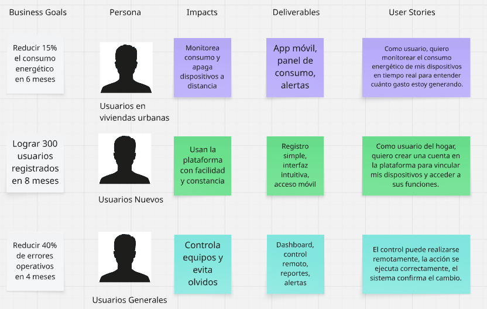

## 3.3. Product Backlog

| # Orden | User Story ID | Título | Descripción | Story Points |
|--|--|--|--|--|
| 1 | US-01 | Visualizar info y testimonios | Como visitante, quiero acceder a la descripción de ElectroCorp. | 3 |
| 2 | US-02 | Motor de búsqueda inteligente | Como visitante, quiero buscar por palabras clave y hacer scroll automático. | 5 |
| 3 | US-03 | Cambio de idioma (ES/EN) | Como visitante, quiero cambiar el texto entero de la página mediante el DOM. | 5 |
| 4 | US-04 | Suscripción al boletín | Como visitante, quiero llenar un input de email sin recargar la web. | 3 |
| 5 | US-05 | Interfaz interactiva | Como visitante, quiero navegar fluído y pausar la música con un botón. | 3 |
| 6 | US-06 | Comparar planes de servicio | Como visitante, quiero leer las diferencias del plan Free y Enterprise. | 2 |
| 7 | US-07 | Registro inicial del usuario | Como usuario, quiero crear una cuenta segura en la plataforma. | 5 |
| 8 | US-08 | Emparejar dispositivo plug-and-play | Como usuario, quiero vincular un dispositivo inteligente a mi cuenta. | 8 |
| 9 | US-09 | Asistente de instalación guiada | Como usuario, quiero una guía rápida para configurar mi primera sede y equipo. | 5 |
| 10 | US-10 | Nombrar dispositivos | Como usuario, quiero asignarle un alias reconocible a mi equipo. | 2 |
| 11 | US-11 | Ver estado en tiempo real | Como usuario, quiero verificar si mi dispositivo está encendido, apagado o en mantenimiento. | 3 |
| 12 | US-12 | Encender y apagar remotamente | Como usuario, quiero controlar mis dispositivos desde la plataforma. | 5 |
| 13 | US-13 | Programar horarios de encendido | Como usuario, quiero definir a qué hora se enciende mi luz. | 5 |
| 14 | US-14 | Crear rutinas automáticas | Como usuario, quiero configurar grupos de acciones masivas. | 5 |
| 15 | US-15 | Ver consumo en tiempo real | Como usuario, quiero ver una gráfica con el consumo de Watts vivo. | 5 |
| 16 | US-16 | Consultar historial de consumo | Como usuario, quiero ver cómo varió mi consumo durante los 7 días. | 5 |
| 17 | US-17 | Recibir alertas por alto consumo | Como usuario, quiero notificaciones si mis aparatos gastan demasiado. | 3 |
| 18 | US-18 | Ver recomendaciones de ahorro | Como usuario, quiero leer pequeños tips basados en mis propios datos. | 5 |
| 19 | US-19 | Administrar múltiples dispositivos | Como usuario, quiero ver la lista completa de lo que he enlazado. | 3 |
| 20 | US-20 | Gestionar perfiles de acceso | Como administrador, quiero asignar permisos diferenciados a usuarios registrados. | 5 |
| 21 | US-21 | Bloquear acceso no autorizado | Como usuario, quiero proteger rutas y módulos con autenticación y permisos. | 3 |
| 22 | US-22 | Registrar actividad relevante | Como administrador, quiero consultar eventos importantes para trazabilidad operativa. | 3 |
| 23 | US-23 | Controlar equipos del negocio | Como dueño, quiero gestionar mi pequeño local desde la casa. | 3 |
| 24 | US-24 | Programar equipos por horario comercial | Como dueño, quiero que el local se active de 9 a 6 automatizado. | 5 |
| 25 | US-25 | Revisar consumo por área o equipo | Como dueño, quiero saber si un sector de la oficina consume más luz. | 5 |
| 26 | US-26 | Compartir acceso con personal | Como dueño, quiero aislar los permisos de los empleados a sus sectores. | 5 |
| 27 | US-27 | Contratar suscripción con checkout | Como usuario, quiero contratar el plan Enterprise mediante checkout con validación de pago interna. | 8 |
| 28 | US-28 | Cancelar suscripción Premium | Como usuario, quiero regresar al plan Free sin que me sigan cobrando. | 3 |
| 29 | US-29 | Recibir alertas en la aplicación | Como usuario, quiero que un pico de consumo me aparezca como alerta in-app. | 5 |
| 30 | US-30 | Consultar reporte mensual | Como usuario, quiero consultar mi resumen de consumo del mes en la app. | 5 |
| 31 | US-31 | Recuperar contraseña | Como usuario, quiero generar un token seguro para restablecer mi contraseña. | 5 |
| 32 | US-32 | Editar perfil de usuario | Como usuario, quiero actualizar mis datos personales de perfil. | 2 |
| 33 | US-33 | Desactivar cuenta | Como usuario, quiero cerrar mi cuenta para impedir nuevos accesos. | 3 |
| 34 | US-34 | Configurar preferencias | Como usuario, quiero elegir canales, tema, idioma y niveles de alerta. | 2 |
| 35 | US-35 | Registrar telemetría energética | Como desarrollador, quiero registrar lecturas para monitoreo, alertas y reportes. | 5 |
| 36 | US-36 | Filtrar historial por fechas | Como usuario, quiero un calendario de inicio y fin para mis reportes. | 3 |
| 37 | US-37 | Exportar historial a Excel | Como usuario corporativo, quiero bajar una tabla de mis métricas en CSV. | 3 |
| 38 | US-38 | Agrupar dispositivos | Como usuario, quiero juntar varios enchufes bajo la etiqueta "Sala". | 5 |
| 39 | US-39 | Activar Modo Oscuro | Como usuario, quiero activar tema oscuro para descansar mis ojos de noche. | 3 |
| 40 | US-40 | Gestionar múltiples locales | Como dueño Enterprise, quiero saltar entre varias de mis tiendas. | 8 |


# Capitulo IV: Product Design

## 4.1. Style Guidelines

En esta sección se detallan las bases visuales y comunicativas de ElectroCorp, orientadas a mantener una presentación consistente y profesional en todas las interfaces del ecosistema IoT.

### 4.1.1. General Style Guidelines

**Branding:** 
La identidad de ElectroCorp busca democratizar la domótica en el Perú. El uso de la mascota (el enchufe con capa de superhéroe) transmite que el usuario tiene el "poder" y el control sobre su consumo eléctrico de forma amigable y heroica.
<br><br>
FOTO DEL LOGO


<br><br>
**Typography:**
La tipografía es el pilar de la comunicación digital en ElectroCorp. Hemos seleccionado una jerarquía basada en fuentes _sans-serif_ para asegurar que los datos de consumo (watts y costos) sean legibles en cualquier condición de iluminación de la interfaz.

-   **Fuente Principal:** Se utiliza Roboto, tipografías de sistema diseñadas para interfaces de alta densidad de información.
    
-   **Jerarquía de Títulos:** Se aplica un peso de 600 (SemiBold) para transmitir solidez y autoridad en la gestión energética. El tamaño del título principal en el _Hero_ es de 3.5rem, asegurando un impacto visual inmediato.
    
-   **Cuerpo de Texto:** Se define en 1.1rem con un interlineado de 1.6, optimizando la lectura de párrafos largos en la descripción de la startup y testimonios.
    


#### **Colors**

La paleta de colores de **ElectroCorp** ha sido diseñada bajo una estética de "Modo Oscuro" (Dark Mode), que evoca tecnología avanzada y eficiencia operativa.


#### **Spacing**

El sistema de espaciado sigue una progresión lógica para mantener el orden y la limpieza visual, facilitando que el usuario no se sienta abrumado por los datos.

-   **Secciones Principales:** Poseen un relleno (_padding_) de 80px en la parte superior e inferior con un margen lateral del 10*, creando un "respiro" visual necesario para separar los objetivos de los planes de servicio.
    
-   **Grillas (Grid Gap):** Se establece un espacio de 30px entre elementos del inventario y dispositivos, permitiendo una diferenciación clara entre cada unidad IoT.
    
-   **Separadores (hr):** Se utilizan líneas de 3px de alto y 60px de ancho en color azul eléctrico para indicar el fin de un concepto y el inicio de otro de forma minimalista.


#### **Dimensions (Tone of Voice)**

El lenguaje de **ElectroCorp** ha sido calibrado para generar confianza en una audiencia que suele temer a los costos elevados de energía.

-   **Enfoque:** **Formal pero Entusiasta**. Somos serios con la precisión de la medición (watts), pero entusiastas al invitar al usuario a la "Revolución Eléctrica".
    
-   **Lenguaje:** **Respetuoso y Profesional**. Evitamos términos excesivamente técnicos para que la microempresaria Elena o el gamer Ricardo comprendan el beneficio directo (ahorro de dinero) sin esfuerzo.
    
-   **Estilo de Comunicación:**
    
    -   **Sereno:** Transmitimos tranquilidad mediante la seguridad de que el usuario tiene el control total desde su app.
        
    -   **Heroico:** Usamos la narrativa de nuestra mascota (el enchufe con capa) para posicionar la tecnología como una aliada contra el desperdicio.


### **4.1.2. Web Style Guidelines**

En esta sección se establecen los estándares visuales, técnicos y de interacción aplicados a las interfaces web de ElectroCorp. El objetivo es garantizar una experiencia de usuario (UX) fluida, coherente y accesible que permita a familias y negocios peruanos gestionar su consumo energético con total confianza desde cualquier dispositivo.

#### **1. Diseño Responsivo y Adaptabilidad**

Priorizamos un enfoque Mobile-First para asegurar que el control de los dispositivos IoT sea efectivo en movimiento.

-   **Adaptación Fluida:** El sitio utiliza un sistema de retícula flexible basado en _CSS Flexbox_ y _Media Queries_ que adapta el contenido automáticamente. En dispositivos de escritorio (desktop), se mantiene una estructura de 12 columnas con contenedores máximos de 1200px; mientras que en dispositivos móviles (smartphones), el contenido se reorganiza en una sola columna con márgenes laterales de 20px para facilitar la interacción táctil.
    
-   **Puntos de Ruptura (Breakpoints):** Se define un punto crítico en los 768px, donde la navegación cambia de una barra horizontal a un menú vertical optimizado, y las tarjetas de servicios (planes) pasan de una disposición en grilla (_grid_) a una lista vertical.
    

#### **2. Sistema de Layout y Patrones de Lectura**

-   **Patrón en F:** En la landing page, aplicamos un patrón de escaneo visual en "F". Ubicamos el logotipo de ElectroCorp en la esquina superior izquierda (punto de entrada visual) y los llamados a la acción (CTA) en la parte superior derecha y centro del Hero para maximizar la conversión de usuarios interesados en los planes.
    
-   **Jerarquía Visual:** Utilizamos el contraste entre el fondo Deep Navy (`#0a0f18`) y el Electric Blue (`#00d2ff`) para dirigir la atención hacia los indicadores de ahorro y botones de compra.
    

#### **3. Elementos Visuales (Imágenes e Iconografía)**

-   **Tratamiento de Imágenes:** Las imágenes ilustrativas (como el enchufe superhéroe) y fotografías de hardware deben estar optimizadas en formato WebP para garantizar una carga rápida (peso < 200kb). Se aplica una opacidad del 15% en las imágenes de fondo del Hero para no competir con la legibilidad del texto.
    
-   **Iconografía Funcional:** Implementamos la librería Font Awesome. Los íconos deben ser lineales y minimalistas, manteniendo un tamaño uniforme de 1.8rem en el footer y 20px en los botones de búsqueda y audio para asegurar consistencia visual.
    

#### **4. Componentes de Interacción (Botones y Estados)**

Los botones son los elementos críticos para la toma de decisiones. Se definen tres categorías:

-   **Botón Primario (Action):** Fondo Azul Eléctrico con texto negro. Utilizado para acciones principales como "Suscribirme" o "Empezar Gratis".
    
-   **Botón Secundario (Nav):** Enlaces con efecto _hover_ que activan un resplandor azul (`text-shadow`) y cambian a color blanco para confirmar la selección del usuario.
    
-   **Estados Visuales:** Cada elemento interactivo cuenta con estados claramente definidos (`default`, `hover`, `active`). Se aplica una transición suave de 0.3s para evitar cambios bruscos y mejorar la percepción de fluidez.
    

#### **5. Formularios y Entradas de Datos**

-   **Claridad y Validación:** El formulario de suscripción y la barra de búsqueda central cuentan con bordes redondeados (30px) y _placeholders_ descriptivos.
    
-   **Feedback Inmediato:** Mediante JavaScript, se informa al usuario en tiempo real sobre el éxito de su suscripción o la falta de resultados en la búsqueda mediante alertas visuales y mensajes dinámicos, evitando la frustración ante errores de escritura.
    

#### **6. Accesibilidad y Estándares de Calidad**

-   **Contraste y Legibilidad:** Nos aseguramos de que el texto claro (`#e0e6ed`) sobre el fondo oscuro cumpla con las pautas de accesibilidad WCAG, garantizando que usuarios con fatiga visual o en entornos de baja luz puedan leer los datos de consumo sin dificultad.
    
-   **Navegación Asistida:** El sitio incluye un sistema de búsqueda inteligente que interpreta palabras clave del usuario (ej. "precios", "soporte") y lo desplaza automáticamente (`smooth scroll`) hacia la sección relevante, facilitando el uso a personas que prefieren no usar el menú tradicional.


## 4.2. Information Architecture

En ElectroCorp, la arquitectura de la información se ha diseñado para facilitar la transición hacia un hogar inteligente de forma intuitiva y sin fricciones. El objetivo es que usuarios como Elena o Ricardo puedan gestionar su consumo eléctrico y controlar sus dispositivos IoT sin necesidad de conocimientos técnicos avanzados. Organizamos el contenido mediante una jerarquía visual clara en el Landing Page y sistemas de navegación que priorizan la eficiencia energética y el ahorro económico inmediato.

### 4.2.1. Organization Systems

En ElectroCorp, aplicaremos diversos sistemas de organización para garantizar que la gestión del stock y el monitoreo de energía sean accesibles:

-   **Organización Visual del Contenido (Jerárquica):** Utilizaremos este sistema para guiar al usuario desde el impacto inicial en el Hero hacia la toma de decisiones en la sección de Planes. La información fluye desde la propuesta de valor ("Domina el consumo de tu hogar") hacia los detalles técnicos (Sistemas I.O.T.) y la prueba social (Testimonios).
    
-   **Organización Secuencial (Step-by-step):** Este sistema se emplea rigurosamente en el proceso de instalación _plug-and-play_ de los enchufes y en el flujo de suscripción al boletín informativo. Cada paso está diseñado para evitar la sobrecarga cognitiva del usuario.
    
-   **Esquemas de Categorización de Contenido:**
    
    -   **Por Tópicos:** La información se agrupa en módulos lógicos como "Nuestros Planes", "Nuestros Objetivos" y "Sistemas I.O.T.".
        
    -   **Según Audiencia (Grupos de usuarios):** Segmentamos el contenido para dos perfiles principales: el usuario residencial (Plan Free para departamentos) y el corporativo/microempresario (Plan Enterprise para oficinas o negocios grandes).
        
    -   **Cronológico:** Se utiliza en la visualización de datos de consumo en tiempo real, permitiendo comparar el gasto energético actual frente a periodos pasados para identificar patrones de ahorro.

### 4.2.2. Labeling Systems

El sistema de etiquetado de ElectroCorp utiliza términos directos y familiares para reducir la confusión en usuarios no técnicos.

-   **Inicio:** Sección principal que presenta la misión de democratizar la domótica.
    
-   **Descripción:** Detalle del ecosistema IoT y la facilidad de instalación sin obras eléctricas.
    
-   **Objetivos:** Resumen de las metas de sostenibilidad y eficiencia económica.
    
-   **Planes:** Sección de tarifas donde se diferencian las opciones "Free" y "Enterprise".
    
-   **Enchufes Smart:** Galería técnica de los dispositivos de hardware disponibles.
    
-   **Soporte:** Canal de contacto y suscripción para asistencia técnica.
    
-   **Suscribirme al Boletín:** Llamado a la acción (CTA) claro para la captura de nuevos _leads_.

### 4.2.3. SEO Tags and Meta Tags 

Para optimizar la visibilidad en buscadores y asegurar una correcta indexación de la plataforma de gestión energética, se aplican los siguientes metadatos:
**Landing Page:**


- **Título:**
```html
<title>ElectroCorp | Gestión Energética Inteligente</title>
```
    
- **Descripción:**
```html
<meta name="description" content="Domótica accesible para hogares peruanos. Controla tus electrodomésticos y ahorra en tu recibo de luz con nuestros enchufes inteligentes plug-and-play."/>"/>
```
    
- **Palabras clave (Keywords):**
```html
<meta name="keywords" content="ahorro energía, domótica Perú, enchufes inteligentes, IoT hogar, eficiencia eléctrica, ElectroCorp"/>"/>
```
- **Autor (author):**
```
<meta name="author" content="ElectroCorp Team" />
```
- **Copyright:**
```
<meta name="copyright" content="© ElectroCorp.app, 2026" />
```

**Web Application (Portal de Usuario):**

- **Título:**
```html
<title>ElectroCorp Dashboard - Monitoreo en Tiempo Real</title>
```
- **Descripción:**
```html
<meta name="description" content="Panel de control para la gestión de dispositivos inteligentes y visualización de consumo eléctrico en tiempo real."/>"/>
```
- **Palabras clave (Keywords):**
```html
<meta name="keywords" content="consumo watts, control remoto enchufes, dashboard energético, smart home dashboard"/>"/>
```
- **Autor (author):**
```
<meta name="author" content="ElectroCorp Team" />
```
- **Copyright:**
```
<meta name="copyright" content="© ElectroCorp.app, 2026" />
```

### 4.2.4. Searching Systems

El sistema de búsqueda de ElectroCorp está optimizado para la navegación rápida dentro del sitio de una sola página (SPA):

-   **Búsqueda por Palabras Clave:** Un campo de búsqueda en el Hero permite al usuario ingresar términos como "planes", "hardware" o "misión".
    
-   **Buscador Inteligente :** El sistema utiliza un diccionario de términos ('gratis', 'precios', 'dispositivos') que activa un desplazamiento suave (_smooth scroll_) hacia la sección exacta donde se encuentra la información buscada.
    
-   **Feedback de Búsqueda:** En caso de no encontrar una coincidencia, el sistema proporciona alertas con sugerencias para guiar al usuario hacia términos válidos.

### 4.2.5. Navigation Systems

Diseñamos la navegación para que sea persistente y minimice los clics del usuario:

-   **Barra de Navegación Persistente (Sticky Header):** El menú superior permanece visible durante todo el recorrido, permitiendo saltar entre secciones como "Testimonios" o "Planes" en cualquier momento.
    
-   **Enlaces de Ancla (Anchor Links):** Facilitan el movimiento fluido a través del landing page mediante desplazamientos programados por ID.
    
-   **Botones de Acción Rápida (CTA):** Botones prominentes como "Empezar Gratis" dirigen directamente a los puntos de conversión.
    
-   **Control de Audio Global:** Un botón flotante permite gestionar la experiencia sonora de la plataforma, brindando un control total sobre el entorno multimedia sin interrumpir la navegación.
    
-   **Navegación Móvil:** Para pantallas pequeñas, implementamos un diseño responsivo que reorganiza los elementos del menú en una lista vertical accesible para una interacción táctil eficiente.

## 4.3. Landing Page UI Design
### 4.3.1. Landing Page Wireframe

El wireframe de la landing page representa la estructura base de la interfaz antes de aplicar estilos visuales finales. Estos wireframes permiten identificar la distribución de los elementos principales, la jerarquía de contenido, la navegación entre secciones y la organización de los bloques informativos dentro de la página.

En esta propuesta se consideran las principales secciones de la landing page: inicio, planes, preguntas frecuentes, enchufes inteligentes, reseñas, descripción del proyecto, objetivos, equipo, dirección y soporte. Cada wireframe mantiene una baja fidelidad visual, priorizando la ubicación de los componentes sobre los colores, imágenes o detalles gráficos finales.

**Home / Inicio:**  
Presenta la estructura principal de bienvenida, incluyendo el encabezado de navegación, el mensaje principal, el botón de acceso al dashboard, una promoción inicial y una barra de búsqueda para consultas del usuario.

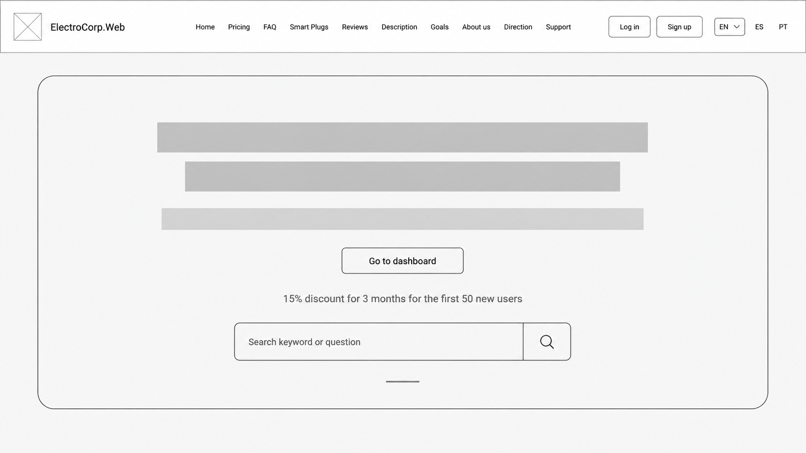

**Pricing / Planes:**  
Muestra la distribución de los planes de suscripción en tarjetas comparativas. Se incluyen los precios, beneficios principales y botones de selección de plan.

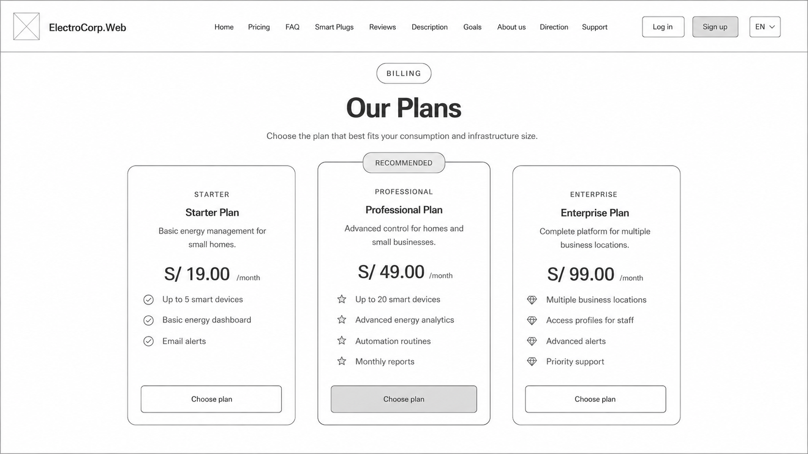

**FAQ / Preguntas frecuentes:**  
Define la estructura de preguntas desplegables para resolver dudas comunes sobre consumo eléctrico, ahorro energético y uso de enchufes inteligentes.

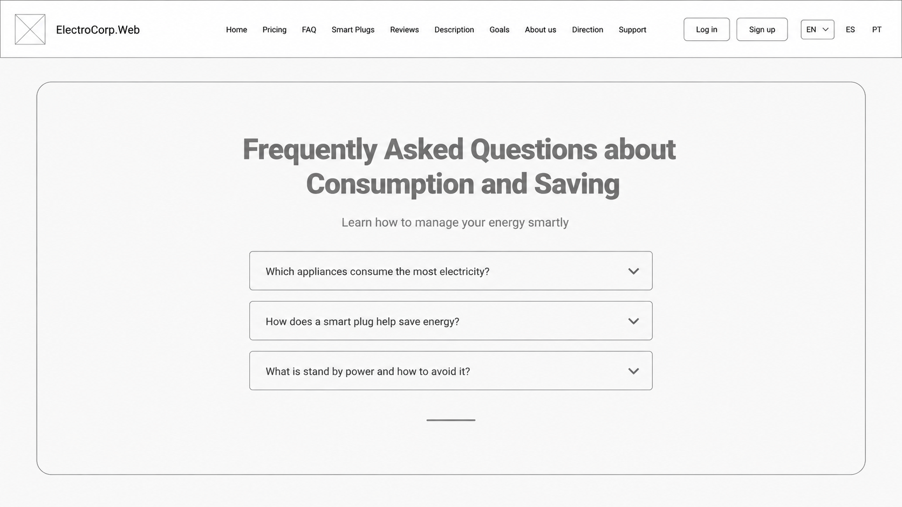

**Smart Plugs / Enchufes inteligentes:**  
Representa la sección visual destinada a mostrar el uso de enchufes inteligentes en distintos contextos, mediante dos bloques de imagen principales.

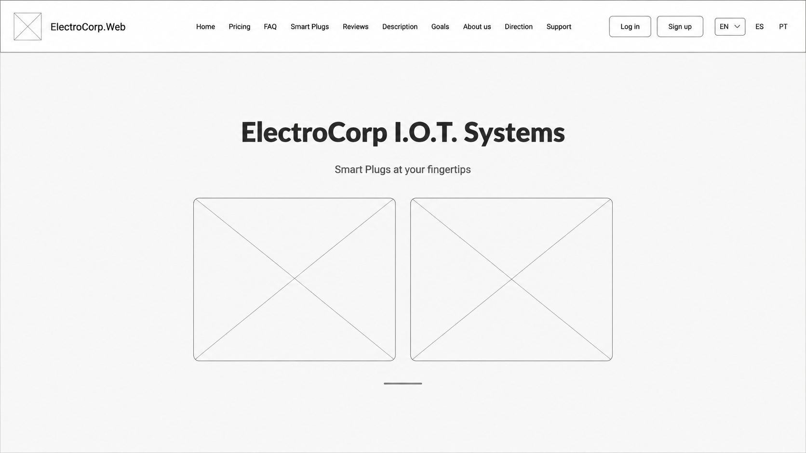

**Reviews / Reseñas:**  
Organiza las opiniones de clientes en tarjetas tipo carrusel, incluyendo imagen, nombre, tipo de usuario y comentario.

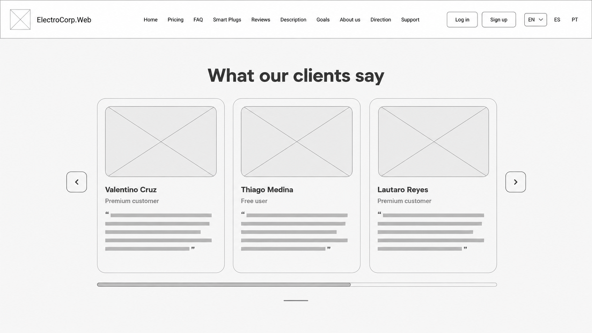

**Description / Descripción:**  
Presenta la sección informativa donde se explica el problema, la propuesta de solución y el valor del ecosistema IoT de ElectroCorp.Web.

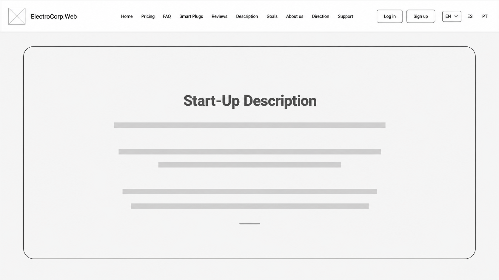

**Goals / Objetivos:**  
Muestra la estructura destinada a explicar los objetivos del proyecto, acompañada de imágenes referenciales sobre automatización y monitoreo energético.

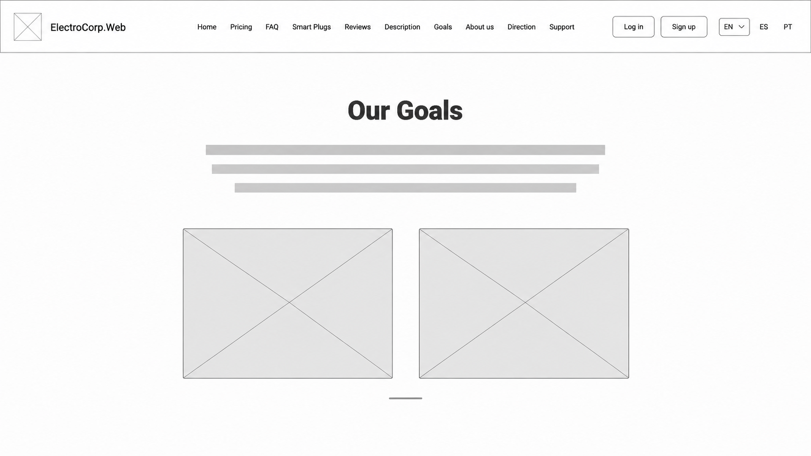

**About us / Sobre nosotros:**  
Define la distribución de las tarjetas del equipo de desarrollo, mostrando los nombres, roles y responsabilidades de cada integrante.

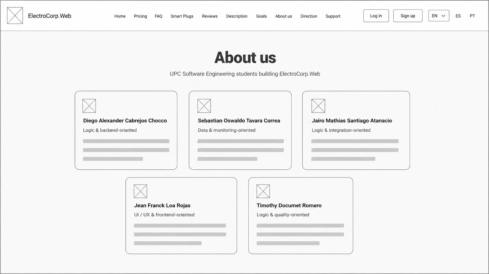

**Direction / Dirección:**  
Estructura la sección de ubicación, incluyendo una tarjeta con información de contacto y un bloque destinado al mapa de ubicación.

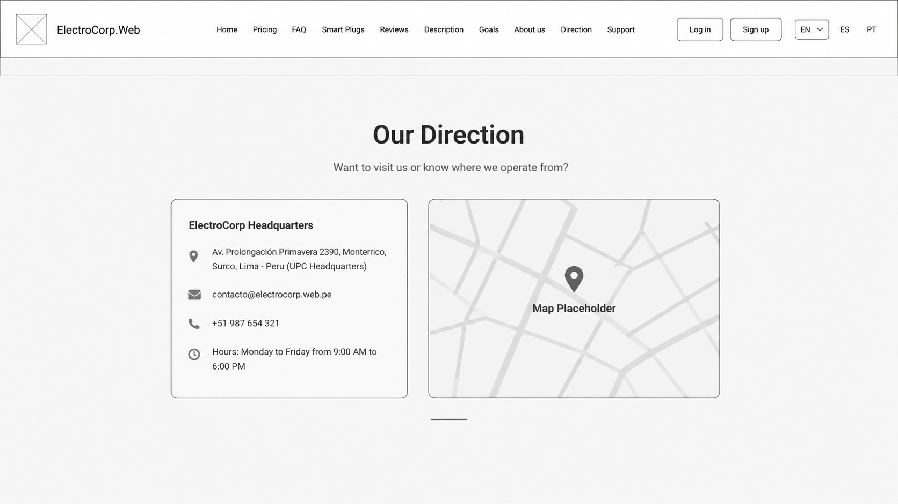

**Support / Soporte:**  
Presenta la sección final de suscripción y contacto, junto con el pie de página, enlaces sociales y copyright.

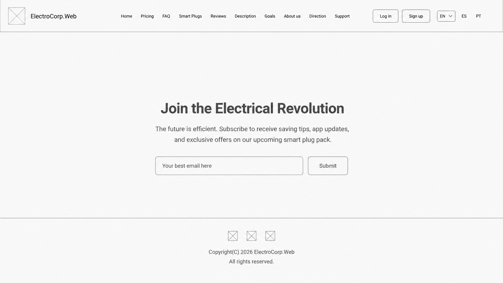

### 4.3.2. Landing Page Mock-up

El mock-up de la landing page representa la versión visual de alta fidelidad del sitio web ElectroCorp.Web. A diferencia del wireframe, esta etapa incorpora colores, tipografía, imágenes, botones, tarjetas, fondos, sombras y elementos visuales finales que permiten observar una aproximación cercana al producto terminado.

La propuesta visual utiliza una estética tecnológica basada en tonos oscuros, acentos celestes y elementos relacionados con electricidad, automatización e Internet de las Cosas. El objetivo del diseño es transmitir modernidad, confianza y facilidad de uso para usuarios interesados en controlar y reducir su consumo eléctrico.

**Home / Inicio:**  
El mock-up inicial presenta el mensaje principal de la plataforma, resaltando el control del consumo eléctrico del hogar y el beneficio de ahorro energético. También incluye el botón de acceso al dashboard, una promoción para nuevos usuarios y una barra de búsqueda.

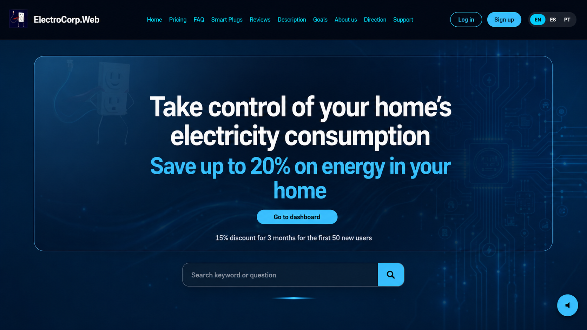

**Pricing / Planes:**  
Esta sección muestra los planes Starter, Professional y Enterprise con una presentación visual comparativa. El plan Professional se destaca como recomendado para guiar la decisión del usuario.

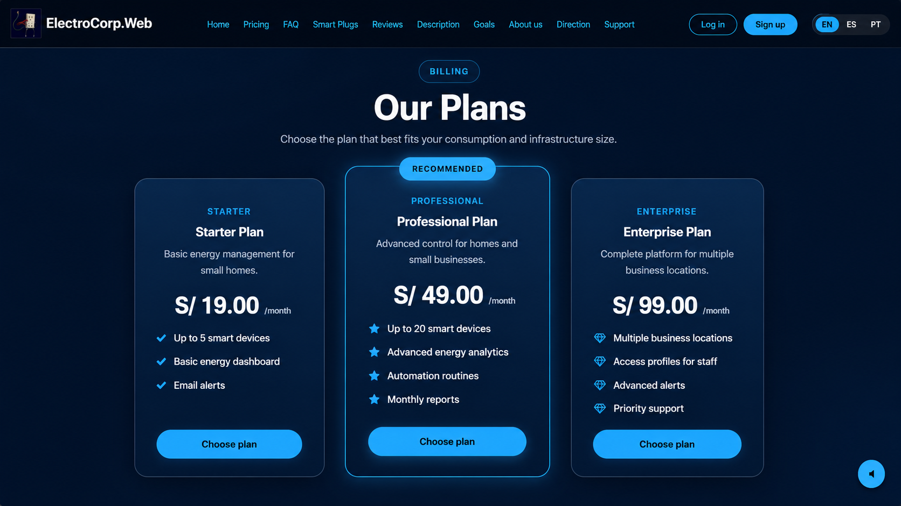

**FAQ / Preguntas frecuentes:**  
El mock-up de preguntas frecuentes utiliza tarjetas desplegables con diseño oscuro y bordes sutiles, manteniendo una lectura clara y ordenada.

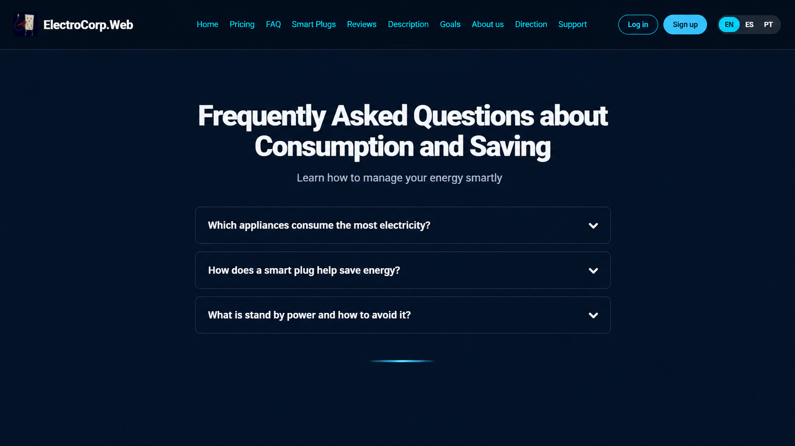

**Smart Plugs / Enchufes inteligentes:**  
Esta sección muestra imágenes del uso de enchufes inteligentes en el hogar y en espacios de trabajo, reforzando la idea de monitoreo y control energético en tiempo real.

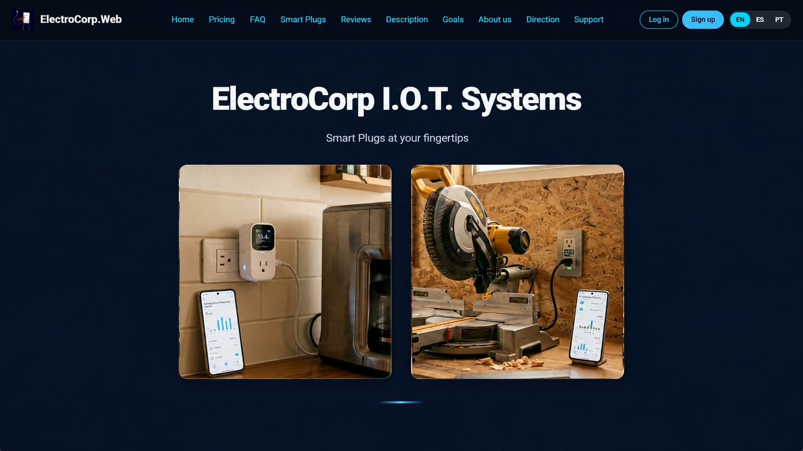

**Reviews / Reseñas:**  
El mock-up de reseñas presenta testimonios de usuarios mediante tarjetas visuales con fotografías, nombres, tipo de cliente y comentarios sobre la utilidad de la plataforma.

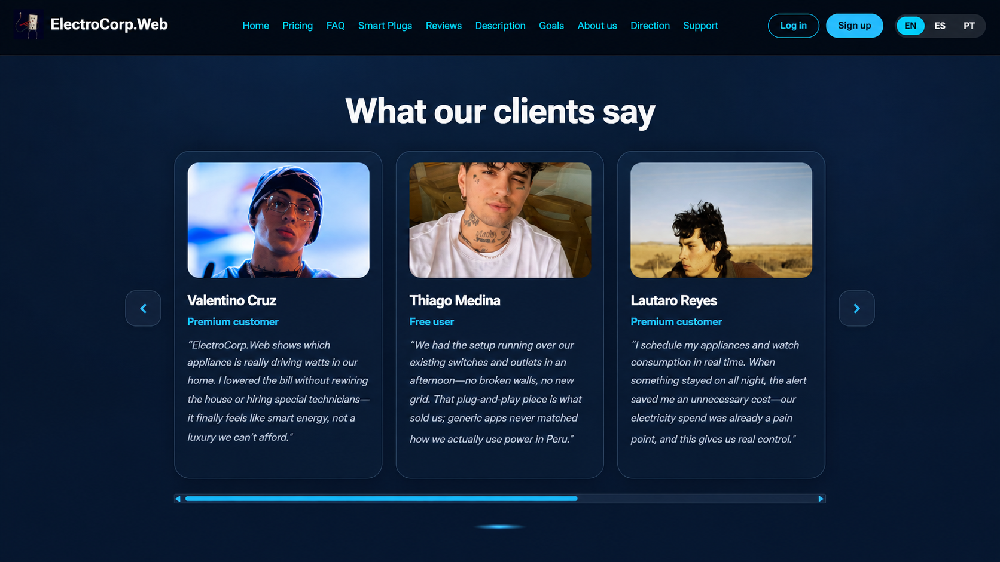

**Description / Descripción:**  
La sección de descripción explica el enfoque de la startup, el problema del alto costo de automatización del hogar y la solución basada en un ecosistema IoT plug-and-play.

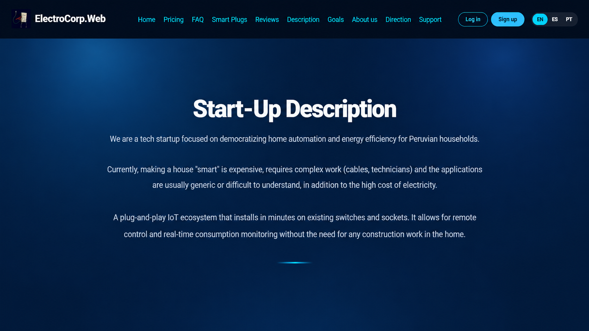

**Goals / Objetivos:**  
El mock-up de objetivos presenta la meta principal del proyecto: facilitar el control del consumo eléctrico mediante una plataforma comprensible, accesible y orientada al ahorro.

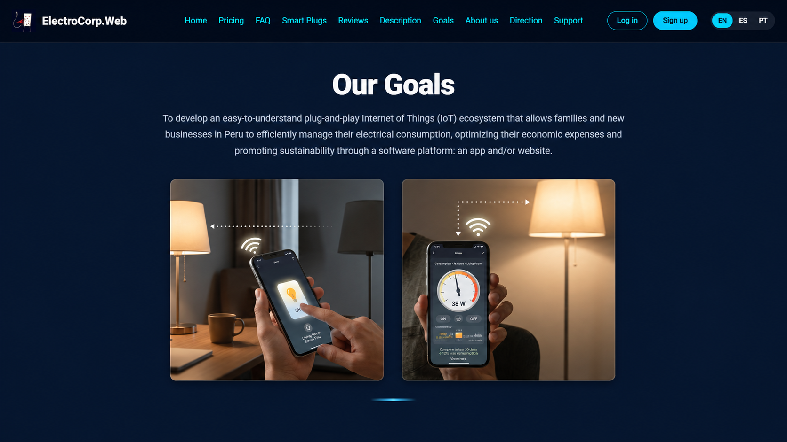

**About us / Sobre nosotros:**  
Esta sección muestra al equipo de desarrollo de ElectroCorp.Web mediante tarjetas individuales con nombre, orientación técnica y responsabilidades dentro del proyecto.

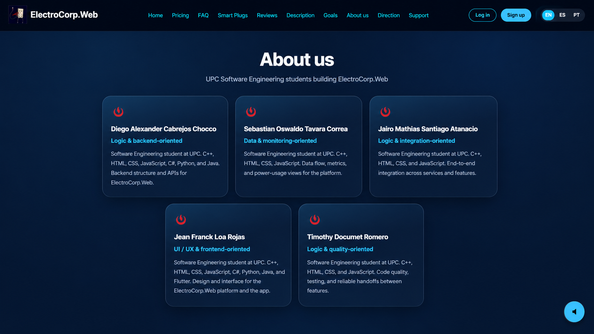

**Direction / Dirección:**  
El mock-up de dirección incluye la información de contacto, ubicación de referencia y un mapa integrado para ubicar la sede principal del proyecto.

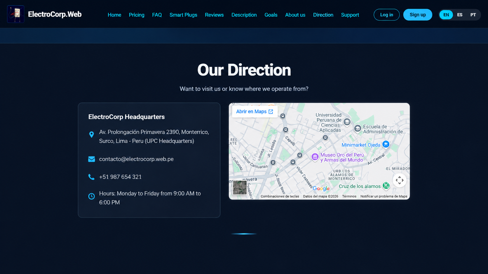

**Support / Soporte:**  
La sección final permite al usuario suscribirse para recibir novedades, consejos de ahorro y actualizaciones del producto. También incluye el footer con redes sociales y derechos reservados.

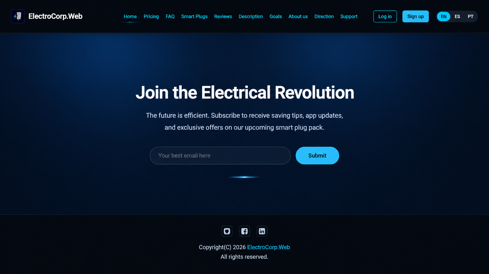

## 4.4. Web Applications UX/UI Design
### 4.4.1. Web Applications Wireframes

Los siguientes wireframes representan la estructura de baja fidelidad de las principales vistas de la aplicación web de **ElectroCorp**. Estos diseños permiten visualizar la distribución general de los componentes, la jerarquía de información y el flujo de navegación antes de aplicar estilos visuales finales.

---


**Login:**  
Este wireframe muestra la pantalla de inicio de sesión de la aplicación web. Incluye los campos principales para ingresar correo electrónico y contraseña, así como las acciones para iniciar sesión o dirigirse al registro de una nueva cuenta. Esta vista funciona como punto de acceso inicial al sistema.

---

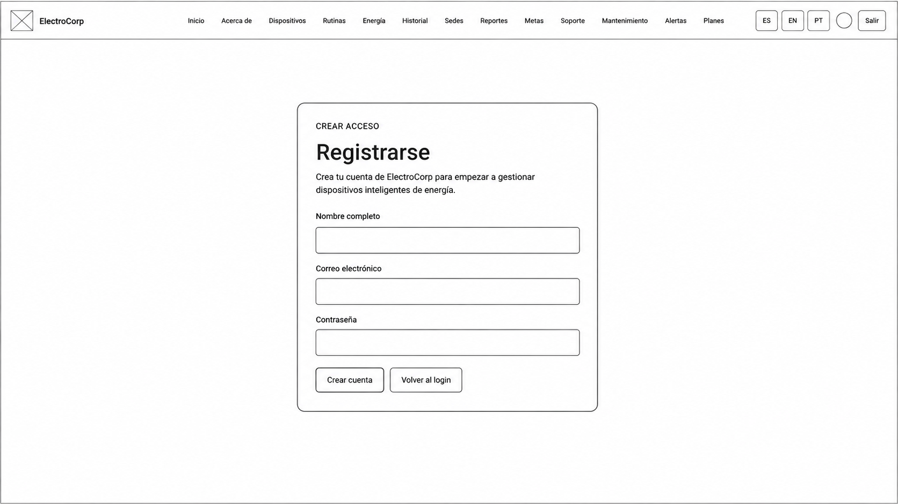

**Register:**  
Este wireframe representa la pantalla de registro de usuarios. Presenta los campos necesarios para crear una cuenta, como nombre completo, correo electrónico y contraseña. Además, incluye una opción para volver al login en caso el usuario ya tenga una cuenta registrada.

---

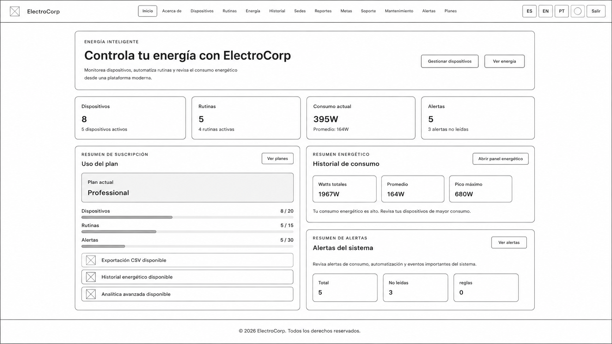

**Home:**  
Este wireframe corresponde al dashboard principal de ElectroCorp. En esta vista se organiza la información general del usuario, como dispositivos conectados, rutinas activas, consumo actual, alertas pendientes y estado de suscripción. También se incluyen accesos rápidos hacia las funcionalidades principales de la aplicación.

---

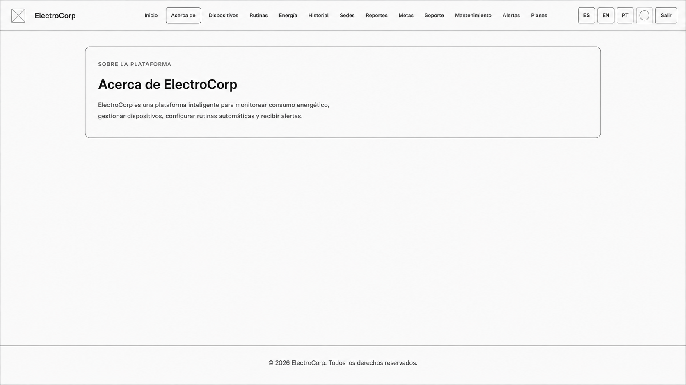

**About:**  
Este wireframe muestra la sección informativa de la plataforma. Su objetivo es presentar una descripción breve de ElectroCorp, explicando su propósito como solución para monitoreo energético, gestión de dispositivos, configuración de rutinas y recepción de alertas.

---

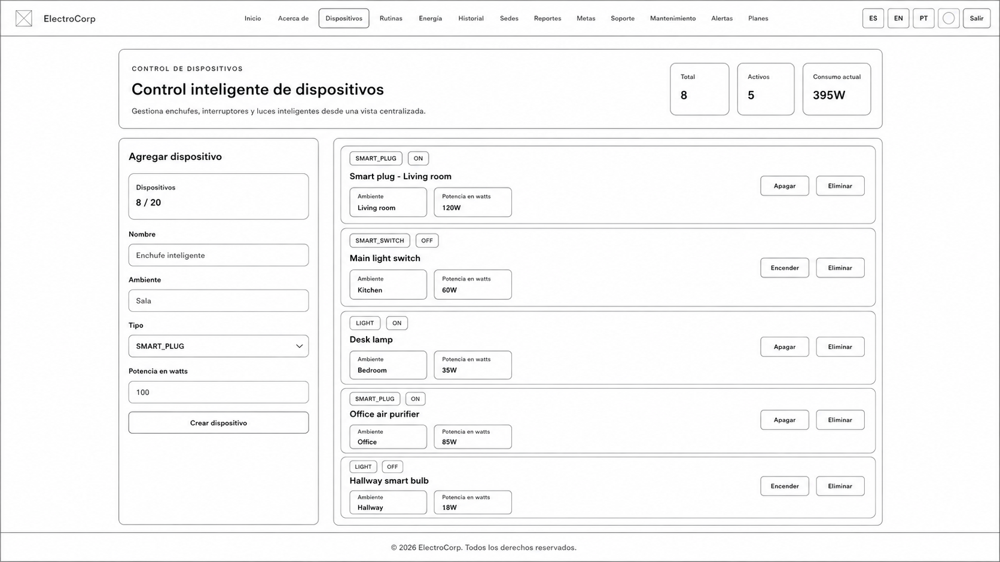

**Devices:**  
Este wireframe representa la vista de control de dispositivos inteligentes. Incluye un formulario para agregar nuevos dispositivos, tarjetas resumen y un área destinada a listar los equipos registrados. Esta sección permite organizar la administración de enchufes, luces e interruptores inteligentes desde una sola interfaz.

---

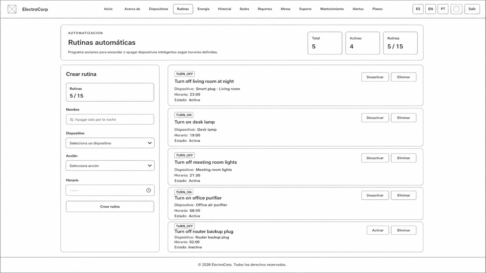

**Routines:**  
Este wireframe corresponde al módulo de rutinas automáticas. Presenta un formulario para crear automatizaciones y una lista de rutinas registradas. Su finalidad es permitir que el usuario programe acciones como encender o apagar dispositivos en horarios definidos.

---


**Energy:**  
Este wireframe muestra la vista de monitoreo de consumo energético. Incluye indicadores clave como watts totales, promedio y pico máximo, además de filtros por fecha, recomendaciones de ahorro y un gráfico para visualizar el comportamiento del consumo. Esta sección facilita el análisis inicial de los datos energéticos.

---


**History:**  
Este wireframe representa el historial de consumo energético. La vista contiene una tabla con registros organizados por dispositivo, consumo en watts, fecha y estado. También incluye una opción para exportar los datos en formato CSV, lo que permite generar reportes o análisis externos.

---


**Sites:**  
Este wireframe corresponde a la gestión de sedes y ambientes. Presenta indicadores sobre sedes, ambientes, asignaciones y cobertura, además de secciones para visualizar distribución de sedes, resumen operativo y tarjetas de ubicación. Esta vista permite organizar los espacios donde se encuentran instalados los dispositivos inteligentes.

---


**Reports:**  
Este wireframe muestra la sección de reportes de consumo. Incluye indicadores generales, comparación de reportes, periodo de mayor consumo y tarjetas de reportes generados. Su propósito es analizar la información energética registrada y mostrar recomendaciones basadas en el consumo.

---


**Goals:**  
Este wireframe representa la vista de metas energéticas. Incluye tarjetas de progreso, métricas generales y una lista de objetivos creados por el usuario. Esta sección permite definir metas de consumo y revisar el avance hacia el cumplimiento de los objetivos energéticos.

---


**Support:**  
Este wireframe corresponde al centro de soporte. Presenta indicadores de tickets, casos abiertos, casos críticos y tasa de resolución, además de una sección para visualizar el ticket más urgente y la lista de solicitudes registradas. Esta vista permite gestionar incidencias o problemas relacionados con el uso de la plataforma.

---


**Maintenance:**  
Este wireframe representa la sección de mantenimiento técnico. Incluye métricas sobre mantenimientos pendientes y completados, el mantenimiento más cercano, estado operativo y una lista de tareas programadas. Esta vista permite planificar revisiones preventivas o correctivas de los dispositivos inteligentes.

---


**Alerts:**  
Este wireframe corresponde al centro de alertas de ElectroCorp. Incluye un resumen de alertas no leídas, formularios para crear alertas y reglas, preferencias de notificación y una lista de alertas relacionadas con consumo elevado, sugerencias de automatización y eventos del sistema.

---


**Plans:**  
Este wireframe presenta la pantalla de planes de servicio. Se muestran diferentes opciones de suscripción con sus precios y características principales. Esta vista permite comparar planes, visualizar la suscripción activa y revisar el resumen de facturación del usuario.

---

### 4.4.2. Web Applications Wireflow Diagrams

El siguiente wireflow representa el flujo de navegación principal de la aplicación web de **ElectroCorp**. Este diagrama permite visualizar cómo el usuario se desplaza entre las pantallas principales del sistema, partiendo desde el proceso de autenticación hasta el acceso a los módulos funcionales de la plataforma.


**Web Application Wireflow:**  
El flujo inicia en la pantalla de **Login**, desde donde el usuario puede iniciar sesión o acceder al formulario de **Register** para crear una nueva cuenta. Una vez autenticado, el usuario ingresa al **Home Dashboard**, que funciona como el punto central de navegación de la aplicación.

Desde el dashboard principal, el usuario puede acceder a las secciones de **About**, **Devices**, **Routines**, **Energy**, **History**, **Plans** y **Alerts**. Cada una de estas vistas representa un módulo funcional del sistema y mantiene una navegación de retorno hacia el dashboard o mediante el menú superior. Esta estructura permite que la experiencia de usuario sea clara, centralizada y coherente con los objetivos de la plataforma.

### 4.4.3. Web Applications Mock-ups

Los siguientes mock-ups representan la versión de mayor fidelidad de las interfaces web de **ElectroCorp**. A diferencia de los wireframes, estos diseños incorporan colores, tipografía, estilos visuales, navegación superior, botones, tarjetas y una distribución más cercana a la implementación final desarrollada en la aplicación.

---


**Login:**  
Este mock-up muestra la pantalla final de inicio de sesión. Presenta una interfaz moderna con soporte para cambio de idioma y modo visual. La vista permite que el usuario acceda a la plataforma mediante correo electrónico y contraseña, manteniendo una experiencia clara y directa.

---


**Register:**  
Este mock-up representa la pantalla de registro final. La interfaz permite crear una cuenta nueva ingresando nombre completo, correo electrónico y contraseña. Además, mantiene una navegación sencilla hacia el login para usuarios que ya poseen una cuenta.

---


**Home:**  
Este mock-up presenta el dashboard principal de la aplicación. Se muestran tarjetas resumen sobre dispositivos conectados, rutinas activas, consumo actual, alertas pendientes y uso del plan. También incluye accesos rápidos hacia módulos importantes como control de dispositivos, consumo energético, historial, alertas y planes.

---


**About:**  
Este mock-up corresponde a la sección informativa de ElectroCorp. La vista resume el propósito de la plataforma, explicando que permite monitorear consumo energético, gestionar dispositivos inteligentes, configurar rutinas automáticas y recibir alertas.

---


**Devices:**  
Este mock-up muestra el módulo de gestión de dispositivos inteligentes. Permite agregar nuevos equipos mediante un formulario y visualizar el estado general de los dispositivos registrados. Además, presenta métricas como total de dispositivos, dispositivos activos y consumo actual.

---


**Routines:**  
Este mock-up representa la vista de rutinas automáticas. El usuario puede crear nuevas rutinas, seleccionar dispositivos, definir una acción y establecer un horario. También se muestra una lista de rutinas existentes con opciones para activarlas, desactivarlas o eliminarlas.

---


**Energy:**  
Este mock-up corresponde al módulo de monitoreo energético. Presenta indicadores como watts totales, promedio y pico máximo. También incluye filtros por fecha, una recomendación de ahorro y un gráfico de barras que permite analizar visualmente el historial de consumo energético.

---


**History:**  
Este mock-up muestra la vista de historial de consumo. La pantalla presenta una tabla con lecturas energéticas registradas, indicando dispositivo, consumo, fecha y estado. También incluye una opción para exportar la información en formato CSV.

---


**Sites:**  
Este mock-up representa el módulo de gestión de sedes y ambientes. Muestra indicadores sobre sedes, ambientes y asignaciones, además de una distribución por tipo de sede y tarjetas con información de cada ubicación. Esta vista permite supervisar la organización física de los dispositivos dentro de la plataforma.

---


**Reports:**  
Este mock-up muestra la vista de reportes de consumo. Presenta indicadores de reportes generados, watts totales, pico máximo, promedio por reporte y reportes críticos. Además, incluye una comparación visual de reportes y tarjetas con recomendaciones relacionadas al consumo energético.

---


**Goals:**  
Este mock-up corresponde a la sección de metas energéticas. Permite visualizar el número de metas creadas, metas activas, completadas, fallidas y el progreso promedio. También muestra metas individuales con barras de progreso y métricas asociadas al objetivo energético.

---


**Support:**  
Este mock-up muestra el centro de soporte de la aplicación. Incluye métricas sobre tickets, casos abiertos, casos críticos y resolución, además de una sección para destacar el ticket más urgente. También permite visualizar solicitudes registradas con su estado y prioridad.

---


**Maintenance:**  
Este mock-up representa la vista de mantenimiento técnico. Permite revisar mantenimientos pendientes, completados y tareas programadas. También destaca el mantenimiento más cercano y muestra información asociada al dispositivo, fecha programada y estado del servicio.

---


**Alerts:**  
Este mock-up muestra el centro de alertas de la aplicación. Incluye un contador de alertas sin leer, formularios para crear alertas y reglas de alerta, preferencias de notificación y una lista de eventos clasificados por nivel. Esta sección permite al usuario supervisar eventos importantes relacionados con consumo energético y automatización.

---


**Plans:**  
Este mock-up representa la vista de planes de servicio. Se presentan tres opciones de suscripción con sus respectivos precios y características. También se muestra la suscripción activa y un resumen de facturas, permitiendo al usuario comparar planes disponibles y gestionar su estado de facturación.

---


### 4.4.4. Web Applications User Flow Diagrams

El siguiente diagrama de flujo de usuario representa el recorrido principal que realiza una persona al interactuar con la aplicación web de **ElectroCorp**. Este flujo contempla el acceso desde la **Landing Page** o directamente desde la **Single Page Application (SPA)**, el proceso de autenticación, el registro de usuarios, la selección de planes, la navegación por los módulos principales y la gestión de funcionalidades como dispositivos, rutinas, consumo energético, reportes, metas, soporte, mantenimiento, alertas y facturación.


**Web Application User Flow:**  
El flujo principal inicia cuando el usuario accede a ElectroCorp. Si ingresa desde la **Landing Page**, puede revisar información pública sobre la plataforma, conocer sus beneficios y seleccionar un plan. En caso seleccione un plan desde la landing, se recopila la intención de contratación y se redirige al usuario hacia la SPA para completar su registro y checkout. Si el usuario accede directamente a la aplicación, puede iniciar sesión o crear una nueva cuenta.

Luego, el sistema evalúa si el usuario ya posee una cuenta registrada. Si no tiene una cuenta, se dirige al módulo de **Register**, donde ingresa su nombre completo, correo electrónico y contraseña. Si el registro proviene de una selección previa de plan desde la landing, el sistema asocia el plan seleccionado al nuevo usuario, registra el pago simulado y crea una suscripción activa. En caso contrario, el usuario se registra sin una suscripción activa. Si el usuario ya posee credenciales, accede al módulo de **Login**, donde ingresa su correo y contraseña.

Después del inicio de sesión, el sistema valida las credenciales ingresadas. Si los datos no son correctos, se muestra un mensaje de error y el usuario puede intentar nuevamente. Si las credenciales son válidas, el usuario ingresa al **Home Dashboard**, que funciona como el punto central de navegación de la plataforma. Desde esta vista se muestran indicadores generales como dispositivos registrados, rutinas activas, consumo actual, alertas pendientes y estado del plan.

A partir del dashboard, el usuario puede navegar hacia los principales módulos funcionales de ElectroCorp. En **Devices**, puede registrar dispositivos inteligentes, revisar su estado y encenderlos o apagarlos. En **Routines**, puede crear automatizaciones asociadas a dispositivos y horarios específicos. En **Energy**, puede visualizar métricas de consumo, filtrar lecturas por fechas, revisar recomendaciones y exportar información. En **History**, puede consultar el historial de lecturas energéticas registradas.

El flujo también contempla la gestión de espacios mediante **Sites**, donde el usuario puede revisar sedes, ambientes y asignaciones de dispositivos. En **Reports**, puede generar reportes de consumo a partir de lecturas energéticas, siempre usando rangos de fechas válidos. En **Goals**, puede crear metas energéticas y monitorear su progreso. En **Support**, puede registrar tickets de ayuda y revisar casos críticos. En **Maintenance**, puede programar mantenimientos técnicos para los dispositivos. En **Alerts**, puede crear alertas, configurar reglas, actualizar preferencias y marcar notificaciones como leídas.

Finalmente, el módulo de **Plans** permite visualizar los planes disponibles, revisar la suscripción activa, seleccionar un nuevo plan, procesar un pago simulado, cancelar una suscripción y consultar el resumen de facturación. El flujo termina cuando el usuario decide cerrar sesión mediante la opción **Logout**, lo que elimina la sesión local y redirige nuevamente al login. De esta manera, el diagrama permite comprender el recorrido completo del usuario dentro de la aplicación, desde el acceso inicial hasta la navegación operativa y la salida segura del sistema.

---

## 4.5. Web Applications Prototyping

En esta sección se presenta el prototipo funcional de la aplicación web de **ElectroCorp**, incluyendo la integración entre la webapp y el servicio temporal `electrocorp-platform`. El video muestra el flujo general de uso de la plataforma, desde el acceso del usuario hasta la navegación por los principales módulos del sistema.

El prototipo permite validar visualmente la experiencia de usuario, la navegación entre vistas, el consumo de datos desde la REST API desplegada en Render y la separación entre frontend y plataforma de datos. Asimismo, evidencia el avance funcional de módulos como autenticación, dashboard principal, gestión de dispositivos, rutinas, monitoreo energético, historial, planes y alertas.

**Video de presentación del prototipo:**  
[Ver video del prototipo de ElectroCorp](https://1drv.ms/v/c/0e85bddd31a5a6b2/IQCP8SBS3IW5S5o6jAGWF7XLARHP0FJrkJaB8oKVd_Yd1Bo?e=y85xUO)


## 4.6. Domain-Driven Software Architecture
### 4.6.1. Design-Level Event Storming

El Design-Level Event Storming de ElectroCorp se organiza por bounded contexts para mantener coherencia con la arquitectura DDD implementada en el backend y en la web application. En lugar de representar todo el dominio en una sola imagen, los eventos, comandos, agregados y reglas se separan por contexto para facilitar la trazabilidad con el codigo actual.

La primera vista resume la separacion de bounded contexts y sus relaciones principales. Las vistas siguientes detallan los flujos internos de cada contexto, usando la nomenclatura actual del proyecto: IAM, Billing, Workplace, Device Control, Energy Monitoring, Notifications, Reporting, Service Management y Marketing. El codigo fuente Mermaid de cada diagrama se versiona en `docs/diagrams/event-storming/` para mantener trazabilidad directa con la implementacion.

Para la entrega final, los eventos candidatos del Event Storming se implementan como eventos de dominio dentro de cada bounded context y se traducen a integration events desde la capa de application/interfaces mediante `IntegrationEventPublisher`. Los handlers se ejecutan despues del commit transaccional y los consumidores principales son Notifications, que crea alertas operativas, y Reporting, que persiste una proyeccion de actividad en `reporting_events` para trazabilidad y analisis sin acoplar controllers entre contextos.

| Domain event | Integration event | Consumer context | Resultado funcional |
|--|--|--|--|
| UserRegisteredEvent | UserRegisteredIntegrationEvent | Notifications, Reporting | Alerta de cuenta creada y registro de actividad IAM. |
| SubscriptionActivatedEvent | SubscriptionActivatedIntegrationEvent | Notifications, Reporting | Alerta de plan activado y actividad Billing. |
| PaymentRegisteredEvent | PaymentRegisteredIntegrationEvent | Notifications, Reporting | Alerta de pago registrado y actividad financiera. |
| DeviceCreatedEvent | DeviceCreatedIntegrationEvent | Notifications, Reporting | Alerta de dispositivo disponible y actividad Device Control. |
| OperationModeActivatedEvent | OperationModeActivatedIntegrationEvent | Notifications, Reporting | Alerta de modo operativo aplicado y actividad de automatizacion. |
| DeviceAssignedToRoomEvent | DeviceAssignedToRoomIntegrationEvent | Notifications, Reporting | Alerta de asignacion y sincronizacion Workplace-Device Control. |
| EnergyThresholdExceededEvent | EnergyThresholdExceededIntegrationEvent | Notifications, Reporting | Evaluacion de reglas, alerta de consumo elevado y actividad energetica. |
| SupportTicketCreatedEvent | SupportTicketCreatedIntegrationEvent | Notifications, Reporting | Alerta de ticket de soporte creado y actividad de servicio. |
| MaintenanceTicketCreatedEvent | MaintenanceTicketCreatedIntegrationEvent | Notifications, Reporting | Alerta de mantenimiento asociado a dispositivo y actividad tecnica. |

#### 4.6.1.1. Bounded Contexts Overview


Esta vista general identifica los bounded contexts principales de ElectroCorp y muestra como se distribuyen las capacidades del producto. IAM centraliza identidad y acceso; Billing gestiona planes y suscripciones; Workplace organiza sedes y ambientes; Device Control coordina dispositivos, grupos, rutinas y modos; Energy Monitoring procesa lecturas y metricas; Notifications evalua alertas y preferencias; Reporting consolida reportes e indicadores; Service Management gestiona tickets y mantenimiento; y Marketing sostiene la landing y la captacion previa al registro.

#### 4.6.1.2. IAM Event Storming


El contexto IAM representa los flujos de registro, autenticacion, perfiles y control de acceso. Este contexto provee la identidad base que otros bounded contexts usan para validar propiedad, alcance de usuario y permisos de operacion.

#### 4.6.1.3. Billing Event Storming


El contexto Billing cubre planes, suscripciones, pagos e invoices. Sus eventos permiten conectar la seleccion de plan, la activacion de beneficios y la validacion de acceso a funcionalidades de la plataforma.

#### 4.6.1.4. Workplace Event Storming


El contexto Workplace modela sedes, rooms y asignaciones de dispositivos. La vista muestra el flujo de creacion y administracion de espacios, junto con las relaciones necesarias para que Device Control, Energy Monitoring y Reporting trabajen con ubicaciones reales.

#### 4.6.1.5. Device Control Event Storming


El contexto Device Control representa dispositivos, grupos de dispositivos, rutinas y modos de operacion. Estos eventos sostienen la automatizacion del producto y preparan la informacion que luego consumen Energy Monitoring, Notifications y Reporting.

#### 4.6.1.6. Energy Monitoring Event Storming


El contexto Energy Monitoring organiza la captura, consulta y analisis de lecturas energeticas. Sus eventos conectan dispositivos con metricas, dashboards y condiciones que pueden activar alertas o alimentar reportes.

#### 4.6.1.7. Notifications Event Storming


El contexto Notifications modela reglas de alerta, preferencias y evaluacion de condiciones. Se apoya en lecturas energeticas y configuraciones de usuario para generar notificaciones relevantes dentro del flujo operativo de ElectroCorp.

#### 4.6.1.8. Reporting Event Storming


El contexto Reporting consolida indicadores de consumo, metas energeticas, reportes y exportaciones. Su rol es integrar datos de billing, workplaces, devices, energy monitoring, notifications y service management para producir una vista ejecutiva del sistema.

#### 4.6.1.9. Service Management Event Storming


El contexto Service Management cubre tickets de soporte, tickets de mantenimiento y seguimiento de atenciones. Este contexto se conecta con dispositivos y espacios afectados para que las incidencias tengan trazabilidad operativa.

#### 4.6.1.10. Marketing Event Storming


El contexto Marketing da soporte a la landing page previa al registro. Gestiona la suscripcion al boletin (`NewsletterSubscription`, idempotente por email), la busqueda y el contenido de la landing por idioma, el bundle de traducciones, la configuracion multimedia (audio y menu) y los terminos y condiciones. A diferencia de los demas bounded contexts no publica domain events, ya que su rol es de captacion y presentacion, sin acoplarse al flujo transaccional del resto de la plataforma.

### 4.6.2. Software Architecture Context Diagram

En esta seccion se presenta el Diagrama de Contexto correspondiente al Nivel 1 del modelo C4 para la arquitectura de ElectroCorp. Este diagrama permite visualizar el ecosistema general de la solucion, identificando a los usuarios principales, el sistema ElectroCorp, los servicios externos y los entornos de despliegue que participan en la experiencia completa del producto.

![ElectroCorp - C4 Context Diagram](https://www.plantuml.com/plantuml/svg/bPL1Rziu48Nl_1M3vcetALgtQM08TPm6MQ1P67KMUuXpeCInJ9ZY24CgZhlP_xuWHTboR1HO-IBCFF5zd4V9tvoNx9lA2BVMjfOiAyXbiIwP6gkcP8ZXx3PUFOLRIKKRRKjOIkEmrr6ub8tnjsJzdx92cB2MvhZ_W2z-OdHfAxGU2hGUkQVQiAp_rigluCF7KQzUoPTxT4wMEDU_4BvSz7gM53giuU01bdOTYf_wnGapRTBMBYVXzxOPy9FWSxnE2UP-Qn1oCkfjzs6bYxL5v-13dmKBBsrfy6SxMhR8S75AS4siaFUhd1Jr68_oEH2rdBMHsfwIm3y2uDWHu5vRNJLLoc4q4W0pgLH8_LByArPQ8JYFZEItDGfFDNY2dBod2fGE1fgi45vxW_3TOE6PfiGr367w2QPaFRvukD6oP5a9iITwDywpllulXpm-pxE57UliSORio3wDptMsi0jxHnNI9ioI6FB6wRY1jh9P4LJIoX8Te4KkjmDG-AmBT0DWh8cz6u1hwd07qYh8jJ7Qbk_VWNJH5yukhaUZhnz_npVVEe_Ldd1EIx-HZAcnGvqPwPV45Io94mzKPBKdrhOSW6myLJ9CRT213C2IrqjTnFAEEeGGS1ros4tQP7YPMlBMEB1_lhq-Of_9RNplPapFMlLd-_t58rjfZiYP2dGE7RWcTmNhEk94XcA5nPeQ3yvBtxWMeBCu-t9xERsyUJkyIchpF-nlqEXdP0VIO8miPTVE8CLNjL-6170V74wxJmqr2kx8XJ6UCEzYwXqnvntKJMvq0Kvx7C1yDcdFYopMk0yYcQUrT_uYdgJXCEk2kOB6eLlOnskcZKD-4gaHDDtihg1kxuBmxk5XDeTpcCp-E137VLuTdfBVo3koAr1O6zgY0h8B-nXdyYGwwo2Dp3k6bAw8VhqsXYYTs3_vkD9AeNrYNQxyCFAbXzvq4agQJTTKjB73DAOT-64pBYaCbc7mSJ41CCwp7x4I0XK0h-FqucPGnmy6l7RLy4fauDgrKxKDAWFi3i6kZLQrLa9yGwl2N-L_)

El contexto muestra a ElectroCorp como un sistema unico frente al usuario, el servicio externo de terceros y los entornos de despliegue. El detalle interno de website, SPA, backend y base de datos se separa en el diagrama de contenedores.

Como parte del contexto, la solucion integra un servicio externo de terceros: **OpenStreetMap (Nominatim)**. La Web Application consume sus endpoints publicos de geocodificacion (`/search`), geocodificacion inversa (`/reverse`) y sus *tiles* de mapa (`tile.openstreetmap.org`) para permitir a los usuarios ubicar y registrar la direccion de sus sedes sobre un mapa interactivo. Esta integracion satisface el requisito de acceso a un servicio externo de terceros, complementando al RESTful API de desarrollo interno de ElectroCorp. Los pagos de suscripciones se procesan mediante un servicio de validacion interno (checkout propio) y las notificaciones se entregan como alertas dentro de la aplicacion, sin depender de pasarelas o servicios de correo externos en esta version.

### 4.6.3. Software Architecture Container Diagrams

A continuacion, se presenta el Diagrama de Contenedores correspondiente al Nivel 2 del modelo C4. Este diagrama detalla los principales contenedores tecnicos que conforman ElectroCorp y muestra el flujo general desde la interaccion del usuario hasta el procesamiento de la informacion en el backend y la persistencia de datos.

![ElectroCorp - C4 Container Diagram](https://www.plantuml.com/plantuml/svg/dPTVSzeu4C3V_IbscjTmIPkaJJc6gO7qUfsaH-jq-X1uaAq5TCYIHbg7q6k_-uqaspY4T6uENiZkIllRltRUEMAMgb8cRYsKOPQLaBDYlRIwKdoifRPmz3vyEXPknRZU2BM41PCEEngE2rP9UgyLVM8bGce5aq_rj_X0gHHBLQ8YA50HsexLnZBpJN1QmSkpYuwyP0ytw1nROYQ-8xmvxUYKvkZGmAC3bgcr5vvtXQcrUbE7TfdwxxxIuzS6hyFda456MucGQydtjRShKQmLEWSlkonO45DBYLzYQgr22wU734RQShIxMmuQTHYVrEUHKUGqaWbro0J-IG2UUWIu4KgKLLdNuU8Y0PWopdtLBvEVtPeoOZbpyQR7fru_Vwe560oohICiHpujp6w7muYqruLacNA6MLJK0jVndwV-Uo2CLwqi9e4pjqAU07IITnO-jQnJqxrGNf-VTa9v-UfW1lQPZyPlpyvUZGvPTlcVjVfLZRistHAl14TmX1OrRGqcf0sGXbmJwHAuy7aNMYK92P88Ln8BidgihO4UZCzXh1KnuNjp8jZIiZ99ThtoOf0FkoU-EhI3atmuKmCnl9kYTLhD1oTYE5CpzTMX0rFbKXJ050TMqGeLYO8HSZ1MyweWM4YzSR-z0ER2RN1qEhguU7lsAw_J-cZJCJk2J2zemon2RAc0yWAUwR373gwP2gMTiYLsBYH6ee1lc3j1s8OsZL7TCrcXZyHe9tnMZtqHb0lX5apA7kaU2_dknbdV1aTdvsyl9wCdADrOls6U6hC3IjMoain2fYjR8AJ6j52ro5ZzDnO46q4hiBeYTCTmBt3ZZc712iRztuwqnSYPJl-4GWfKjCDBZVbFTDaqtQ6DTMc4H0ujupHjuKPMRtnvRQL8b0Xv9IJ1mkeIQ8MDJy_ZqDuZzo0k9dyX9DPecM4jrnCmFtqO0-eKq5XVrP7Mj6ljbkf6yq1QQgMbpvUsIwR4T-IGRs4ocK3kUmOv55eHFZGfIetevATTWFlfcTIApeXeHqkBsUVh0pH-VeGZ1vL3w-fUEeQDjciZMU7hnl5UX1yMcM_NyCjeIx6M98erDf2JFFcvFqOVjAFGvPBHGjjoHtRrG6WLawsgnVf3q8Sg3uFXOAKze2-Ph0V6i2N-3bzGSRInU56VJTF0bDTbyIfHO6HhE8xUlBySNqxsAATi6ruCfbRV2zvTCIrbPy13xrScPi5LkIkiC67cJ7sFdxtejxdviD-haWdvVxmoYPP2jB4Qm56AUxJRwFN6NzkuJCAQw_M6xHxeGnwcmyMApzHTFItpf37nvhxv--3GDvXVe9AfcReRtwPmBTHwlhit6cg3VXCPitUVdxETbPz3xa0eqZFLRfSWdIVUn9lwTk_3bwliTgRkFcP_VO8J-71xEytcYLTvaqaE_J08m8e2dG_YupI54yW-Ny-JHt4qjU-7Pa8EMhMUThfw3UJRriLEPolb_Ab6qrIrtrRShuxAjGQX07qeuykZw_3ShGJdgEPMB5VKg_TGcwOzRMPO96taN6zKpwSdUjepd-H9mxolgecJXdnVxu6JHEBIJqwG9G3-AHKalZCJW1-3-c4v11CUlV0ZIkDc6eQb5P_bjIA-QGnt6wkMnzOS0ZQDtZs9YaUG97c7Ylj_5lu5)

La arquitectura de contenedores separa la Landing Page, la WebApp fuente, la SPA compilada, el backend Spring Boot y la base de datos PostgreSQL. El usuario puede llegar desde la Landing Page o abrir directamente la SPA; la WebApp se compila en la SPA, y la SPA consume los servicios REST del backend.

### 4.6.4. Software Architecture Components Diagrams

Los siguientes diagramas de componentes representan la arquitectura interna de ElectroCorp separada por frontend y backend. El diagrama general muestra la interaccion entre bounded contexts. Los diagramas por bounded context muestran la interaccion entre capas arquitectonicas. Los diagramas de presentation frontend detallan como las views y componentes UI se coordinan dentro de cada contexto.

#### 4.6.4.1. ElectroCorp - Frontend General Components Diagram

![ElectroCorp - Frontend General Components Diagram](https://www.plantuml.com/plantuml/svg/dLXBKnj93Bxthr25mrxCaeIG0ELoPJ2mosx8KfXK3aaEyemyxgAdUwgx1yDkyj-t-Z4lU-o3pSMMrD8dVMffXe_6ehPL8PXvvB94ZGNCCNtCjQfaDbL2QJYuzf-EXLbYfbPSvh10OQYZoMY1bR3NIjhFM10acgFOr3_Giqq4psL1qa9AqfBkMAqqbbzvPfVmvlYa8o_m-PQCmPnc_5-23wyxEgaoCbH2xu16-UY4xxh2H6krYgcT9kvlNUdWHuFt_ZDaCBClWc2kHBQkVLZoz56ICV2cYuLIYp8NT1zAgoLfU3raSA5qHhhrCcZKmRZ1Jyyeu2m5SZba0lynWCs80BTSyg8g8WydJdI7MUPOFsM_XboDnnSkDSgcIbfwjfD9SBxMJrQZD2LgahO97JDvbxY_0K1l6rb89qEpf8m1TCfmx3zHrc5dBPNtRxkfl7dBVh4bpmYC9KtAlfJ4h2h1AfWhQrK16NSPSYKPizmAWYj1gTLggdG9Xt2jNROoWpz8aaO1KrMKIfAq1YuvvXeBnjfolnhF9rq7NmpfyT5yybsE-UJR7McZv8_n4Pzybz_b5qC6x99WTfS0bu0mrsfbIF_-2j3uit3m-kBavEnuLum6OkG78a5mYsKREv5v9L3xM4Vj6MUBN9Bsg5x15fRxqPEoX4_ueYexu7z9GZGfFgXoZde44fzuZgxC8n0eymfp0aCk2wK1PGPQLPOqgCeAig408GGS7ByxExsy64HnxqzjeWZo1eR_QHphYphnUInM6l8q8MGuruJSY3bRegOC_YOjITI5RiElCz0qIuDaHiR4AhZaHYx-WkULziNnbIW5seNI1HZIJpob22s6FZWvJSwkJZUGtIIt--19AhiaQNaQoQaCQJE2Kgi55sGy84nJTqjTfRGI0OqBjmtA1HV2tRuzuDm9b6O4ffgRLFFION9eyANmDywXuV99jLMfOzLODi1yLVgn59ZIFd0-gL0NCmAjL140PEHO0JGchhW8fOsqhJ2NuUGq578VGC636O4RkQM7LLak8r6gfDX7XTkN0LOCkWtJbIITly2jajmglITjzuHktZhci2WT8ICm5YqtbgUnQcYMSuKwYx1YtAsyVLQMBs9RchqwMv2shaAL8D_Hj21DCesreYSKbVSUyFJZRQlMFPLAsxshv0uxyXGACm9wzhzZLnkUBvinr8JP1cGMPWFSeiIS_8FMFjEeAbqWi3nz98UiGEx68qhNu3AhHn0ib11gTLYLSHP5yLRsahiRc0hkBiVcSBwH2ut6wYgrbQPsLxoKr4HqYn4jf2Y4VsHr8_l-QlO09BDIyURI9IMFSU3W-lXiwZV-ZcLv4NqbTpSjiAjdIrgYMDk6laAblnCNIjaGtsMMAccgWZAOlxGBfRz8wZW77wvFfwUNZFbjVdWugRVQkHkrXiLVJX5tptbOXHaySLePngBOMSGL42rCL-NcyP2ydez3kdPW3MdZt1XInRixfEfVeo6BjhU7j7LdDJhcCkibRy8AXIythCwkhG2cgQhSMqTWWxKvjZPknu59LKai9hbU3LDYIeR5FFlLYAEEzJFjbILLCkDUpjfi-spCuxU2hERfkbqNowhvFcpR8EjC_q731Xw5BxLLNVAUCrmiA7LT6BQTOIpMtrbrBjrvk1NrhMtOsc7I9Ms7MP-v7OOT3dTOTRZSORL9wWxZVdbt67OhlCEie_BD4aV8EVmr--Sp7C6V3mztCyP-yuCSKmj-dyOdoMQIV5loB2Fv8rChUHY7IdF3-igRvBQXjTPejuQ2odEv9e_aRHmB3XlE-cU3Cl3Kqj_N1dwwhAz5ZiThjjUqsuy7zprYDvp4MjLyDitIrqSQrvja3KdhfTCVQpQrfm6B4AfjXLvNz8rYWp0cA7UDufqpWF5yyibBt8PZ03_7yIro0gL_0uMVGHhUSYP-MFgrLol2MdUA-CHGAyAAdG3lhV1Q6tRT1AZUfrt79BE0ax6F93FtNwd_0G00)

El diagrama general de componentes del frontend muestra como el usuario interactua con el App Layout, el router de Angular y los bounded contexts de la Web Application. Cada contexto consume API clients y se apoya en el Shared Kernel para layout, sesion, preferencias y servicios base.

#### 4.6.4.2. ElectroCorp - Frontend Bounded Context Components Diagrams

##### ElectroCorp - Shared Kernel Frontend Components Diagram

![ElectroCorp - Shared Kernel Frontend Components Diagram](https://www.plantuml.com/plantuml/svg/rPTDRziu48Rl-XM3vEhKiTqaJc08zKSC1DiiWgH53sqFOt4i4Q58BKd5SRVzxmjIiat9Tj5JW9Lld9UQPpuueZyOYzgMkOZCCvS5QinXWSbpgbKfsLG9fU5qxfz0OJ9aQiLb2aiKXW8BeoMMmiwLj7zZJZ3M7CM-_HEzsh7WgSn9MaX8MjA1QgMn-CAPpQ3VFm_MStoz9sCmfIV-Ww0t28rICJ9Km5Mug54-kyLXk3ZMMgtgs8PZzsiR7NyjkFJF8S6JNGk2XHAiRVsKyUHPaZ7G2raeiIXJGOzLRhKa3UU711Eb6UdTMmwA0iQz0ZL45MSXaCj34lWt0jZt273F9S_Bl2f4xzejFI1ZhkozVlGhh2fQNA2fNjNOrk_zPjiMOJHwMXjB-SGb1lKwZYkeLYDQZT8Kg4dQBNATWVTZzpiGI7-xLgM1eSc8HG11-WR-gTU2ghPYkRfin38y5ekFWjXKIKklzdyOowQSRURJwVLWq9ySKeRyHrM_wzXG4pPinXc1iQH9sNL1aQ2b1Qj0ypIpmBZBErSoYYotWk1MK6ArcYfTm1ayPQY9mL-a9GcOQrSHoM2gya99ajR0Z6EgCO-YtN4u6ItY8nlhoa9Tsb5t4N-J8nv_7Skq5AXXJcXBJN2lM2de-wZBunCuqX5DZm-Q34cBBXZuY6lIkxS_O4e6kY5t5nvLQSbu5z_aD_b8af4syC9fPJgGeMI239I6D70tNj7d2L0oO2GeHKi6Z4LBa6GeKpBlJW0DD41EBuRZwzlX7ksuA0HF3iBECK7cSP-iqW7XL2dDkFH-FzzLhZiE418qP3pPiixVIkddfL2hcYbqTmnffdBaUpJtYf7mwIf5m3AZ9PTaOBcfREvr7Py-q4xhUOHAK02hNiqeuOOhMKFL3e_ntCcbHcDrcVY8MbpZXpkO2bxNyXwBWdIOAcdAd8p_53iyagnGt8aTLOw50Kr6bJeXuyghsf5KY2s63UglLhU7XsPIUnm_tEreRryjQOd2DpvoINhNTxTFdvmOaegPmM8DDkD1RfEgxIkapVjFh-R3wN3sH-Tk1rBRFz-vzYBZgh4bUT3gXRlE4xXMfUs0gGGTA3GjIPDCo7JStaBpd5l-KXVPVxbS20lAy8KhNP7MlWw3tetlWvRV3HOVwS6Mb_Z2Kz_27NT_Sg-kJf_IiELZVWxM_KN5-H7l4ou4b-aR4FIE47nH-haGcD0RCFIFCCpeXIVatMabtW1ai0M96bFox2nkZAWRc75Je4soQjHLezT4eSRjgIV8JRNPZQDw_Fa1j2TldUORUAH_IZBMUCgePNOxDeVj1hOJnP_NxJXfnl7kNRpf-XluRBP72RhDKzCWszzKdpleXWTlRuzlRmUsgycAs-oGhlU7kluVwWQ7TAsIViquOoI_-tl6MLZUPbrQkggaKLtPjhLPeYWIbBhoU6i4C5h47_sAw-K8uEVez7noSN4zYC5z7fI4dvlLo_ba48Fnj-RDwk3zzN0sYVsyzKDwOwZ6lZFKzuUDOJwudlRwCV1cwtI1DWE_5bPNkdXtqQ_Ng-CGx_IXRt9N41TE57qWoToVpFy0)

Este diagrama muestra el bounded context frontend `Shared Kernel` dividido por capas: presentation, application, domain e infrastructure, con sus dependencias hacia shared kernel, backend API y contextos relacionados.

##### ElectroCorp - IAM Frontend Components Diagram


Este diagrama muestra el bounded context frontend `IAM` dividido por capas: presentation, application, domain e infrastructure, con sus dependencias hacia shared kernel, backend API y contextos relacionados.

##### ElectroCorp - Billing Frontend Components Diagram

![ElectroCorp - Billing Frontend Components Diagram](https://www.plantuml.com/plantuml/svg/rLTDRziu4BthLmoIgrF7TfCuWI7K7p4GRBC8ye4zD3sCnR54X2Ar91N7tVQ_BqZ9DYNRFIwmyetpo7apxmqbVp4MjIrp4PatBWlKcCC2axTKgrAogH9Am-dSFm72PCZKYiiKbYWC1H56Ioo5dIjf_yISOAmvYltuCttOiU2fp4bQI4XQqW5gfR7uYpERGRz_7gpd-75Fnc1AJ_m7GMyG1gLYPAY0gt1HetnpYyDmSQorMjMr3SVkrmuw_ZNWqZ-704zsBGWMIh1sz3dZoPiaOw0NSg74eam5FLQzrP8qd1y2J9Hcf7Ud70G57FS4Qe0gdeL0BWz1u9y8O3yZm3sNF2_pIeZUjLjwGCQSxBr-z2jK5Iqkq5H7DRRrUx_PjgKm6ZsjZQLyuXg3UXt75QcM4Qr6QGhK9EsMSjs1psFtEr18VxjMjO6XoOX5047x1lwfrm9LMxLSNJPg6HwhnLT1RAgafG_xFwnb8sURy-dqUZ3eJmuXG_v7KRzpR8W93PjnHc0iQL9sNL0aQ6d1Aj0ypImmxlhEbOmYowqWk1MKMAscIXTm1XCkXAjlhfqMai5KvOMI9As16STKOnv5kq4u6ItYlIsrcb3BEUekubSvul6tiKnBWHhcXBRK1FUAbOA-ZxeyFe4ZBcZcUj1aI5fq1S1NN9FUdVw0AHdeXeoxyAXAIyQdU9Mlyf4a8stWdTFAT213oGGPA0rfuEvAHTyRGCc0aQ0KBHam5Yr1ag5CoNmw0JJG879wCHnVtmxts8wBGl3a8Dav9iWytIUhTC1mgfHcNFgyBtTLweuZ20aQCfxPikxVIkctfL2hcbEOxXYbcSgHxx6vLuo4RrSf0YupMd991fORPNEFw_ZsWNPOpqUe10MmwcX62JTSoPfKdV0Odpkvr6YiBXDVKOlN-E4EfeBNMjvZKP0EMoLDcPFnhrz7ZoGh57TWnoh7me0ceqgTa77ogdOb5SKMXmtLNosVXuCogJEE7-vsR6y_B6c9mXiVkIIzyztjqxC3Gr9nPh1OWyruqDkaidr5QNF-wTLyE1tEMaoUCjJ4u0_IaiHsxdP4wlZBdRCN6QV6bic3Lk_SEK_WMfMs0wO2TA3Gj2HDCY7JSNiBpNDk-NijidzRkH8MbE4xLxfYMkSwJFHkV1zOVdUb-4eFMbxYEq-zXJlkcyaTNKsVqh3bn_pTL_kBYlCZsH-fKDfocVu777fR3b7ZQZWxYnjpUGCpRWgqILRDTtNVc2Z4k3trsDnKczqCrZFlfsuFthBm3JpItoKPQppBg1LsEpOEku7j67cJRcUeMSUdJ_56wXjuCLl_GBTfbGQp_KsrsQ0RkcrlZzVK4Tjfik8sEuJh7SAr9FYMSSP8VlSlmBDGZcOVMxXAWgXMeXrjjZIA1AMkdJuQ0OmMyLU_uhmN0VmSdPvFBYwk1p6uEqn9-BbPlPnF1Z4O_pctMHrylXxE9h6_5FnDiWbKTvCBr2-vJM0-k9xs-Z7mfjHTeCsjL0EhRuruzmLQhrVsZNVuC3UvzwGh9ug-a6Jkty-_)

Este diagrama muestra el bounded context frontend `Billing` dividido por capas: presentation, application, domain e infrastructure, con sus dependencias hacia shared kernel, backend API y contextos relacionados.

##### ElectroCorp - Workplace Frontend Components Diagram


Este diagrama muestra el bounded context frontend `Workplace` dividido por capas: presentation, application, domain e infrastructure, con sus dependencias hacia shared kernel, backend API y contextos relacionados.

##### ElectroCorp - Device Control Frontend Components Diagram

![ElectroCorp - Device Control Frontend Components Diagram](https://www.plantuml.com/plantuml/svg/rPTDRziu48Rl-XM3vkhKiTqsJc08zKSC1DiKGTAYXxQ7iJYMY52aTaZ5yMxxtnUaP5kMxQAd0YlVE2_5Ppv5lxSEsPMvYkoJr0Kovh30v2bbKsenDSemdCt3qr3O38LPIPt24fMbXaNG4albvaQxZvWJZ5cYEhH_eXStLZBLEMa72Mb7t52j68ilKhWC-lsBndgEBtTaBQRqAFyXw0sQHcq4MIhWihd8g9_yuh2vE6OsgzgtuTZ_saRFNmlUXUUOuD6j5S72AD6sVifaygJ9MkWrMIXng5D53rLiMHF3nJ71nB0WthtbgAZ1U92WFL75MIYK-fW4_eq03ay4k9DQvcLU9Q9tvPVkKGYVzbu_-jdCAZfSeArUjRUjt_l5jYt2QFIujexoYGyCyZgEAwXM8Jf6RGjaqcwBN4VWpTZ_ZZZItwvLOH1eCn8HG2DyW_3KQusijdovVBVdo_2KBy4B4bEZ7Rsu_w4lctIscS-cLuD1Vt9CsUG_gVfLnJOrpOBDf22mZfYCMnSKALewS0POffa38NtSfT5HvAHJ13UA4iTcQhY0SvZHiqm8V2ROA9YpJuaMC3LvOJHfPs4cCMNCesZN3wz6Y_ZKpZgtK2Ttr5t4t_H8nb_7EYqLCim9NSa4TqQKYhwFkZ9-1ITgOl_8UoPBsg5t1pxWcdZtzdjCoKAt2Tw51rCwik68R_gRVY0jY2qyIrhP3cIeXI8BfIK6wGSiXaW1QW625ANeo89rw0YI37LAzlKhG0jx86TlX-Ehc-41xRWeb4oEmiunGH5m7vtX1k7K61PIXtC_trP7TpmW96Z91h9b7R-LuQUbCgkQgNdSAQIPoL4UqDmPGIg4grGDbXajfIOBoqrcyw3hXF01UstWKIP11Q9wjQ14Mcbq3LKVU8hdLYyPhUCo2HwrkCRtjp1Liixb7HO5SJDKsfOvsV0nzdYaHM6a5tkg70iBJDQKd93rwJLjJoh45iC6zMUht9jjCwbF7D_VxcXlNXonHXKA7wKctjNTpUCdBuQaOXQmM8FBP2EsILNs5TBc_MUNy-5qE6kHF6R89E0lOasxljk1rFRFjxwyoFfiR4dksJnBNtaArwPq7R2Le0C5qvAOT4Asu_SMB7Ffv7ETvF3jyYuiACDdQRWYhSyw3lh5y5EXCA56uU_cI_3tQE5hV9PfAEIElqVv0weUD0nRIX7cOLrbL5oSOBZHnEaQxeoMph3KwHzWwPrW-MYSNDOjQly0H_y4nmCLXjsVYSLWon3j3StpytXlObt3JDe2NP9Law-Qn3PgQloUUg1SLvlzTAgdOPX71_9MSr_30_rTadKsK4Ojiz-nwRrhs0wOqBxRwRBln-lNyQO9hk6ptNOMTFURQ8_iS5FTXj1jzk71db3d7coNavLqsJ5TxpTr_T_K3OxfMYdzcaaXI7yF5u_pPdhtyzBILIcDwioshVifYY95gKzFi4O0eqNy8QpuMeu0VepEBYPltruDOl1V2wFXnsRrtNmoYC66Q_HcTV3cQZYRn67yXfczCLHV0M-ehnCRmtnmDUtrOv3xfTC5sip_MbZTyUBTpRzUhzeXtkcRPvE_aNXtekWzQU7_TVu7)

Este diagrama muestra el bounded context frontend `Device Control` dividido por capas: presentation, application, domain e infrastructure, con sus dependencias hacia shared kernel, backend API y contextos relacionados.

##### ElectroCorp - Energy Monitoring Frontend Components Diagram

![ElectroCorp - Energy Monitoring Frontend Components Diagram](https://www.plantuml.com/plantuml/svg/rPTDRziu48Rl-XM3vEhKiTsaJc08zKSC1DiKGT9W3qqFj3YMY52aTaZ5yMxxtnUaP9kIxM1F1TQvSLwApyoy72cVZMLaorn6vaMeWX7BOS6IbvHqgVXKIqrmElU_G64onlLAg1IMJ1eC8XoNh9HshfNzodA4CGacz-FVyCsEfKXLZif2WieY1QeLiU9FmMq6_Vvvi9wpjpiqXgNuAFv6w0t2eD8S3HRmALmafbxSuZ1S71FfLPtRSEp-sa77Nmik_U-GuD6k9S92IzwEVij4ygBG6EY5B9XOfbA93rLjII71-I71H1D7sZtbe2XWt6jGGrHn5f89TKW2_qG0-oS2t0abyZAl6j6xSaltZ7FNzbu_-XLsbLcsOAPwL6DRl_VEjYt2QFIuDXRpYIiCetKSLr0j8rfYoXICKDajSbs1ZsFtTo2H_dQjAWDd9aCU0GJb6_XVlHPqjPNBfyj6BiDZkVWia4-rilXc_uUvRDhPPZwTNWq6_SaXPSX_LFMUOqDDQDXCS0HZaL3RTO6HnAK5gu54cbdWmjLTQ1L5LbY9S2CniQIdcWeuWnk5bAxXJYjXDRbCv-IweZXCTLveXSeQc0cM4ikZQ7SbJaQB-9tDTOUXRl6ekuYVrKZ4tySgBIKZc2Ep9I7SQLvA_37gYlW4ZZYZUUezeK5bcKiAlh0rqkxfzon50zsGlGiFkhHe_17FwbazeE981bu5ham7CgQuH0EbGGBXnYppzGAcE72Kc3AB1enb5Y79c4hHV3W1Pg01Sden75_T3FTenqKXHN8GTiuInZtkezKK44wr9YwKF_VfjZgwum0XOGQD9rlMzLjfUbbAlQgPmkEE8SrqpiGUpPtcA7svIXcmp70f51fORZgRUrt7bm_8QJsFr0cJmAj7Sqo44LhLKFM1ntXkrPAOiLGcFgCMr_Z-5gPIrBsyOqM159PAcJ97ur_93WyLBxHmOaULiy80eT4b9MXSUtKxamgnnR11_TLsV71v9lM9u_lR7UtDcqLIJ7hZCw6GThwxUVpcn91Kp1mMQx2P26gRLBQla3RFF_qq7qw7inR9OyO8EVo1f51kxzqEf8u_tJfxeN7Ts9BSatuLpdcIhNLfEs0gGGSAmYKIgWHDn-qjIEJ2YjUwoVuDvb9OOCPUXQQAj3xhCEWCNqM2lXwaPU3-tPpnIHzqlsAl8lLkxhXFAdTATH4rmHQL-z5OMmsByoCWNxKLo_fkcD_0qJl2yO259YjK-XiO-bk6g36jpixYngYuXfam1RD9LesSQWIQADIuFVLDlguskx5GZo4_2FRahLjr3G_uLud66ayPjS9knyRqrx2zsVxURAzrCuyF7-AD-wxXoMmj3TscUnja-vjg_qCtl01xUxot7DYk9ojXiqEwtd_KzG_fMgtwdWdEKVtmx_Epi6tDUhTqLQkYkcFjQBFqKIGnTMNtqGXWj8Y_-1NdqGZWv-ZqV79nSJM8mOrVhU3dPlLoFXd4OFpNwMPryF5gE9l4Vfxv8RW9L6FL1UhtyoOm7rnDU_qOHDCINS3DGAs5rQTJlFkWhjShcySxVNWskbUyIoUAFgFYxf-vVm40)

Este diagrama muestra el bounded context frontend `Energy Monitoring` dividido por capas: presentation, application, domain e infrastructure, con sus dependencias hacia shared kernel, backend API y contextos relacionados.

##### ElectroCorp - Notifications Frontend Components Diagram

![ElectroCorp - Notifications Frontend Components Diagram](https://www.plantuml.com/plantuml/svg/rLTDRziu4BthLmoQgrF7TjiuWI7K7p4GR5q4IOizD3tGubWYGf7Q8HN7tVQ_BqZ9DYNRHKy1LhxDF6hUp9iPqH-DPMJBN4RcIQY24SjXoPAdb7If-5HBJN0szq-0C1dZUYrK2Yic3GOUZYjMIZlNodvcESAO19E7_Y_uOiTIf2f7PI51PP42r9fOyRVWDeD-_oAmv-nbWSQm51_43uJU87GgpT5W0PUXaPXwSiPXQ1mJwNMTst3iVcsdury3FlZd6E31RYJ2KalUzdx9HFAaq1ZeXLmmiKob4k-hsf92WejZW8acZhH_or5GmF50e0Qeubb89jGn2FmR0Hn615W89V8ohuJeNJdJ7UFSoTxhHxz2LPbbIsQgLpMEzNk_ERQZC1ezR8p5VE8AmsWJnnMfLYDQOieKZ53P7UMw0k_6xdSaaVxELfM1CvCXZm22yWtyKzi2LLkvN7vev38ybOlF0lbKAuilzd-OorREDkUpwTLWq9ySGuRyJw9-rx4X9cpOJ704Ov5Gsqs1aSIL1Qk1H9fPuCBLNMWLHLPOYN0ZCR6afveAE8VFsegLI9X369YJKqHncEgyq0gLDJ0JB2MMHz5-7DwCbl69WxMoK4ixwYxZHpKIyRUnIal92ER8R4a82yrBYTz7NH6_WHCTqOnuHsXGMHyHFh4DqlxjTon50zsGTnVkTMdH-12Fwb7Te-981fu5haq7CgQuH0EbGGBXrYlpTGAcE72Kc3AB1enb5Y79c4hHl7q3p423oDdxuVZgPdZ0TbmKiYvFc-oS9OnxkWzMKy1mgZLneNpShxTLw8uZ20apQ3opLLs_jQQdbTJhcbCOxXIbcSwPE62pq1obBrSf0oupN0c51bPRPNEFw_Zo0JcivoDrmYJmwjKS4s5SGrIawe2d-Dog5J5ZgKnyHYrUuxjRc4fHQxbWHO4KbagPCaVZFyME7YfUQE70ZbNE2WE4HfUKe77owdOc5SKMXotLNwrk3uTcKaSStztksTwyM2J5f6zy9XJIlkzk7huuC2GLPmxB3TXC1BLDghQlA6tVVtOv7qw7inQJXumHSlWBIQ7SpTsUIEt_UklQ2urJOyVaZlIpS9qdsKQNjWEc0dIW85mXeKhGTDpPWaGkh7YkHVPVBfV24ZFsB3HLJEjOnudUAAHq0mkjXDKaL1eCm7xD-BoF3e1YpoBr3TrnjoaNg9f5JR1Zo_rMhBiDYuiJN6RuB1BquKZBLo3IEq7aThnuXUZz4z7liT1aNqUAmOv3rDYNv-TnOrbTmqoOWjaagvPUjOHD56BScNgNN5U7tMAg5w5VHGVmrbnVmpt-KwAnnhECMcvtOZjsrx3RBNvoTukbcSVRj_6s_w_XgzaD5NIRyzDWTdYeda3eXYDuSCQtjYEsrsGjR7OCr_j3NFyFSODZk9QatpB1EQhl_iPn7ihRrAM5goIDQcNRtgP4KIGnTV9uRmGmMiQVlCNrSWJmStHsCNd__ceGW_jGQ0K_jzOFyyaW1kFlprlhuDtLS3Q9_URrwthhg3u0pb7V9BQE-U1gskl789gjqmNShluQM5tkulsLlxPNun3lyM5iT9SHbquKVKJ5tT_D_m00)

Este diagrama muestra el bounded context frontend `Notifications` dividido por capas: presentation, application, domain e infrastructure, con sus dependencias hacia shared kernel, backend API y contextos relacionados.

##### ElectroCorp - Reporting Frontend Components Diagram

![ElectroCorp - Reporting Frontend Components Diagram](https://www.plantuml.com/plantuml/svg/rPTDRziu48Rl-XM3vkhKiTqsJc08zKSC1DiiWgH53sqFOt4i4Q58xP2AusxxtnUaP5kMxQAd0YlVE2_5Ppv5lxSEsPMvYkoJr0Kovh30v2bbKsenDSemdCt3qr3O38LPIPt24fMbXaNG4albvaQxlp4d6BD4TMZ_I2zkh6IgSz8E4jAEkA5QCHQVfN0PzFiNZVKSN-x8MapfKNudw0sQHcq4MIhWihd8g9_yuh2vE6OsgzgtuTZ_saRFNmlUXUUOuD6j5S72AD6sVinaygJ9MkWrMIXng5D53rLiMHF3nJ71nB0WthtbgAZ1U92WFL75MIYK-fW4_eq03ay4k9DQvcLU9Q9tvPVkKGYVzbu_-jdCAZfSeArUjRUjt_l5jYt2QFIujexoYGyCyZgEAwXM8Jf6RGjaqcwBN4VWpTZ_ZZZItwvLOH1eCn8HG2DyW_3KQusijdovVBVdo_2KBy4B4bEZ7Rsu_w4lctIscS-cLuD1Vt9CsUG_gVfLnJOrpOBDf22mZfYCMnSKALewS0POffa38NtSfT5HvAHJ13UA4iTcQhY0StYWmh3p7ixPPqCBc9gyC9gqip2Jc3BcKRHhXLUZHNnaKvrHg5CwwYxYhteauozZdPOA6UQ4hcI2EoDAHTz6NHc_WXELi7_QFPCbxT0x0HzmJRnx-pscPA7RPEx2WoaTsN34L_rLFv0Mn1QU9Qri1pBKGf65qXA3z6CLGtm0jG11Yb9qPC4wT0H9XZeb-_eLe8KzaBEtm_7LpV20TbmKIYP7OUUOe0YuZyvmWt1g30kfmxcVRgkZEnuG4hHa0zcoZj_AyDDIcLNDr3pk5DBCv2WFQEwC81N2LQe6ouoMKfE5vIQpUT1rGlY0lJRmA9EW0b6zMb0YhJIwXgeFFCLpgvUCrd6P18zQNEFxMvWgMUVo3ek2k1agRSkSRFW4UppIeZ3IYprLZeK59cjAJiZwz9gs9nLYYs63-hDLwSrccTGdZkzlTxGtBuvOemg5Zr8Jx-hkvl6Z5qDICGjOhC5biX7Rf2hx2cdp_hFB-N0wdBL87ZDa4l0NiIQrxRiTI6t_TElBYwpFnfRadispz9MdS6rArm5R2JfGC2s9IITaEtvlmJANJZxNIGvVBE_2WZ9ybeOhqlgiuw0JgPJKQQFiTuCbU7kqx3K-opIKSSVVdVphgmuq35j64MPWNMDKN9mW-6pugL2Oq1zWw9rWcD6pJ2WSnqRz0P3-2P0RJPokuSvewGp_cSGCjYpHtimyFu_t1jOrpAGjq2LPDVYgGMoZfiRlgUV9TRNP3wTw68PnT21lzVOrFD0_9Lbd0sNKCliTczQxXkry2Tsx7IxxVhn-7Mzwu1e-sMrZGNU_X_R83ZVLNGZTPXiUx0c5xi5sELb9bntJzNvJr_zDtU2OhfNIBvaKWlItSDiuRwPtFoyjNPNIgCvisxgVeYXIbFhq16i4C5h47yAAh-K8uCVex6BozktL80R_iJ0QVcnMtyqdWnXik3jlLWTlheQpIHocRnZP6qFr4V26-ZQnCSm7LzDUFmQvNpfTeCtuhuNLnIxUNVVhzQeTufs-UJRv2ubt9uhUanR-h-P_)

Este diagrama muestra el bounded context frontend `Reporting` dividido por capas: presentation, application, domain e infrastructure, con sus dependencias hacia shared kernel, backend API y contextos relacionados.

##### ElectroCorp - Service Management Frontend Components Diagram

![ElectroCorp - Service Management Frontend Components Diagram](https://www.plantuml.com/plantuml/svg/rPTDRziu48Rl-XM3vkhKiTqsJc08zKSC15ilWgH53qqFOt4i4Q58BKd5SRVzxmjIiat9Tj1JWPLld9UQPpWVeZyQYzgMkOZC4vS5QinXYSbJgbKfsLG9fU5ixfz0OJ9aQirb2YiKXW8BenMMmiwLj7zZJZ3M7CMX_JEzsB7WgSn9MaX8MjA1Qgsn-CgPpQ3VlmZMStnPa36OqWF_GT0RX4Qf61agu39Sr2YVtE8mN1nhhTPrRCEn-xMDZhyMVF3FCS63tGY2fHAiRVsSyUH9aZ7G2raeiIXJGVVLsMf96YwE2IPACzBxjnmL1Om72Mg8Aiv289V79F1l173e4M319S_Bl4f4xyejtI5ZBkszVlGhp2fQNAAfNjNOrk-zics7C1ezR8obVE8E1lKcZYkeLY5QZT8Kg4dQ7N9z0k_6xdSaaFvkhJe6XYOZ5W44npVmJxqMPBKLo-M7HYp3Kx7uA8XDbRJqOl-7iMpJsMO-cruD1lt9CMN8VrBrMiM6ch1WCyu8Z2LDocuAYWIjB5W5cgUP1SRTkNCbeyXoAmXk12LMgwdI1Pp30-bddX0iK69AVjRCjKkBP31LUQ4aIMjWnZ7Lc4VHlYVUZ9RnQxlh74ETv55t6J_A4O-_ZMLQ2jGm9xIb9bWeLWhwFkho-0sSg8scspjDXgH55nPymWtf_TllC2K3tH2-2_Ugj6IyYqVvAEz9Cj86dZcjJGSob4oGWTAG1ku6BVeJ0vGC60bAqP81Oz4I91dAbCpRDu066Y1dxuVZgvlX0UsuA0HFZiBECK7cSH-iqW7XL2dDkFH-lznMhZiE418qP3pPgZw_jT9FAw7MDLFexXJIJEN83sWMYf7mnrMAW6L6Aox9m6gRsTphElxuG3kjvn4gGG6iUZMZX1kkP0rLEpp5SojN6etLPU8ZQd6DxsvXAdYTomKM1UdmgAGfSpB-e-pmIB92SITsL3aM1ZGPLUg4Z4klQaTI8ROOjgY_MYKVji-azZY-kztJthnOqXA5BtpaalI-xcuUFZin91KpW-K6RCQ3iqsgig-Gjky_kvmFfyDPk_aorCJWBzAInAxlzY2r_SkjAoyoBXixaZkjdhchF84RLTeEc4hGWKBJYZJ9X4p7xIqqpxdbptMI_JVCXR2a39-vqXLfxUiuwEru4PJyVhhuI8-MlCHddleIxhYRb7jrrNrAmuwF-ObOrnSL5oUyVrNwgH2Oq1zWw9rWc94VaywTLk8FWFHFWDnJeRJbClq338CTGzIOa-VdSMD8NSECcm9jabN3hXg-9WerRayzGwwhpMuWrGFGZw03UQkVh-6U_Yd9MECfevRPxTYsspNiPehlsDr0QSRnzcsyhVjh-69spGJTPjyqo0utrPq7tR3r3lRu0dTW-voikSsEwNg_gUl_fcvmJDTAwRUCCqRokxzpd8VfRUQbfQjI6jMPRLkRAOeYGQbBZxT60ADb_Cclk5gE07wEpYucxzzV3M9m7mWbuUTszSDyCeZ1-1lqTdNmxceucyH-ulenlJLKWzyPwXl4rZ0VN4rx_HXuitIwGDkHNmkhwrsyl_JNwrKxn7jzw9lS9SI54qKVIJBtX_C_)

Este diagrama muestra el bounded context frontend `Service Management` dividido por capas: presentation, application, domain e infrastructure, con sus dependencias hacia shared kernel, backend API y contextos relacionados.

#### 4.6.4.3. ElectroCorp - Frontend Presentation Components Diagrams

Estos diagramas detallan la capa de presentation del frontend. Cada vista muestra como las paginas, componentes UI, rutas y facade del contexto colaboran para sostener la experiencia de usuario sin mezclar detalles de dominio o persistencia.

##### ElectroCorp - Shared Kernel Frontend Presentation Components Diagram

![ElectroCorp - Shared Kernel Frontend Presentation Components Diagram](https://www.plantuml.com/plantuml/svg/rLTBRzj64BxpLmoiQsnPP6nBXa14aYCWQ98QbjqUwXv6t16ry7ANs5tgaIR_lLWk9P5wk44FBaeT3Cry_FQRfzOVZ4LjYqm4veNB73LcCCNa9TMga6oaXDBG6fTF3M7coDIIonHcA0pLF8ncM0WxLj9-nOnWe3cAG_yZhUn0y5Hc92qa92tf6cgfCV-TCpk7CBoisJDSVI5ZCAK9_qRGYUfEgHWPok6cRjGeNvonMpSEj5RBAhRkm7tsdKv_1RWkdsE0YLqBWgaIRD_xEEV9YoHZe5FNGeb5cGfwyBdLaZHS7WCCbMQaTon7GJMD1mLgWBpEN22Nno3mLm1mU2B05ovvLcI-49sUCzqZOwxidJ3uKQygMfoYyLIDryBEAwzj9VJxaxMnb0rTOb2luzYBscj4gr6Q73L9kvLSPU3zm7sE119kRJuD3CsSM01GIrzKFfMjLjMzM6wk6x5qJyLIHa5ifAIbbVqVnh8fvxxcrgWNHU7m6BAk_oJgjOwjO-eDE-UCm5ZIfEmwfq3Gp89Le7awjy2uopjNCWWijuBWew34QZLIEeTpcCnH4uDVI4iICDQk8fB1lIP3qg9x4KOgovKaQGtSSKmrPa6mcusp_ZHkiZHU_enhqltsD7wMVHx_CP1f8L33qoUO57g62VtPR_Fu34uqHVESGPuxGbNOdQWTzpsc16ruK8Kb1hznMfRSp_9P_hgK1aoYYUIve0K949u69OF2a0Rk5YoMcOAPwxuvDp0Zj8McYpD00ux-4bfNtK7lO_T0MfM2fq-rTBsfjCv9QPzHfeKJC5bocyn9_qV92qygV5Jv57LvwavHFPLRBNVSv0BN1ZGL1gU26cSh3Gjk2XHWB5ggj13aBhYPK4ilvec_KaVEo6dvYWkUbYtyDef-fdpaHbVfjn7qIhNcb15CvYJ4sqY9_cdgDkiB4sHKMpPvBdZYzv3tRPKzK49yGSODB2tAtUQwcLQvCcHgWlBwCakse-sbUL9eHUzxtRjXyEFuMZon4nhQjy96g9bv1zF2MYNDEw0ijsklnvcHfUvlRG25ml8NoaEyhegwTJFkZhfthoxhSk3DuO8kxNehQv1Old07WFORmXN9x8QzaIRXThvNukctIeBg-_bvNEtJMzXI1zxYV5LYR-61a6tAqGP3aXdmxMFskJe7N9r_pHKUS8K_pxKBmosQMrzyGoPmNoykuarvRk79D9IwBT20Tqx0mmeUDk7X2VX6JDI4HqVWLO073Z1aZAjjsvLwHffaGYO81ANklb3UDG80jwvAYske0E1xltKvlBhgHJ7af8sIy7rZlHuFenXCUQlTMFqSnP0eQP6xot_byECVxmPmunX7lL4dZ87BcKPZTP6utnne0wqiQObY0_HNhdXt4Q_ilZ7Z7Rv-Dadc0mo23oIP-oVmRm00)

Este diagrama muestra las views y componentes de presentation del bounded context `Shared Kernel`, junto con sus rutas, facade y dependencias de Shared UI.

##### ElectroCorp - IAM Frontend Presentation Components Diagram

![ElectroCorp - IAM Frontend Presentation Components Diagram](https://www.plantuml.com/plantuml/svg/rLTBR-Cs4BxhLmpYwsOTovl43WnX7MTT1DsqGRnf3qqFOt4i4w58WKF5SRlxtmkAiYs_jeiU0bGw69hvEFpcIVeZExIkp5N4pr8NQ367AQRFcJMb5YEZZ8NMk7eQ29wZC0kfCvYXOcfe1CsmL6vijFi5SuAXbQZszL_erGsLp7HEsa5Asf5je1OMYz-bS7E8uxE6FCVNEsB6Z2RoBu9EjwdKHX1J0PTDeKNzx8Mzfd1ehLdKllM6_jrLUluruA9w3W4cRga8faQ9NUsNkKoVDJ53fyc5KeSwK_GGOcirMJWx1BWsLf3TM3a8Qd3SIz0MAF0i54fz209_Hm3xEmBSIItpCW-9wFIzw1w5y6dlnD6tPbRHuHGvcDfQ5dU-isnDOJ2OBDbHVkq3WtQP987KJY4wYveBjAJTcd8TWGz3_nvm95xBGXW4yfn41D08NxTwQbaZgpk-N5vi-T8xvalb1OcHqOvUtV_GbrKwTpctHlrkDxu-X6poFuhwNiKsCSs2dKj1m8ui6RSiA58qS-0CM9dD7GZfuowDZY8ddIBuf2XrreoCBU0KReTtCBO-3rh0lIKcxT33OMJomcZIZk56OcOnZw9DHvmCfebVkxNaCox93jhJv4aFPFB7K6UbGWkFjp0fxGnJ-dFGbia972c0RUkVJIOrt6D66ul-2zhmO4f70dwJjAWiFkad_Uj2Ct1gYVIfeXTIe71fIWUe1PHC5gGVeLZ50cQ-lkQIOKReIallJm2vskmCMkUzOVzJRu_G0sNIX_djENMEShgtPYOLlJsb-2YbaBUniVc6qEFjffpML6ua5mgN39PAngcYhQsDXHV99IfWXuvgAWI5zsscp29mUPG_aB2t8_FlcPgKUOvs-JPqZcTfGipUr4ybsb0YRyEeUvHHDOamHT4ev65HA9c6uH9qQpuFb99y8VRJXLwgCULBc5uBmyGD6aLpGgNheHO81QFGwdxezswkesyx4suoHqi2cW7X3RjQ-pDPJMfDR8HMy3kObiuPpU-0yi8j0nylHf7vtqRNAOFL4HCWWLTjkdKvxerwDmVcRjNRl3zhAxbTanccJhvuis33CF09uKrVRmL7-V4TzW_cr_j7zVVfQL8FoIjOcuw2nElgS5x10w5O9Q4DJ5emX5BXNLkTFLkT_smhthCL_xYjZHj-g5o5b3Dnv3_VlqzMIRc2HzvYwjj-2zuv0ezhUBmDZu_0LsIws_3k0NZju9u2kExpja_rZ2pfb3YA56N-mA-k21607zkLn1TK1F1rq3gxFZ_lTnCeoBBHy7KblHXVTnFWwZAwaeRkII0rsg7qT_PQ4LezsRJTIZ7kzaUTE06fPnRPsJBrnmkqWLuTMOrg1GmtfMHpVwxbeJ2J3RwvDsaH78oYZwI5_-_s3m00)

Este diagrama muestra las views y componentes de presentation del bounded context `IAM`, junto con sus rutas, facade y dependencias de Shared UI.

##### ElectroCorp - Billing Frontend Presentation Components Diagram

![ElectroCorp - Billing Frontend Presentation Components Diagram](https://www.plantuml.com/plantuml/svg/rLTBR-Cs4BxhLmpYwoQEvKrY1uQmjhDkWzrjWsJJ7feUnkBO9aAH0eUoutRtlnSKPLj-POiU0bGw69hvEFpcIVe3ExIko5J4prBdQ363CQRFKsiABOP66GkDKVdK43n3OHPIJs62Ygcc4JJ1GhcHqUuNp0ZwLgBQrt-b5zTNSgepqWvIqevi3RMmcFykXPj179_Nv1c-V25cdDA3_8kWrQuhjH74bCDLNMXHFtjXfoxiMsiMbM-TldztbPv_1RWidqE01xTK16EZnAxswqocpvgOeLNdGgb3FLLq7s9hDLauFmGO62l8RgmS1DKuxYLe2nHuvWgbFWI1loE0_Hq1laWjio8BYMXrlUWEXV1fRyNHztfMqU4OEPZQMXQtNbcsfj3hFIpPKJRmWK6xJ990QgSGdKNDELhIRasvYi3xldyFE1AlPI4C0db68WAeXQzTFfMibjKTNwukjtpf7FEbz8B4q6X7B-v_wCigdRkS6yDkknqF3Y7h_8-YNglOEgPUi3Cf2DYH9UEMEKMA9WwS0IkdCmT2-hXBewF8IQS8FYfAdJL3OtCuXO5KolitiZuNMi2T9IRjq2-1eSboeqaxXXk9KujP56swugGtJbRhjvPznYNPNdESFEcUJFxewscXqCBZBJmKTe8f_TbhokG4ZXJ2zWvt2ZN37KvfOz5_GHFkJU58m6-I5gN59_saVrre1aujaJvLD2S52fUcS81QGC5aGVfHYcLCOEBhR2OP9eIki7Hs0XWsEuV6HQVV_TZP8xHo-MV9pjZbsrDh7QNcOmN36QNFtgpV_4s9nJyWXbPi-3pURifhpUH6SgvmoM2fO1mhsjhPM9XBBb01EtHKCI78lMiJPHQ1ogCydhn0n6GvMib6mqzMlX6dLxA6o_AG7ncRlGsNuucwrNCZKth3NBL_s6WZJ57KMgoVvqgcOTG4tPhJFQKavyH-rj2y75o-XkabDqnSevBNvrMw7dE1L30AZVRxRkTc47tVcNaFCxGae1uKth2hj9_8Qb9hOZwU_0x6XND6ypkWB7VBmCUBKKpzRwtjbC7ou0cGmAiotRWQTOQTcoEJk6nmtf--fTok2VLJ9-VUDDWm4NnYUDFSMm5IVg073i7ycaDKVP-U9jNOl8QrwIX8lAuAwJNS4ufL8fh0f0L3A1dUjTNQizNwpxRYFLlnlxUrSSEFbkkGTYQE_EVPMR9Ap3KyyXPJt_LRyDOHU5p1usruV0I-8jFUXhSFm2i7znJ0nEnps_Ifdf0bdH97aQAflmQKbuS8e3TEFfSINr0HmBTUutnmST5j9v2JzHFqsqfwEHgq4-3ochgIXWvA83NQeVIt-KeHMZxPjDvACMftXwqu0Qad5jdP8lLd33I1NXnPZMe537UeP7EphkIXC9CDlhutQH4SZA8Ff8N_L_SF)

Este diagrama muestra las views y componentes de presentation del bounded context `Billing`, junto con sus rutas, facade y dependencias de Shared UI.

##### ElectroCorp - Workplace Frontend Presentation Components Diagram

![ElectroCorp - Workplace Frontend Presentation Components Diagram](https://www.plantuml.com/plantuml/svg/rLTDRziu4BthLmpYQnF7SfFOWI7KSMgWsBGRnCtsiDd3M1pRH6XIu51slDl-zmL5sPA_Wc8FALOw69fv6hwPDnpH7zYXTVbSHVmiTOOMvp36z7bgJQx5m2XZeJ4ihXg2PoZCKkefJ50nrJo29fWhDpJQVS4vGTzALFl-h_JY-afEzPoqWvIq8rj3BIrctwHmCuZZyvfzZY-VYHcdD99_4xJQTQSsWfWokAeRBUfdR-pKZNrhpRBChTFtzwxJyoy1byLr231oAqKmDahiUh_EPFgiYHbQTIwKEjHJHG-XjbQJXVD3W1jZ1Tagoa5GZUEUG5kWm3DJAFKX2FmJ0Uol2F1PQZdFvq68LjURxb48BtihZdxKLKM7O-GGQkkrkFNAQniAlTvenOxcDxumQ5T94aZjDAApg3b3IzfjA9SLUD_tzu54ueqjb44WpqX40BNojOkhjDLKtSdbwd8hbywnN8eiI0oCTlJY_eUvhENSvTmOTDlj-EOGiix_AEgrZgrZwWqxauA07LaoRfLHf6ZYm1cmSZfp8AIlkpGwYfnqYk2ZejHPCp0sWrFuPknpfZ0b65glXXPmRub9E_GlmS3CCwD9EuPRYLEByoYgziL9RvnK4RPUlCCLsLvpd3pfdap-xEjfhj32uoSOvNQ2AVtLQyha18uqm_OQToOjeZBSuvIggFu9cl1WSaS2_f2qBA8-wIVz-r8pS6g9zAcY1IbGk3Av0zG2SYOBqezKB6e34zzlCyam8NIvfRCJmB3OEJGkEltknyuUgGTZvh-0KEieeLjQo9IWprn-Ddu1k_WekxM6C40hAawFdweUsx2vbPmfN35OoXd7YhPMDnOMadDKm0uTbMm8Cf_UH9bbeFCeNzSExYIxjo5oNBDABBX7JUfj-1nNgThD8_A3mjYtOTJ-2KP3J57KshcVPKgMJHLy6rOFb99S4FjvGujYA_X6ffVCC76DJ5QVMUbcs0LQ8IWqsk-xdTkRwCVEv1lDq9A0UbcuObTwVoEhIMs8-URdTp3EdJEQtm7DCxSAVBmPnTJ_rlQUCbXyW08ay2f3Dww6dK7dzkWyBlOvxy_WmcutbFgfamiV76mO35uShlRuLecK7-k1HGY_OH6LpwUdIJauhs4JEWeMxokBUWqFX68jHHEOj608RSExiLfxiLh_ELQy5ol--LXL6dwwN0VXcJZoZsTdoLgQQtZaBQP-1cp1MqVWSGcFj-7n4VYQJ7iRtZu0BnFSSm0JizUswQMUa2MT4aUHega_3XJ7Y0Z0Z_32uXig0lZUQvpVN5nqsmbaPDbe-BwsNWvlsWbmSM1TMyCUIY0rsg7qv_hI4RPzKcs-jMFOxWvQSG9IJoooitdgFpNG17fnP3MgDJ2SffBgZ5tQGsCc5Rw-DcaH4eoY3wI5_t_tBm00)

Este diagrama muestra las views y componentes de presentation del bounded context `Workplace`, junto con sus rutas, facade y dependencias de Shared UI.

##### ElectroCorp - Device Control Frontend Presentation Components Diagram

![ElectroCorp - Device Control Frontend Presentation Components Diagram](https://www.plantuml.com/plantuml/svg/rLTDRzj64BtpLmoiQsnPP6nBXa14agCYQDmO_cWFTGyZxaXQUBLBx2njgqt-Ux5SIgA-x2107PGw29nvd7qpytQM_C0EhIjcAk87gNEqE8CHPWyJQmej1aOP2urXUTKGF4LXdgIUm1WLKyqZQ8o5SaEZtMyu8-XPYMhRVqlFhgVaHCz8EyX8Ex8rr9F5_0yft1JY-BXcd-7p9J7ZX6xatmIjfExKHX1J3cTreqNzu8tjkh5dhNcgSclt_6_JwVbNWDFosWMuSND5C39AR7flfp9xqCGChJeNoXpgYQBhK5khoSBnBa3VM45s5MKdgCPngq5heC0pLoZrBWZy4m5ihmXmARMS5RFGY5R7cwvG2D_sLXnzgtSL7OwGGwYrn-BM2uyjANIxDtDsDElxmg2TfsaWjI54Pr5pZfQqMrAkAl2-vtyx4ecNjb06WJmb4G7KofUKLsMhTNKZbxFJjLpQ-t8fio0nCDhHi_iVvh9evoRdng2J975_5xBEVo_g9SNMCNN1JgKWO4UMZ9ld52aQEt06h9nC7GZfwowDZY8ddIBug2XprWoCpU4GBkXHPWI-4zOe65hV4YtWoXAJTkYVX86PvKQJTWmN4YSMPr6qsXm7tL6w4MRjwSyu9zjjZj9xtPNfdpqzAHHQkFi4DuKTOqP_TPioFO0zijYr4CCLJcWLqzz14wvDuKZ0xvAUofZt-bv_UT8Cd5aYVQZeaHGed9l20Me11PC5wKShbZM2iTVTL3AC2LrXwUW0C2ns38sJTg_piRs74lnYJP7_16AjlSJygbB_Z6B5UpbzoSa6MLpwmwXS_asf9Q_rSO1Mh1ZTVLgfVydbGdAkSCvWgM0SALfRsrXub5oW0dRegE92aFlaniey1J9tylia1LUeIRqDerUr1Fr2Ab7VplybdVqoykA1MpFnfycRK7bTDei9YXcA6gbUdYkP1Sa7tvBQDMKa7udzAAJ7ShnwCTDpRfYunYYlZzDiEOm3jn0K6idxJlkY7ttRcCmtKxGae5uRNh6hlB-IrQIMnFmMu7SmAfmpcjy1pN8t3toy6SN4_zVsdp9Odf814dXLeHjdm_QWVV7oUL5kUDu-8qgxNVBgPKu--XN0XWdXsyIhpRvM9-MFdK0bX5zIYQhxmyEq6ktdi0mT1OltLPKzXsj2iUX74vYqO0W2uirOhQrOhH-E5M_5YdyuLh8LA_d-MAkI-A5r7fJ4n96_FJfA5xq-XpjUozfFb3LuQmyyhk3nEZpU0qygUB8EJtR0gmIt7C34x7NIzB8PaoMT4KUHeeb__obVdYA0xYZzN5gyE2E0hzt6SV_af9Eaa9Dbe-7hmdewx2SfSFcQlh26JPb2PhH3wRzcAaSO9kbgDoySmwGpQCKfI3ssoCuMcJ-_e0dqxCXgL0jWU8TCLryMbJs8F5tXwskJ5Y71AFf0MlYlsdy1)

Este diagrama muestra las views y componentes de presentation del bounded context `Device Control`, junto con sus rutas, facade y dependencias de Shared UI.

##### ElectroCorp - Energy Monitoring Frontend Presentation Components Diagram

![ElectroCorp - Energy Monitoring Frontend Presentation Components Diagram](https://www.plantuml.com/plantuml/svg/rLTDRzj64BtpLmpYQnnRL3vaGo0Yon4QD6u3EsuFJGyZxeXQUBbBp2njgqt-Ux5SIgA-ag103PGw29nvE_jctknezLOyigzBayYTjXKobZ35_AvWLrirTiOn74sQfuEGEIhte6q1CpH27O-Y6TR6Jvprls19C6ADPjV_YHxzoEZ2bcGzv6GzSGVrm5ZzhfMVGvgUTkmbFbwH21Pqe_yYwFMxJkiK2LNmfcjaj7V1EEWQHypkeSrjC0gVRMVWtm9UDyy-m8rV68AfCshR-sckypjB8j3hSg7SeoqCNSVQiYM6qts02yUAU1rbBwZ3SKUW3L3aMHdKTXy4_au0TdS4kD9MbtKPXUYT1TD7L2h8takJhrrLqUCK9ORQM9Rslh5iHM4ul5c8f_8Y50PvaMMHr5OZUaOh5J9PlwBSLk3bA7ps99AkRB4C2cLEAW7ebA_VFAsje-fMBczUR-GoE9HBamMfiREU7lt_C9UbdDkSZyPd_NvwiG_PvNyGzQsExMAw3JlNYa0yCJc_g2WnDFFW7R0kvXwK3dNNpYQ9rzuGl3EKUtPZnnKSmpjBN2pWobdj7OTC9nnKiGe-CWbPZs4nZ5rPEKlM2rngB1ZB95cVZsV3QRORQIF01rmG3q-csMSxrDaV8rlK1XbktyDDpJFCwS_XYSwUmO7csBlN9Sfywf0LVCI2ri736vp0jQizAVXDqqCJ_BFzR7zzi0AICv4zDdHF1WmkNEq1hO9QY467IOjDoM0Msd2k1MQ4lcPwyGnGcirEuUZLO7JsRd28sqzQlEF5qpFh7MGsTbRgichMNv5ddKj3uKdffJz4Rpn7zcjUj-_N3RXYTAcbChWGOAe5fuOs63Y6Uoqr6X2Fdbf615L8SMRSGwHqgmyhUKtOdFsbb9_29az3wh28KJYugSiIUG5ZPFKqb0uBTndMNQCj22RQ-Eun_oy9zRzt1Bj33NDK7Ur6LMLq7YTJzAtONLDE-fuaZ2QwRoPUQ75wh9oGT4XLtV6Mh-PZf1U3mb7_vTdWyYBvkZKiR-R8fA1R7bcpQxq_4rioAs91QdaEqzfxP-KvK5dvHUGJpAYAyDqvbSR5_esGoAiDVVHcCXWFBhyxmfj98BjZkx7pYjeez_e-R08SHqSGIzPJOADK9lmIH3On_8fDqhuV7sVja3s7LUWaMeAlBUuvX1EwbEG4XAmIY6qasx5wEx5w_pfMkXCh_V5OwpJ2x3cF3I0aINXzyI9RIdGEjxB1D4o53NZl03njuUacF3q0NvBfRyBxU-1jWZiE4189sfu4gMV4P7EI935KX9j4SnD908RJx4DZ2GsL07mP7frUl7frri-W8XPduSlI-dfoqSz0cZllqXhFKWQvinvr-6lGEk8OoDQ7SEcOzC_6lJG3RMUCuhdEmuyHd00zUcABPWcC5x9iVKrlxR4nipM-kpTP5HDCahTaLVYB-0y0)

Este diagrama muestra las views y componentes de presentation del bounded context `Energy Monitoring`, junto con sus rutas, facade y dependencias de Shared UI.

##### ElectroCorp - Notifications Frontend Presentation Components Diagram

![ElectroCorp - Notifications Frontend Presentation Components Diagram](https://www.plantuml.com/plantuml/svg/rLTDRziu4BthLmpYQnB7SfFOWI7KTcAWsBGRnCdkORE7iJYsYT2amA7YkDl-zmL5sPQ_qc8FALOwQUPf-6RUS4HzP8VMvJCLyRFK6LgSmGZJvuarkHPzeuo5sg2uAWYUeZ1pgISmHiLKyGWQOwxSm6Zt1MS4NIjHxVeVwDLrbPpe6Ma7AMb7jeAQMyp-bC9D8OxFAlOPlducPfpGK7ubQ3IhJcq4CMLmMJLQrC_UsAeQkzQQUPbRg-llRQVdNm8kYciVOEWMYc1abDZsFanb-go96HfLBfGwr1D5zw6sLfE5its0dh62x3hANb25uuv06w30CrCezJu8_1C1xAu8y5bgESjdGOX6svlkK0WlUoEElbTLHOSZv11guxMuySPhAmgTpd31ZcOzNnYqYoG9fBOQqLdKdA4bxLQKomfywFfxJoBnoXRA892d92A0IlcQnLNQAgfkvN9viP5Bwr0kHHOa-aOxUdN_mroMScvphlNRpMRSsuUiyZ-8UgjZgvXgmqwb8617benRP1Gf6Zjm1goSJ1q8wUikZOuY9vqYk56KEclwncPm0b-CasEPeaSm3AnNH0kuiyIaNM66lfbbHfDs3DSI9nPdKRJU6qUTKR8PPUFbMroGxTH7oPFkoEIlhfxa2YqyVe9XRiUOqj-TkaoEu41JRAxJLMGTmnrEQ1tIFq4TxatkIC0VakP5o2Vzf7-VQmPEBP4-KVH22XGkJEu0jO2SoOBqSnMB0i7ODzrKCem9NMxfz0WmB7O6jVDMjttJsiy8xdD5lu1Muo2jgY1UZp5Pqkclu1Z_e7ItajsQqEEdTRUjg5nBpXGk62pbZ2D56qiR2o-ISrJ03XsLL0WodzjOcNdWyYWFY-ZbWniXdR7lG-MmS6kjuC5C_B1y5q8_KcdeqEKCFHIJTsBK_AdUPXXWYgB2gPjbQjdumRTYTayfoHTYFtpefPXdlfdfDJDCN26KLGTOkff-WLe82hNcXtRhkXTztng5mobQ4b0j3Q_PbTxVo6fIAs9zj8AFOPGxPpGV0yqojmXylDaNdO-h-qyPBBvA0H9ubQ5hbuDMltNzve0kzZll3kN2RbUqkgcJBtu1i650U95ulTStogJyd0zCGlWLawXyFZb9oc5w1QlGKR1uNrdOAxWd54ivwi2a1KDe7zwErTY9rVZFiUATMF7FnrgduGVDLH2VYIF_U7gQBEMvWaVUOEg7mGQySG0Ub_1u4nuVW2_9D3VXpJtmCi4T1p0nUsthNkhb9oIA54ty6Q4uNqG0dL5oMrXyGqK0tpgrizxvURkPG4QMZOPlI-l5eDTCW8kJxD8Qzb42gT4EfJ_mbuwm_PFr1bmw1irsln4d8FNO8ZkRf_wJ0tMWLqTMere2mp4hMH--Itjep6IDhwvDMeG4e-WZQU5__Fu5)

Este diagrama muestra las views y componentes de presentation del bounded context `Notifications`, junto con sus rutas, facade y dependencias de Shared UI.

##### ElectroCorp - Reporting Frontend Presentation Components Diagram

![ElectroCorp - Reporting Frontend Presentation Components Diagram](https://www.plantuml.com/plantuml/svg/rLTDRzj64BtpLmpYQnnRL1BBXa14agqWQD8QTjmUcXv6t16ry6gNc5dQLfhyzsAvb4HzfKKFBaeU1Cwy7RwPDpjSlHEFxAkvIUHUsn8Pvp31_BvWLrarSiOn78thguMG6Ihtg6q1KpH2BO-YALR6ZvtrF-ESOC0QpQx_CptvWT65dPFra9Frn2tK8sFvcrP-1cbwshBFyUaJYM11j_ehGQVRTbgdIAY4ixQHqTu7Owzj732xnoQttY3Ssyx0lm6yhQzzW5k_C0GJPzIsz_DCv_UMHA3JvaAvHriOkecrPKiCf_i0GyUAU1rbBwZ5SKUW3L3aMHhKTXy4_am0Tjy8y4bRFQ_cKOZEUJ1Ter91zawQV6-hYXudA37KnhAqyuDbAmhz_kr2FCs7eJ38YooBfBOQqJDQAP79-XNbfWAl1-7UaqYwiiKoA9GPgGIWLRvkVJMsbgfRkPoztSYbToYNEWjI8sSzFVd_OIvBERSv7utEkzrqk0_PvdyGzQEERMFQ3JlJYa0yCJc_A2anDFNW7R0kPXwK3dNNpYQ9rzuGN1dAFRkHunAEuOPAnpvaEEQWXbLmpIHaFOP5C7BpqbcoNk1IOy4uJvBrldZHdsJh21iBF-A2k7yooRxOliv-7zYYCiXmzm5kAvvYJd_qJtJs0Wuqmxvt25nZGUkOuGbEuCPLdXJygkcnZld5Vh6_F5e1oPd87Xjw80C65wxoW5P19SIWmq35kZ8m3Tqsqm9JGbynlNe165zs2aTlUeFpgzuEfIjBN2pWlKFp7_3g7EHrYJARE6G57wo43f2QmREoIm-oYqB2M1jF3DTeoQoPtNrOjzkAqwMMqk12WAaId1ZQuE0O7hHKQ40yUceu4PGXoQbnZv7KdJuiP50GhjaL70R825az3wF34buzrKKQLjux2-_PLUNpK3giMzDBS5lDvyYBvw7J_PisggSMvgXQUszGbaRdSGH5tuhL3UMa7qZ23AA7UgI5lgQdqWb9YqpPdcFvQW16MZ4e77LVd_SkXydthMbuEqCc1Usoo9fTu_s9s99P4Giz9ozXKkijBu7cfLz4Fi6CgWY_hQre7DOVfGY9l9hGHsVZtgXtUN16rzjUTkToRUSLfK7kzKC83XpdH117rbj-eqGcZFh88ePViKYQv-FZh1cd5x0AdKHBy3L5lO0RGhMKuWI4h1A8RIFRiJexiJh_EbQw4olzvx7MQOGnSn655v8aFBvwbIsbkO0xsM0QPi06l7C0dZRmT1EU7e0loNGtuTqzy2R17GS8YGHjJuBKKsAoEKcI62h24Q4-MYG0_KdsiRQ4Xae0llMFJeTltfntCoY9nLdujhI-7G-x6KXzY5rQunxA87VMemvd_SOHjtsstdnBnxXxFkga6MWxPHJFLHw-F702zEI9BPebC9wmilMvkx77nipM-FQxoQgOO9Ay8wl2Vxw_0000)

Este diagrama muestra las views y componentes de presentation del bounded context `Reporting`, junto con sus rutas, facade y dependencias de Shared UI.

##### ElectroCorp - Service Management Frontend Presentation Components Diagram

![ElectroCorp - Service Management Frontend Presentation Components Diagram](https://www.plantuml.com/plantuml/svg/rLTDR-Cs4BthLmpYwoQEvKrY1uQmZhC65jriWpXf3qqFOt5i4w58bKFPSRlxtmkAiYr_xHOzfAXyC3JpD7ppmIVg0pkqhiXKn2zIvsWnWp6cBrDh2Yq6HXaBZM5vrH0yGs4MKazXWegfvX4qmKAveT7k2sO4VIjHxViVwTNrbPpgZBI3bBGZMqCjBEQ_Ik5c4CVdDNk6htV4Z5CQoJy9MkswKnj1J3bSrOqMzOitTkh6lhLcKUNMwVlVhjFphm2NvNK8C79BHJ0sIknw7sSoVT743Aqw5qeTwgcYXr1Rgyd2-I70ZR62x2RAGL2Durw3ja21PwvGwaCG-2i2s5yHu4vgcHLPQ4IhwqttA8HlUokEljMxYWx7o27KrcDnwpkFhIdqUgCbEyfkV67GBfCaaDePH6THSuwMj5jJhYhmlkz_1nA9rxPG1e4y8n41rChNBg_ALklgJYvNbrkvT8xbKcP1Oc2qerVtFynbrSvTper1jzsERmuXw_oFehutiNLCVM1dKX2m8ql6BNEA54qSE0DMJcSEXFHrbqP7aPDE4NnKb3fh1iRcS0eZidEP4joXnYcLMZEqlYrQmBqb9ktGFmq3a-L6atOCjnAd5hCescoGazuuEH1gAy9dN9BjDSV9i-x9vBU-dXOABJnzWb5X9vZIxxscJ4xWo7ZiB5RakR4E7cNwGexX7gUqYUtle0aFfd0au1T9YpBsitxMFoyq0wUMI9ygcfC2XKjJE40je62o8BtKObapcFWvd4c62Q4hB9sT08R5pg5nqUbtFtRsgDsXZw1Hf_JVqMiTfHSemIqvbAfS_4s9nJyYDZGssp1w-hIPl3MNMycvmYM3fO9nh6XhRMDXBhb01UpGKSM58FV9JPHP139FydWBAoeZXwvWU9GPAQdfRLWTxrnzi1xeZuBOmG2jU1jUnnktsei3e-TaEUpsUzIatePP-pYp0-g6AOfQA_jvhcGQE0VVcju3fIJdn5wYQ5vAdnzsUiqD4zTOvNMPIzT26VY5eD1el-zsRc-YRxkgEKDB0khruGsxoliJMKrgJSmtdT_1k73EQ7u7bELk6VXuCugf_w_jJsMmV8i5IE1LXMvS3Jk3pksFjRmK1TxNxz9krzpwgPDplmhOe2A-NRmHXArQAVzA27H2-3MTgBe_FKqgkRs6TUWeMBolgkurF12ALK-QmAG5GnWatetLselL-jUnuhrOyJ-FjKd3Yz5rc00cZlpjsLcowj4rFF4MKwyIM_3M4NXSmUDjU7m4lYBJteQt3y2h1FSSmCJiUzlqhPwG9PqIHv6YgJzJb8UI2A0tJZwN5ZzG4S3NNkFyvkAYsquW9yj6mzULzN9uqqw0o-FloXesKmAfqGwb_qge7448aiqkN3c6xUwW5ISWzSGYErka_hq4JQ1NHrQZMW73sIpPdDWhUnZCP8ElhqrQX0IZw0DfuRyM_mO0)

Este diagrama muestra las views y componentes de presentation del bounded context `Service Management`, junto con sus rutas, facade y dependencias de Shared UI.

#### 4.6.4.4. ElectroCorp - Backend General Components Diagram


El diagrama general de componentes del backend muestra el contenedor Spring Boot como API REST modular. El entry point distribuye solicitudes hacia los bounded contexts, y cada contexto persiste informacion en la base de datos de ElectroCorp.

#### 4.6.4.5. ElectroCorp - Backend Bounded Context Components Diagrams

##### ElectroCorp - Shared Kernel Backend Components Diagram


Este diagrama muestra el bounded context backend `Shared Kernel` dividido por capas: interfaces REST, application, domain e infrastructure, con sus dependencias hacia database, shared kernel y contextos relacionados.

##### ElectroCorp - IAM Backend Components Diagram


Este diagrama muestra el bounded context backend `IAM` dividido por capas: interfaces REST, application, domain e infrastructure, con sus dependencias hacia database, shared kernel y contextos relacionados.

##### ElectroCorp - Billing Backend Components Diagram


Este diagrama muestra el bounded context backend `Billing` dividido por capas: interfaces REST, application, domain e infrastructure, con sus dependencias hacia database, shared kernel y contextos relacionados.

##### ElectroCorp - Workplace Backend Components Diagram

![ElectroCorp - Workplace Backend Components Diagram](https://www.plantuml.com/plantuml/svg/rLTDRziu4BthLmoQQx9kx7uuWI7KTX9i5qcRnbdqqFGm5YSoDnIf3aTrqct_-uAIR5Esq_jA5sE--ERD8oc_yu8iLM4I_w1jYOm5p35xoDbLLasTSGm75_KJHVW5AhVKDeTxD9uYZw9xh8nSE2iVi20OiqQpwx-bHnaRdTk2h416LeYZg2LZ-LahMK2__pAo5_XuHTvZJZFzW-1u43kjK-IfXBUnaT4-1ECmDewPtRBjRJWExxOpu6y3tjJFle2PF1c2kJDgstkxqDc39U_XECP2cQ3D3TqqtB8bXfVx0YQE5V6cojwW2EFEW3f13SxIeBRxGk3V161tHO0hRNLH5SqWZa-2wHgL2cC_xYU_ugcYu1nzKwgJrZ_-JTeQmcWqU_92nIGGW_oKfWseBI4Ae_KbCbbPGsuPU3KExvv6-cjRGuD2lo2L04Jq3UgdjKLJtUhbxPjEByFdUgcx83LrLkXH_eUzhCQvZVbWUZ8Oz2Vx8cFypqRzJh5nJ2pOXLO4NeZ9oLD9YRWInC7SYRW2b0wyQsUJHBGOWdD3cR2REYxX23uxVYWDPbJJJrR1r1MbisJ5mvd6dB58airEU36Qft65sVLur9kdTtQaqoyXLHjICBPvPP23z-kefzCxUsSdx9QU6BYoeWi2MQ10vgol2l8W2-rXtiWYM8CkG1Rigdm1VzxUNi_-U07eOLOY70nUdGpF9jkmTbjfPGQjpZP0PoM7eKwS4xXogZ9Kmtm1pqYpkz3xS1RVOqOURivdjt29JyIRuhMj1pVaNSKP-JK3eIOxOuWzq6FfFDMT0LbLEXq8HwiQsHiK0bvL06t50PQbqHc6MGBJjugy-8QK2D31w-7uv7ouWtaS9M_XdRgYGAiyzE1JHQmf_9eHVzTTy8wLjYZaeV846NhoXmrQh0Nc3o5hInt2jxPIw2W6xjkw3V0OrNF8pro1UWVqEC-PyXfD3wwTqPcEm7vSMW_poklwKE3A1AYuJZa4ig95Xr_VqLG4RluFPH8Stsar2DKit4NSedaEx7jxp-Y5gqmgfctGryHUUo6R4VHWhB0KuWtgzqLfgAZNPogTr-AunbX6UGMMfRQvFuJnz1AmhT4eXxA5rHcQe1VAkUPrBP4Ei1N-NydwOjhUsMUj8uBllEHCiq-NQyWpSKmUZ6k6w0-1dIjQ_YZm1kXz-nMpeh0jd2HXCnyTfR5-Js6AnhGRQxqnxkoNlsOVFq2lEGg-9b56A13hw1JEoBJIM0irYID2HZl7KpYtzwxUOrsvx2Hi4NWAVtloK3gMeC1uNibMQ6UvAopzUfuAlA3GteJLM4xXXb0rZ2vP2_cMjoyBhHJPhyejxL54OOURRb3KKxU_RbW3DcanhvsiyuKSRH6nWtshr7hMXl9m9DT54e3HFBsiBK5U2S3FqS7BoUlN9uEqPiTP-BcolhcO35BmzUVFojhS06bzKw0ENucjez5rSBItsCfnCJYP7lTJq5syFQ178RPeLe7DtPnkljXQ-zkBuNHubcxYuxN9ggR197b7LeL_2_y1)

Este diagrama muestra el bounded context backend `Workplace` dividido por capas: interfaces REST, application, domain e infrastructure, con sus dependencias hacia database, shared kernel y contextos relacionados.

##### ElectroCorp - Device Control Backend Components Diagram

![ElectroCorp - Device Control Backend Components Diagram](https://www.plantuml.com/plantuml/svg/rPTBSzis483l_1KxyLMkOYaFsQFXH0zxcewTE9OxFSGvh8WrXHe4cCNIijlaltT0KXBqSEwbBfnzuTi70Eg35sIf2fFu1srBP2nWZjb3pgwoQkACOpYwg9_8mYzGkQMsEToZyHHf5DrZPUJ2MVc41S68DPfz_IqzoSZet1Pa1JAoGXnPBHdBlxII1VHwhoDvWKzNv3tcDDF_49pqOwLrYZoLy3uMCjg781p4mX6pMxQv3KRXjwiC_At1k_evP32JPqCmTqRjQcyNEdkmv3sSn2oK2ThSq4rJMxR4yFgGmTYn8jv4EMWKCUurQCkeuImDQdl81FvD0FPN1BZILXTLqJJYv3I8hb6fqFQJNl8pxYeApj4teRRSUYU_S5iZ38UpPozKZ4DXa9_Jj87Q6KHXjBv49YjhvBO2RqRXTo2HtbhMb46XNv1A0ABozUkdbKLTtSdb_RkjN0OlvL9dGMhYhD2J_0zpMRLpb_beSjhlzyQ7B6F-5wr-DR6nJJom2wq8l12Ja-UI4d4bY8Ev4t45A1tghfrD4j5Y2CuDPS9kuhY4OvZIeyu8GYVOcRe7P1LCN54wIrOyJ3NcZ4MIRBR3g-4yZSFChaV3xZoziqETVWsksf22aSqhWnoqtuPTdTxPEpjcj_J4m9KLNH380WKoPtrLa0TPQ0_pPZQ2D0m7o89TbI_WzzlRwzblhm0zp4g4e_wRqy5ql8lrGZxjm44xSHlQMScXlMFd1AwSgWpLhA_WXI7TNkrZE9NlCICFD-UpMxZ4P-9Dy5hMXHlohkAC_BeCBPuXza1FfVDKfmTaLUbqg3fQrMm0WqB0gmYWhJZ0iZGwmz1LOFfUaHVVL2O2Edex69sU3_QOHv7p3k_45GLQvQ4BNofYJU5jHXnA6iCxLjgYa8VA4sJeoNSQMgn7pNSWQqDru7iRAMGKW_isRWCUKxr4FdK5wZteKPupvJLD5wwTqPcEO3ylhOTvvNLzF71b0YgkNJf0LhJeyFQ8fY9myxyfaw1uf5KZLBFmDd5BynBiHtlFw8MhJ2gcNUXhOg-zaCq8kZ1IM0hnXlfZKHegwlMPIkUrEAuPoyYlmBBKDlST64qk0TiOpUHGjh0wGnFcXNAkwxeUaIsm5V_FP7r5xMxlQQk8y9sNd6dsvNADF1F7v47L-yztsXS8XsFfEy2kaj236i-Lr2114Rv8sdgsgoH9sDx7nsayp6SmGMFQNRRU9NVswn-ppv-WsnmEtvB88mI8X-eCfcJQELbFRH9R18-sgMTmRkzTlU6sPsVFOQUQP_2d9m-bOmdZ63SlsJ7TMkuAIxzkhW8lA7JGOTMZCxWXL4qvbwo5V5kthmkj5DbloYtjSLJ2hTfi6qKvRUUtRTR09YtpMiawNyZnJY7ss7T2hNjjA0_dSnqa0HZEqyjQ4cOj0VWnF7ezVllsj9_MrN4MVgoaxox6_HHy_LMqaZPtGbhV7QZ3nsEhQ8OyADfxRQMuw9zEJdefw6tUBj2J45iqAyFcoaut7tAj_Ft5O3AOfXlxU6sogaamIJwGLU5Fn7y0)

Este diagrama muestra el bounded context backend `Device Control` dividido por capas: interfaces REST, application, domain e infrastructure, con sus dependencias hacia database, shared kernel y contextos relacionados.

##### ElectroCorp - Energy Monitoring Backend Components Diagram

![ElectroCorp - Energy Monitoring Backend Components Diagram](https://www.plantuml.com/plantuml/svg/rPTDSziu38Rl-XMOvfgi6xiVJiQZgUqaizr9sZJEpXwQ7c0HaRcXI1M4ucIt_Uyxb6IRiftULxfu011y0BoKv0zUaAKgJE8Vj2sHiO0vPWyvkygggJEEuU2Ylg88lq3bbjhcS8_6K-HHT8-LaGjdvHCM16FMQ7Rzj_GaOwDpMv0LoCWASHIrP2p_qaeMqE-_Zkm5FbsHzvZJJFz3S3o8dTOfybJ2-zZ8Q1-2SHWRnynksTOs78Txsndusu1tzRKlO2RFXc3kZDhstYvqzc39UpYEMIWJjBcXcwQtR8dXzRw0YMD5lCcoDoXYt1bG9wZXB0rgkoy4_aq0TdS4kD9M5rNH3EBu99YkKQamzkD-yZEUAWhEqJUfEilwnxzOjaOOZMRFNgYOXCOWFwTf0xKbH66qlaGcAslajWDlnk7UKqX_RMlQeD0lI2K0KVi6zTNQegbkrVB-NQUMuKkrr5MGcZehz2J_mrfMuzncFfYU30RzoRx8cF_5g5yfDew91RlGYi0BCJbvBYaHLu8uc3iHLu3IeU_QsIGHBORWt50cxAQEIpY2SqkSFyELireSXqf3IMGLJ5rHEajMF9nfp1cB9DcSY5UZUHfdcbsFHxrvUcT7ElqQbcf32iOshmnoy7uRzNHwP-_iXDtI4mDNLdH180iKo9prLK4UPA4zp1jv16lG1yY2NPKluFVRs-lPRwy0FSnAX8F1cvFXsMG7wyMIMjb1gxiDyAniufmJk7AgCbJZle8NfDhTy6DuDjzZHXvkpcUtS8dFn9lajQq7D-HTnHdvTIT2JdR647kWfz9vgYi4igfqEZGUhMgEWK4Xu5K6q5OSO5aQdM6OBJ1zhyYBRveJ0Hsy7OvFpeSxpEDeyHRlr1K5MkMX1rygOatXrupuKNVX7IjjKSX3vGaozEGF6rgi1USF8MjJ7SBtDbEeA0RtRTu6FAPwYVpC5QXteCTvpfJND3suTaPdEeBzlBGUvfNNzKE2AnDGSRta4CYA5Xr-FQAf2DpyRyeaE1vfDGZLRDmbRcbUWlrexnczS9L9nRGDVKtijHUo6K4FnWfB8TvGVonAGqMzFrFfV2tdm5X6wmeiIsrpVmZZwILWcwDH3cKBgpCqGI-KSztNjKGwO2l-dydwHRLzmizQHuJllEHCio-NQ-IPEAQ0Ywg1ybYK9fmjJoAjIL2q5vqrbDGSr_2adZjajMfikrsIXAD-T9J6gZw5AHhJ7hVrSRcpN_-OVVu4lUP1yIs9LeG4iRfEuOnCAvYrV9Cu8gneftiAv_RUrIUlAwAT1LjjFOK_FNae7KlGPJp5P2kqizqLbduzPLLtZFOkM0th56u8LTFG9MiXt_Rjwq8hHVQRSajx5BMmqvjkK5HJjxvkM0ERjCnh9-jy8KTRZTXXtqgrdhMXF3oewoG9m6YUNjQM8Be4uCVeuFNaxTkJGLftnrduiRA-kvWCKl3rHzBAshmVqlezWZfyIxQEHkt1qRxZLewBmSdqk9-2xlBsW9w4sA9P1JPly7JpNTVQtryCfyEpT1CVxqrMDGKcoGUoAlod-0y0)

Este diagrama muestra el bounded context backend `Energy Monitoring` dividido por capas: interfaces REST, application, domain e infrastructure, con sus dependencias hacia database, shared kernel y contextos relacionados.

##### ElectroCorp - Notifications Backend Components Diagram


Este diagrama muestra el bounded context backend `Notifications` dividido por capas: interfaces REST, application, domain e infrastructure, con sus dependencias hacia database, shared kernel y contextos relacionados.

##### ElectroCorp - Reporting Backend Components Diagram


Este diagrama muestra el bounded context backend `Reporting` dividido por capas: interfaces REST, application, domain e infrastructure, con sus dependencias hacia database, shared kernel y contextos relacionados.

##### ElectroCorp - Service Management Backend Components Diagram

![ElectroCorp - Service Management Backend Components Diagram](https://www.plantuml.com/plantuml/svg/rLTDSzis4BtpL-p4LxkAfNp87WqdacnFqx4JntAdXpY75R6cK8C0irXQTflyzmv8IW8bEVUI5yr-uUtR1u3wu0LPgi8a_a7R4XaBc6FsaBEhh9ewunWEBkedYl0BL6wfRGxtQ3n57aNtM1cvS5O-OK4mPercrtzBJp8sEhS5MO6Ch117KKl6yY-jP07z_kl8Nk3J5NcFEStqFmJ7WzXfdI9F9RoFZOps8HY7iN7Cx9PjRyDnUBUT0NyRyAv-zWNCvDaGp9rHszxRXSuUB7aFnp4MoWHjRkYcuPOjCRpU5p1nh8WtLVO6HHXt1jG9Qd2M1hNT5mB_9W2xAm9SQQkBgcW6SNmIJDUeL1ZxSJ_v6KyL1UVecrATjFxnBzBM44QZsRCNAYQ16EJdD6r0RGbH6AqlaSdA6dBBm9jnUFSqqb_R6XeK-WMf122YRr0_hIsQwbOlxzzrUXc-r4lT1Qcfiq9FyZ_iPJNERSm7qvF1e3_P5ndZVp7gLugDOsB1BhGYy49CJfvBIiIL80xcJiGLe7JWNJkR9AB549mRoeJTr749Hp0ZVjGPmHLQpAa-Qq9FP1LCNL4wIrOyd6dC6OiasMo9LwDv6fUQNOz7lNbwPqSw_HfIjI45OvjN1ZbulurwEhspTtR2Rkc9WIihkY2G1Gfaplgg80-oq1xcZJw2DGW4PC6koXVm--tjzUotLu0UPYN2mU3DoV1iiWth5psrmeDMUHl4ivB3c2VE2LmvLHcgyRw25yJQNV5ZE9tlCICFD-UpMxZ4P-9DyThMWnlohkAC_9gAK9ETCSGUwAbqdkeMWQmgdGxCerNDHZ0e1Bog0DgA0onBepCCqmMcxnLvyGqx4Q23jyFnoVbm1_CuIjx2EtL5WLPvwC6NYbXJ-DMo6eDthBH58G-L9yZGapziq68jENy8MLlg4BwtbK97CN3Vrcs0nwXUGdxc2jGxeCTvpfJNQ7fmxOpET0Jsyz9wc5TUryS4LoP0nNNA8P0LBJhyUaHJ4RZvtvH9S3pIQX2gMRYBk4Np4jYFzfxH2rUPL4pReA-9lVP2DYFemLXXASGRr1-BqjG2zi1KEg_5SOsnZF8AB4jjSty8u-abO5kZKGvb2wipD44lb7FDwreY7M0h_3-JzLMrlSNFMaS4ttd9cMPVBjUGP-AOFFYgB1qBYCuUAD0OI1Ao612tnXfYIoRSEsFSygWgMrRRjP8aRFIZepIMz2bCqPXshwttoftz-iViyoVeDSV4joJA20LYQPt26PbMBMlj9d54o6X7UmhdzjxLswwhe9s4BKvFuKzF7W8HGPJn29EjqCvoLrZwzOWLU46XlGchIPt23Q5g25so5l8jRryNMYcotvHRsgE8mWuttQ2efsv_tR06RD9YNZjPvmivsY9Y1_jMgVMi3UNXbAwB902ZUNfPMuBY4e0VeuFNaxTlJmPfpOwpy6DbVNSn6QJWws-abRMv7TBw5a4TFYLRHoFru6Xlk9NZOd0oFUwdeBjuUq1FGcpHh0AR2ppTVDQrzlSNm-dmBDt4nskJLKs3IVA1h0f_AVu3)

Este diagrama muestra el bounded context backend `Service Management` dividido por capas: interfaces REST, application, domain e infrastructure, con sus dependencias hacia database, shared kernel y contextos relacionados.

## 4.7. Software Object-Oriented Design

### 4.7.1. Class Diagrams

Los siguientes diagramas de clases presentan el diseno orientado a objetos del sistema ElectroCorp, separados en backend y frontend. Se organizan en tres niveles: una vista general que relaciona bounded contexts, una vista por bounded context que relaciona sus capas internas, y diagramas detallados por capa donde si se muestran clases, interfaces, records, enums, resources, assemblers, services, stores, endpoints y componentes identificados en el codigo fuente.

Los diagramas se renderizan con PlantUML Proxy desde los archivos fuente .puml almacenados en este repositorio, apuntando a la rama main.

#### Backend Class Diagrams

Los diagramas backend por bounded context muestran solo capas y dependencias entre capas. El detalle de clases queda en los diagramas backend por capa.

##### Backend General Bounded Contexts


##### Backend IAM


##### Backend Billing


##### Backend Workplace


##### Backend Device Control


##### Backend Energy Monitoring


##### Backend Notifications


##### Backend Reporting


##### Backend Service Management


##### Backend Shared Kernel


#### Backend Layer Class Diagrams

Estos diagramas dividen cada bounded context backend por capa para evitar imagenes demasiado largas. Cada vista conserva relaciones internas de la capa y dependencias explicitas para que ningun elemento quede aislado.

##### Backend IAM Layers

###### Application


###### Domain


###### Infrastructure


###### Interfaces REST


##### Backend Billing Layers

###### Application


###### Domain


###### Infrastructure


###### Interfaces REST


##### Backend Workplace Layers

###### Application


###### Domain


###### Infrastructure


###### Interfaces REST


##### Backend Device Control Layers

###### Application


###### Domain


###### Infrastructure


###### Interfaces REST


##### Backend Energy Monitoring Layers

###### Application


###### Domain


###### Infrastructure


###### Interfaces REST


##### Backend Notifications Layers

###### Application


###### Domain


###### Infrastructure


###### Interfaces REST


##### Backend Reporting Layers

###### Application


###### Domain


###### Infrastructure


###### Interfaces REST


##### Backend Service Management Layers

###### Application


###### Domain


###### Infrastructure


###### Interfaces REST


##### Backend Shared Kernel Layers

###### Application


###### Domain


###### Infrastructure


###### Interfaces REST


#### Frontend Class Diagrams

Los diagramas frontend por bounded context muestran solo capas y dependencias entre capas. El detalle de clases queda en los diagramas frontend por capa.

##### Frontend General Bounded Contexts


##### Frontend IAM


##### Frontend Billing


##### Frontend Workplace


##### Frontend Device Control


##### Frontend Energy Monitoring


##### Frontend Notifications


##### Frontend Reporting


##### Frontend Service Management


##### Frontend Shared UI / Kernel


#### Frontend Layer Class Diagrams

Estos diagramas dividen cada bounded context frontend por capa para mantener imagenes pequenas y revisables. Cada vista conserva relaciones internas de la capa y dependencias explicitas para que ningun elemento quede aislado.

##### Frontend IAM Layers

###### Domain


###### Application


###### Infrastructure


###### Presentation


##### Frontend Billing Layers

###### Domain


###### Application


###### Infrastructure


###### Presentation


##### Frontend Workplace Layers

###### Domain


###### Application


###### Infrastructure


###### Presentation


##### Frontend Device Control Layers

###### Domain


###### Application


###### Infrastructure


###### Presentation


##### Frontend Energy Monitoring Layers

###### Domain


###### Application


###### Infrastructure


###### Presentation


##### Frontend Notifications Layers

###### Domain


###### Application


###### Infrastructure


###### Presentation


##### Frontend Reporting Layers

###### Domain


###### Application


###### Infrastructure


###### Presentation


##### Frontend Service Management Layers

###### Domain


###### Application


###### Infrastructure


###### Presentation


##### Frontend Shared Kernel Layers

###### Domain


###### Application


###### Infrastructure


###### Presentation


## 4.8. Database Design

### 4.8.1. Database Diagram

El modelo de base de datos de ElectroCorp se presenta en dos niveles para mantener la lectura manejable. Primero se muestra una vista general por bounded context y luego se detalla cada contexto con sus tablas, foreign keys locales y referencias externas relevantes.

#### Database General Overview


#### IAM Database Diagram


#### Billing Database Diagram


#### Workplace Database Diagram


#### Device Control Database Diagram


#### Energy Monitoring Database Diagram


#### Notifications Database Diagram


#### Reporting Database Diagram


#### Service Management Database Diagram


# Capitulo V: Product Implementation, Validation & Deployment
## 5.1. Software Configuration Management

A continuación, se presentará un repositorio central y organizado que servirá como guía para el desarrollo enfocado y consistente de nuestra solución.

### 5.1.1 Software Development Environment Configuration

En esta sección se incluye los links de las aplicaciónes, productos de software realizadas durante el ciclo del proyecto en los programas que se utilizaron. <br>

+ **Project Management**<br>
Esta área se centra en la planificación, organización, coordinación y control de los recursos y actividades necesarias para completar un proyecto de software con éxito. Incluye la gestión del alcance, el tiempo, el costo, la calidad, los riesgos, los recursos humanos y la comunicación para garantizar que el proyecto se entregue dentro del tiempo y el presupuesto establecidos, cumpliendo con los requisitos y objetivos definidos.

  +	<b>Jira Software:</b> Herramienta líder en la industria para la gestión ágil de proyectos. Permite a los equipos planificar, priorizar y realizar un seguimiento del trabajo de manera colaborativa mediante tableros Scrum o Kanban. <br>https://www.atlassian.com/es/software/jira<br><br>

+ **Requirements Management**<br>
Se refiere al proceso de identificar, documentar, verificar y gestionar los requisitos del sistema y del software. Implica entender las necesidades de los usuarios y las partes interesadas, traduciéndolas en requisitos funcionales y no funcionales claros y específicos. El objetivo es garantizar que el software desarrollado satisfaga las necesidades y expectativas de los usuarios finales.

  + **Jira Software:**
Plataforma de gestión centrada en Historias de Usuario (User Stories), que se organizan en Épicas (Epics) y se clasifican por puntaje de esfuerzo (Story Points). Es utilizada para mantener a todos los miembros del equipo al tanto del progreso del Backlog del producto, ofreciendo una vista en tiempo real compartida que facilita la colaboración eficiente.
<br> https://www.atlassian.com/es/software/jira<br><br>

+ **Product UX/UI Design**<br>
Este aspecto se enfoca en el diseño de la experiencia del usuario (UX) y la interfaz de usuario (UI) del producto de software. UX se centra en comprender y mejorar la experiencia general del usuario al interactuar con el software, mientras que UI se refiere al diseño visual y la usabilidad de la interfaz de usuario. En este caso realizar un modelo de sitio web para computadoras y celulares.

  + **Figma:**<br>Herramienta de prototipado web y editor de gráficos vectoriales que se aloja en la web, permitiendo establecer los modelos interactivos para versión en Web Browser y Mobile Browser de manera colaborativa.
https://www.figma.com/design/ 

  + **UXPressia:**<br> Herramienta en línea para el mapeo de la trayectoria del cliente. Sus herramientas nos permitieron establecer las bases del modelado de User Persona, Empathy Map y Journey Map.<br>https://uxpressia.com/ 

  + **MIRO:**<br>Pizarra digital colaborativa en línea, usada para la investigación, la ideación, mapas mentales, flujos as-is / to-be y una variedad de otras actividades colaborativas.<br>https://miro.com/app/dashboard/ 

  + **Lucid Chart:**<br> Es una herramienta de diagramación basada en la web, que permite a los usuarios colaborar y trabajar juntos en tiempo real, creando diseños UML, mapas mentales, prototipos de software y muchos otros tipos de diagrama.
https://lucid.app/documents#/dashboard 

  + **dbdiagram.io:**<br> Herramienta gratuita y basada en la web diseñada para dibujar esquemas de bases de datos de forma rápida e intuitiva mediante código (DBML). Se utilizará para diseñar visualmente el modelo Entidad-Relación (ERD), definir las estructuras de las tablas y exportar ágilmente los scripts SQL necesarios para implementar nuestra base de datos en PostgreSQL.
https://dbdiagram.io/

  + **Structurizr:**<br> Es una herramienta de diseño que soporta el modelo C4, para visualizar la arquitectura de software de nuestra solución. 
https://structurizr.com/ 

+ **Software Development**<br>
Es el proceso de crear, diseñar, programar, probar y mantener el software. Incluye la implementación de los requisitos definidos utilizando diferentes lenguajes de programación, herramientas y tecnologías.

  + **GitHub:**<br>Repositorio comunitario basado en la nube cuya función es almacenar, versionar y gestionar los avances del código fuente elaborado por el equipo. <br>
https://github.com/upc-pre-202610-1asi0729-11896-ECorp


  + **Visual Studio Code:**<br> Editor de código fuente potente y ligero que brinda extensiones personalizables, permitiendo que la función del desarrollador sea más eficiente.<br>
https://code.visualstudio.com/ 

  + **HTML:**<br>  Lenguaje estándar para crear y diseñar sitios web. Utiliza etiquetas para estructurar el contenido. Este lenguaje será utilizado en el presente proyecto para implementar la estructura de la página web.<br>
https://www.jetbrains.com/help/webstorm/editing-html-files.html 

  + **CSS:**<br> : Lenguaje de hojas de estilo utilizado para controlar el diseño y la presentación de páginas web. Permite establecer colores, fuentes y animaciones. Se utilizará para la implementación del diseño visual de nuestra plataforma.<br>
https://www.jetbrains.com/help/webstorm/style-sheets.html#ws_css_completion 

  + **JavaScript:**<br> Lenguaje de programación de alto nivel que se utiliza para agregar interactividad y dinamismo a los sitios web (validar formularios, animar elementos, etc.). Se utilizará para la elaboración de la lógica frontend de la plataforma.<br>
https://www.jetbrains.com/help/webstorm/javascript-specific-guidelines.html 


  +  **Java:**<br> Es un lenguaje de programación de alto nivel, robusto y orientado a objetos, diseñado para tener la menor cantidad posible de dependencias de implementación. Es ideal para aplicaciones empresariales, desarrollo de apps móviles (Android) y sistemas de escritorio. Se utilizará para gestionar la lógica de servidor y el procesamiento de datos del proyecto.<br>
https://www.oracle.com/java/technologies/downloads/

+ **Software Testing**<br>
Se refiere a la actividad de verificar y validar el software para garantizar su calidad y funcionamiento correcto. Involucra la ejecución de pruebas funcionales y no funcionales para identificar errores, defectos o problemas en el software antes de su lanzamiento. El objetivo es asegurar que el software sea confiable, robusto y cumpla con los requisitos y expectativas del usuario final.

  + **Lenguaje Gherkin:**<br>Es un lenguaje de dominio específico (DSL) utilizado en el desarrollo de software para escribir pruebas de aceptación en un formato legible por humanos. Utiliza palabras clave como Given, When y Then para describir el estado inicial, la acción y el resultado esperado de un escenario de prueba, lo que facilita la colaboración entre equipos al definir requisitos y pruebas.<br>https://cucumber.io/

+ **Software Deployment**<br>
Es el proceso de implementar y poner en funcionamiento el software en un entorno de producción o en los dispositivos de los usuarios finales. Incluye actividades como la instalación, configuración, migración de datos y puesta en marcha del software. El objetivo es garantizar una implementación exitosa y sin problemas del software en el entorno de producción.

  + **Github Pages:**<br> Servicio de Github que nos permitió alojar nuestra Landing page y nos permitirá alojar nuestro web applications.<br>
https://pages.github.com/ <br>


+	**Software Documentation**<br>Se refiere a la creación y mantenimiento de documentos que describen el software, incluyendo su arquitectura, diseño, funcionamiento, instalación, configuración, uso y mantenimiento. La documentación proporciona información útil y detallada sobre el software para desarrolladores, usuarios finales, administradores de sistemas y otras partes interesadas. 

    + **Markdown:**<br>Es un lenguaje de marcado ligero que permite escribir texto con un formato fácil de leer y escribir, que luego puede ser convertido a HTML u otros formatos de presentación. Es ampliamente utilizado para documentar proyectos de software debido a su simplicidad y versatilidad. Markdown permite agregar formato básico como encabezados, listas, enlaces e imágenes utilizando una sintaxis sencilla y fácil de recordar.<br>https://www.markdownguide.org/getting-started/<br><br>


### 5.1.2. Source Code Management

Para administrar el progreso del código de manera efectiva, hemos decidido adoptar la metodología Git Flow. Esta estrategia se enfoca en el uso de ramas para facilitar la gestión de archivos durante el proceso de programación. En resumen, Git Flow nos permite mantener una rama principal ('main') que contiene una versión estable del proyecto en un punto determinado. Al mismo tiempo, utilizamos otra rama de desarrollo para incorporar nuevas características al código base sin afectar la versión estable actual. Esto nos permite avanzar en el desarrollo de nuestra página de destino mientras realizamos pruebas relacionadas con las nuevas modificaciones introducidas en la rama de desarrollo.

Además, hemos optado por utilizar GitHub debido a su función específica llamada GitHub Pages. Esta función permite la visualización eficiente del proyecto mediante la ejecución de archivos '.html' y la generación de un enlace web.

En cuanto a nuestros archivos feature, creamos una nueva rama “feature/sprint-1” para cada nueva funcionalidad que deseamos agregar. Este enfoque modular y organizado asegura un desarrollo progresivo, ya que cada rama “feature/sprint-1” actúa como un espacio aislado para desarrollar y probar una característica específica antes de fusionarla con la rama de desarrollo.<br><br>

Enlace de la Landing Page en GitHub Pages: https://upc-pre-202610-1asi0729-11896-ecorp.github.io/electrocorp-website/<br><br> 

</img><br>

Repositorio GitHub de la Landing Page: https://github.com/upc-pre-202610-1asi0729-11896-ecorp/electrocorp-website <br><br> 

</img><br>

Repositorio GitHub de los archivos feature: https://github.com/upc-pre-202610-1asi0729-11896-ecorp/Acceptance-Test/tree/feature/sprint-1 <br><br> 

</img><br>


### 5.1.3 Source Code Style Guide & Conventions

En esta sección del proyecto, nos enfocaremos en establecer un conjunto coherente de referencias y convenciones para el estilo de código y las convenciones de programación que usaremos para la creación de nuestra aplicación web ElectroCorp. Estas prácticas son cruciales para el desarrollo de la aplicación puesto a que garantizan la coherencia, la legibilidad y la calidad estructural del código. En consecuencia, nos facilitarán su mantenimiento y escalabilidad a lo largo del ciclo de vida del proyecto. 

En este proyecto, se emplearán HTML, CSS, JavaScript y Java para desarrollar la plataforma web, mientras que Gherkin se utilizará en el proceso de prueba del programa. A continuación, se presentarán y explicarán las reglas y recomendaciones generales que se considerarán al utilizar estos lenguajes.

**Nomenclatura en Inglés y uso de Minúsculas**

Los términos utilizados para nombrar variables, objetos, elementos y funciones estarán en inglés y relacionados con la función o descripción de lo que representan. En el desarrollo web se evitará el uso de mayúsculas, ya que la combinación de mayúsculas y minúsculas puede afectar la legibilidad del código, según lo señalado por Google. Se dará preferencia al uso exclusivo de minúsculas para mejorar la legibilidad del código.

Ejemplo: 
```css
.btn-s {}  /* Mala práctica, el nombre de esta clase no nos dice nada */

.btn-start {} /* Buena práctica, el nombre de esta clase nos dice que representa al botón de inicio */
```

**Identación o Sangría**

La indentación o sangría en el código es esencial para mejorar la legibilidad y comprensión del mismo. Proporciona una estructura visual clara que refleja la lógica del código, facilitando su mantenimiento y reduciendo la probabilidad de errores.

Según Google para facilitar la lectura, se debe agregar dos espacios de sangría y no utilizar la tecla de tabulación, por lo que seguiremos esta práctica para nuestro proyecto.

Ejemplos:

**En HTML:**
```html
<ul class="device-list">
  <li>Smart Plug</li>
  <li>Smart Switch</li>
  <li>Light Sensor</li>
</ul>
```

**En CSS:**
```css
body {
  background: #0a0f18;
  color: #ffffff;
}
```

**En JavaScript:**
```javascript
function calculateWatts(amps) {
  return amps * 220;
}
```

A continuación se mostrarán las reglas específicas para cada lenguaje que utilizaremos:

<br><br>

**HTML**

Para nuestro proyecto utilizaremos HTML5, el estándar más reciente de HTML que ofrece una amplia gama de nuevas características y mejoras. A continuación se mostrarán las características y pautas que seguiremos para el desarrollo:

+ **Document Type**

En nuestro proyecto, nos adherimos a las mejores prácticas recomendadas por Google al utilizar HTML. Por lo tanto, emplearemos la declaración de tipo de documento (DOCTYPE) específica de HTML5, que se define como `<!DOCTYPE html>`. 

+ **Semantics**

Utilizaremos los elementos HTML para lo que han sido diseñados. Por ejemplo, emplearemos elementos de encabezado para encabezados, elementos de párrafo (`<p>`) para párrafos, elementos de anchor (`<a>`) para enlaces, y así sucesivamente, tal y como nos indica Google.

Ejemplo:
```html
<div onclick="goToDashboard();">Go to Dashboard</div>

<a href="dashboard/">Go to Dashboard</a>
```

+ **Blank Lines**

Para mejorar la legibilidad del código, W3Schools recomienda agregar líneas en blanco para separar bloques de código grandes o lógicos. Esta práctica ayuda a dividir visualmente el código en secciones más manejables y facilita la identificación de la estructura y la lógica del programa.

```html
<body>

<h1>Control de Dispositivos</h1>

<h2>Lámpara de Sala</h2>
<p>Estado actual: Encendido. Consumo: 15W.</p>

<h2>Aire Acondicionado</h2>
<p>Estado actual: Apagado. Programado para las 18:00 hrs.</p>

</body>
```

+ **Multimedia Fallback**

Es fundamental proporcionar contenido alternativo para elementos multimedia, como imágenes, videos y objetos animados a través de canvas. Esto implica utilizar texto alternativo (`alt`) significativo para las imágenes, videos y audios. Según Google, la inclusión de contenido alternativo es crucial por razones de accesibilidad y además es importante en caso de que estos objetos multimedia fallen al cargar. 

Ejemplo:
```html


```

+ **HTML Quotation Marks**

Según las recomendaciones de Google, al citar los valores de los atributos en HTML, se deben utilizar comillas dobles ("") en lugar de comillas simples (''). Esta práctica es preferible ya que las comillas dobles son el estándar recomendado en la especificación de HTML.

Ejemplo: 
```html
<a class='btn-login'>Sign in</a>

<a class="btn-login">Sign in</a> 
```

<br><br>

**CSS**

Para nuestro proyecto, optaremos por CSS3, la versión más reciente de CSS que ofrece una amplia variedad de nuevas características y mejoras en comparación con las versiones anteriores. A continuación, se presentarán las características y directrices que seguiremos para el desarrollo:

+ **Property Name Stops**

Para mantener la consistencia en el código CSS, se recomienda utilizar un espacio después de los dos puntos que siguen al nombre de la propiedad. Además, es importante utilizar un solo espacio entre la propiedad y el valor asignado a esa propiedad, tal y como nos indica Google.

Ejemplo:
```css
/* Not recommended */
h2 {
  font-weight:bold;
}

/* Recommended */
h2 {
  font-weight: bold;
}
```

+ **Declaration Stops**

Según las recomendaciones de Google, se debe utilizar un punto y coma (;) al final de cada declaración en CSS. Esto ayuda a mantener la consistencia y la extensibilidad del código.

```css
/* Not recommended */
.box {
  display: block;
  width: 100px
}

/* Recommended */
.box {
  display: block;
  width: 100px;
}
```

+ **Shorthand Properties**

Se debe utilizar propiedades abreviadas (shorthand properties) siempre que sea posible en CSS. Google afirma que estas propiedades abreviadas, como font o margin, ofrecen una forma más concisa de definir múltiples valores en una sola declaración, incluso en casos donde solo se establece un valor de manera explícita.

Ejemplo: 
```css
/* Not recommended */
border-top-style: none;
padding-bottom: 2em;
padding-left: 1em;
padding-right: 1em;
padding-top: 0;

/* Recommended */
border-top: 0;
padding: 0 1em 2em;
```

+ **CSS Quotation Marks**

Google nos dice la recomendación de que se deben utilizar comillas simples ('') en lugar de comillas dobles ("") para selectores de atributos y valores de propiedades en CSS. No se deben utilizar comillas en valores de URI (`url()`).

Ejemplo: 
```css
/* Not recommended */
@import url("[https://fonts.googleapis.com/css?family=Roboto](https://fonts.googleapis.com/css?family=Roboto)");

html {
  font-family: "open sans", sans-serif;
}

/* Recommended */
@import url([https://fonts.googleapis.com/css?family=Roboto](https://fonts.googleapis.com/css?family=Roboto));

html {
  font-family: 'open sans', sans-serif;
}
```

+ **Declaration Block Separation**

Se debe utilizar un espacio entre el último selector y el bloque de declaración en CSS. Google indica que siempre se debe utilizar un solo espacio entre el último selector y la llave de apertura que inicia el bloque de declaración. La llave de apertura debe estar en la misma línea que el último selector en una regla dada.

Ejemplo:
```css
/* Not recommended: missing space */
.nav{
  margin-bottom: 1em;
}

/* Not recommended: unnecessary line break */
.nav
{
  margin-bottom: 1em;
}

/* Recommended */
.nav {
  margin-bottom: 1em;
}
```

<br><br>

**JAVASCRIPT**

Para nuestro proyecto, seleccionaremos JavaScript, un lenguaje de programación fundamental para el desarrollo web. Se utiliza para agregar interactividad y dinamismo a las páginas web, permitiendo a los desarrolladores crear aplicaciones web complejas y altamente funcionales. Usaremos las siguientes indicaciones de JavaScript para nuestro proyecto:

+ **Spaces Around Operators**

Según W3Schools, se recomienda siempre colocar espacios alrededor de los operadores (=, +, -, *, /) y después de las comas al escribir código JavaScript. Esto ayuda a mejorar la legibilidad y la claridad del código, facilitando su comprensión y mantenimiento.

Ejemplo: 
```javascript
let totalWatts = wattsA + wattsB;
const activeDevices = ["Lamp", "TV", "Fan"];
```

+ **End of the simple declaration**

Según W3Schools, siempre se debe terminar una declaración simple con un punto y coma (;) al escribir código JavaScript. Esto incluye la declaración de variables, asignaciones y declaraciones de objetos.

Ejemplo:
```javascript
const devices = ["Lamp", "TV", "Fan"];

const deviceProfile = {
  id: "DEV-01",
  name: "Living Room Light",
  watts: 15,
  status: "ON"
};
```

+ **General Rules for Complex Statements**

Según la recomendación de W3Schools, para declaraciones complejas (compuestas) se deben seguir las siguientes pautas:

1. Colocar la llave de apertura al final de la primera línea.
2. Utilizar un espacio antes de la llave de apertura.
3. Colocar la llave de cierre en una nueva línea, sin espacios previos.
4. No terminar una declaración compleja con un punto y coma.

Ejemplo:
```javascript
function calculateConsumption(watts) {
  return watts * 24;
}

for (let i = 0; i < 5; i++) {
  total += i;
}

if (time < 20) {
  status = "Encendido";
} else {
  status = "Apagado";
}
```

+ **Object Rules**

Según la recomendación de W3Schools, las reglas generales para definir objetos son las siguientes:

1. Colocar la llave de apertura en la misma línea que el nombre del objeto.
2. Utilizar dos puntos seguidos de un espacio entre cada propiedad y su valor.
3. Utilizar comillas alrededor de los valores de cadena, pero no alrededor de los valores numéricos.
4. No agregar una coma después del último par propiedad-valor.
5. Colocar la llave de cierre en una nueva línea, sin espacios previos.
6. Siempre terminar la definición del objeto con un punto y coma.

Ejemplo:
```javascript
const deviceProfile = {
  id: "DEV-01",
  name: "Living Room Light",
  watts: 15,
  status: "ON"
};
```

<br><br>

**GHERKIN**

Gherkin es un Lenguaje Específico de Dominio (DSL) diseñado para abordar problemas específicos al generar casos de validación de características en diversos escenarios. Este lenguaje se utiliza para describir el comportamiento deseado de un software de manera comprensible para personas no técnicas. Gherkin presenta varios elementos, entre los que se destacan Feature, Scenario, Example, Given, When y Then, los cuales son ampliamente utilizados para definir las características y los pasos de las pruebas de comportamiento.

Las pautas a tener en cuenta al utilizar Gherkin en nuestro código incluyen:

* **Discernible Given-When-Then Blocks**

Según la sugerencia de Keiblinger, para facilitar la comprensión y la organización de los escenarios en Gherkin, se recomienda indentar los pasos que comienzan con "And" después de cada Given, When o Then. Esto permite distinguir claramente dónde termina un bloque y comienza otro, incluso en escenarios con múltiples pasos.

Ejemplo de Sophie Keiblinger:
```gherkin
Scenario: Discernible Given-When-Then Blocks

In order to quickly spot where one block ends and another one begins, you can indent the steps starting with “And”

Given I need to prepare some data for my scenario
  And this is more complex so I need a second step
  And this is more complex so I need a third step
When I trigger some action
Then I can see the expected outcome
  And this outcome also has a second step
  And this outcome also has a third step
```

* **Steps with Tables**

Keiblinger nos sugiere utilizar un colon (:) al final de los pasos que requieren más entrada de una tabla. Esto ayuda a hacer inmediatamente reconocible que se espera una tabla como parte de la entrada del paso.

Ejemplo de Sophie Keiblinger:
```gherkin
Given I need to prepare the following data for my scenario:

|  column 1  | column 2 |
| necessary  |   data   |
```

* **Reducing Noise**

Keiblinger sugiere utilizar valores por defecto para campos que el sistema requiere pero que no son pertinentes para el escenario en cuestión. Por ejemplo, al probar la validación del encendido de un equipo, no es necesario especificar la marca del router de internet del usuario. Esta inclusión no afecta al resultado del escenario. Esta práctica ayuda a simplificar los escenarios y a enfocarse en las características específicas que se están probando.

Ejemplo:
```gherkin
When el visitante se acerque a la sección 'Comunícate con nosotros'
```

* **Newlines between scenarios and separator comments**

Keiblinger nos dice que para mantener la claridad en los archivos de escenarios de Gherkin, especialmente cuando estos son extensos o contienen múltiples escenarios, se recomienda agregar dos líneas en blanco entre cada escenario. Esto ayuda a distinguir claramente dónde termina un escenario y comienza otro. Además, es común añadir un comentario separador para brindar una guía visual adicional y facilitar la navegación en el archivo.

Ejemplo:
```gherkin
#-----------------------------------------------------------------------------------
Scenario: Acceso a la historia de ElectroCorp
        Given que soy un visitante de la landing page
        When navegue por la página de inicio
        And encuentre la sección titulada "¿Quiénes Somos?"
        Then podré obtener información detallada sobre la historia de la startup.

#-----------------------------------------------------------------------------------

    Scenario: Acceso a las redes sociales de ElectroCorp
        Given que el visitante se encuentra en la landing page
        When el visitante de click en la etiqueta "Contáctanos"
        And encuentre los botones con los logos de las redes sociales
        And de click encima del botón con el logo de la red social que desee ver
        Then el usuario será redireccionado a la red social que seleccionó previamente.
```

<br><br>

**JAVA**

Java es un lenguaje de programación versátil y potente, ampliamente utilizado en una variedad de aplicaciones. Ofrece una amplia gama de características y funcionalidades, como la portabilidad, la orientación a objetos y la robustez, lo que lo convierte en una opción popular para el desarrollo backend. Con Java, construiremos la API principal de ElectroCorp. A continuación, se presentarán las características y directrices que seguiremos para el desarrollo utilizando este lenguaje.

* **Name Conventions**

Para identificar una variable, método, función o clase, es importante utilizar nombres significativos que mejoren la legibilidad del código. A continuación, se detallan las convenciones para diferentes tipos de identificadores:

Nombre de una clase: Debe comenzar con una letra mayúscula (PascalCase).
Ejemplo:
```java
public class Device
{
}
```

Nombre de función o método: Debe comenzar con una letra minúscula (camelCase).
Ejemplo:
```java
private int calculateWatts(int current, int voltage)
{
}
```

Nombre de variable: Debe comenzar con una letra minúscula (camelCase).
Ejemplo:
```java
int totalConsumption = 100;
```

Nombre de final o constante: Debe estar en letras mayúsculas separadas por guiones bajos (UPPER_CASE).
Ejemplo:
```java
public final int MAX_WATT_LIMIT = 2000;
```

* **Uso de paréntesis y llaves en las expresiones**

Codecademy sugiere utilizar paréntesis y llaves para hacer las cláusulas en una expresión más evidentes. Esta práctica mejora la claridad y la legibilidad del código, especialmente en expresiones complejas como la que se mostrará a continuación:

Ejemplo:
```java
if ((watts > limit) && (deviceStatus == true))
{
   // Ejecutar alerta
}
```

* **Identación y espaciado**

Codecademy recomienda seguir ciertos estándares para mejorar la legibilidad del código en Java. Esto incluye utilizar sangrías y asegurarse de que haya una sangría cada vez que se abre un nuevo bloque. Además, sugiere agregar espacios antes y después de las palabras clave y operadores para mejorar la claridad del código.

Ejemplo:
```java
currentWatts = 15;
voltage = 220;
```

* **Comment Style**

Google nos recomienda utilizar comentarios con `//` y `/* */`. Es preferible evitar comentarios en varias líneas para explicaciones más largas dentro de la lógica, ya que los comentarios no están localizados y pueden dificultar la lectura del código. En su lugar, se sugiere incluir explicaciones más extensas en documentación externa y usar comentarios simples para métodos puntuales.

Ejemplo:
```java
// Funcion que calcula el consumo total del dispositivo
private int calculateWatts(int current, int voltage)
{
}
```

### 5.1.4. Software Deployment Configuration

La configuracion de despliegue de ElectroCorp se organizo en tres repositorios principales: Landing Page, Web Application y Backend Platform. Cada repositorio mantiene su propio flujo de ramas y su propio entorno de despliegue, evitando mezclar responsabilidades entre sitio publico, aplicacion de usuario y servicios REST.

| Component | Repository | Deployment platform | Main purpose |
|--|--|--|--|
| Landing Page | electrocorp-website | GitHub Pages | Presentar la propuesta de valor y redirigir a la Web Application. |
| Web Application | electrocorp-webapp | Render | Permitir registro, seleccion de plan, navegacion de dashboard y gestion del usuario. |
| Backend Platform | electrocorp-platform | Render | Exponer endpoints REST, health check y documentacion OpenAPI para los bounded contexts. |
| Report | electrocorp-report | GitHub | Mantener trazabilidad academica, diagramas y evidencias de entrega. |

Para el backend se considero el perfil productivo de Spring Boot, el despliegue mediante Render y la exposicion de rutas publicas minimas para validar disponibilidad del servicio sin afectar la preparacion de autenticacion JWT. Las rutas de verificacion principales son `/`, `/health`, `/swagger-ui/index.html` y `/v3/api-docs`.

Las variables sensibles y configuraciones propias del entorno productivo deben administrarse desde Render, no desde el repositorio. Esto permite mantener separados los secretos, credenciales y valores de conexion a base de datos respecto al codigo fuente versionado.

La configuracion actual del backend documenta el esquema JWT Bearer en OpenAPI, mantiene las claves con BCrypt mediante un puerto de hashing en IAM y expone los endpoints protegidos sin cambiar las rutas publicas existentes. La seguridad se valida con token Bearer en el header `Authorization`, mientras que `/api/v1/auth/**`, health check y Swagger permanecen accesibles para pruebas y documentacion.

## 5.2. Landing Page, Services & Applications Implementation
### 5.2.1. Sprint 1 
#### 5.2.1.1. Sprint Planning 1
<table align="center" border="1" width="90%" style="text-align:left;">
    <tr>
        <td><b>Sprint #</b></td>
        <td>Sprint 1</td>
    </tr>
    <tr>
        <td colspan="2" align="center"><b>Sprint Planning Background</b></td>
    </tr>
    <tr>
        <td><b>Date</b></td>
        <td>2026-04-19</td>
    </tr>
    <tr>
        <td><b>Time</b></td>
        <td>11:00 AM</td>
    </tr>
    <tr>
        <td><b>Location</b></td>
        <td>Modalidad Remota por Whatsapp</td>
    </tr>
    <tr>
        <td><b>Prepared By</b></td>
        <td>Cabrejos Chocce, Diego Alexander</td>
    </tr>
    <tr>
        <td><b>Attendees (to planning meeting)</b></td>
        <td>Tavara Correa, Sebastian Oswaldo / Santiago Atanacio, Jairo Mathias / Cabrejos Chocce, Diego Alexander / Loa Rojas, Jean Franck / Documet Romero, Timothy</td>
    </tr>
    <tr>
        <td colspan="2" align="center"><b>Sprint Goal & User Stories</b></td>
    </tr>
    <tr>
        <td><b>Sprint 1 Goal</b></td>
        <td>
            <b>Estamos concentrados en</b> presentar nuestra propuesta de valor al mercado mediante un sitio web informativo que capte la atención de familias y dueños de negocios interesados en el ahorro energético.<br><br>
            <b>Creemos que entregar</b> una experiencia clara sobre los beneficios de nuestro ecosistema IoT plug-and-play generará interés real y nos permitirá captar a nuestros primeros clientes potenciales.<br><br>
            <b>Esto será confirmado cuando</b> los visitantes logren comprender el impacto del producto en sus finanzas, comparen los planes de servicio disponibles y logren suscribirse exitosamente para recibir novedades y ofertas.
        </td>
    </tr>
    <tr>
        <td><b>Sprint 1 Velocity</b></td>
        <td>36</td>
    </tr>
    <tr>
        <td><b>Sum of Story Points</b></td>
        <td>36</td>
    </tr>
</table>

#### 5.2.1.2. Aspect Leaders and Collaborators
Al momento de realizar el sprint 1, el equipo ElectroCorp decidió asignar Líderes (B Boss) y Colaboradores (C Collaborator) para los aspectos esenciales como diseño de la interfaz, desarrollo de la landing page, planificacion de los sprints, documentación y las pruebas iniciales. Gracias a esta distribución se permitió un trabajo más colaborador y organizado para el avance del proyecto

<p style="text-align: justify; width: 90%; margin: 20px auto;">
    Al momento de realizar el sprint 1, el equipo ElectroCorp decidió asignar Líderes (B Boss) y Colaboradores (C Collaborator) para los aspectos esenciales como diseño de la interfaz, desarrollo de la landing page, planificación de los sprints, documentación y las pruebas iniciales. Gracias a esta distribución se permitió un trabajo más colaborativo y organizado para el avance del proyecto.
</p>

<table align="center" border="1" width="90%" style="text-align:center; border-collapse: collapse;">
   <tr align="center">
        <td><b>Team Member (Last Name, First Name)</b></td>
        <td><b>GitHub Username</b></td>
        <td><b>UI/UX Design <br> Leader (L) / Collaborator (C)</b></td>
        <td><b>Landing Page Dev <br> Leader (L) / Collaborator (C)</b></td>
        <td><b>Sprint Planning <br> Leader (L) / Collaborator (C)</b></td>
        <td><b>Documentation <br> Leader (L) / Collaborator (C)</b></td>
        <td><b>Testing <br> Leader (L) / Collaborator (C)</b></td>
    </tr>
    <tr align="left">
        <td>- Tavara Correa, Sebastian Oswaldo</td>
        <td align="center">SebastianTavara</td>
        <td align="center">C</td>
        <td align="center">-</td>
        <td align="center">L</td>
        <td align="center">-</td>
        <td align="center">C</td>
    </tr>
    <tr align="left">
        <td>- Santiago Atanacio, Jairo Mathias</td>
        <td align="center">Msa-ware</td>
        <td align="center">C</td>
        <td align="center">-</td>
        <td align="center">-</td>
        <td align="center">-</td>
        <td align="center">C</td>
    </tr>
    <tr align="left">
        <td>- Cabrejos Chocce, Diego Alexander</td>
        <td align="center">MOTOX-357</td>
        <td align="center">L</td>
        <td align="center">L</td>
        <td align="center">C</td>
        <td align="center">C</td>
        <td align="center">L</td>
    </tr>
    <tr align="left">
        <td>- Loa Rojas, Jean Franck</td>
        <td align="center">JeanLoa</td>
        <td align="center">C</td>
        <td align="center">-</td>
        <td align="center">-</td>
        <td align="center">L</td>
        <td align="center">C</td>
    </tr>
    <tr align="left">
        <td>- Documet Romero, Timothy</td>
        <td align="center">HiApple1</td>
        <td align="center">C</td>
        <td align="center">-</td>
        <td align="center">-</td>
        <td align="center">-</td>
        <td align="center">C</td>
    </tr>
</table>

#### 5.2.1.3. Sprint Backlog 1.
<p style="text-align: justify; width: 90%; margin: 20px auto;">
    El primer objetivo del Sprint Backlog fue el establecer los cimientos del proyecto ElectroCorp centrando los esfuerzos en el diseño de la interfaz (UI/UX), la construcción total de la landing page, la definición de los Sprints en la herramienta de gestión y el desarrollo de documentación base. También se incluyeron tareas generales como configuración de repositorios, organización del equipo y avances del trabajo.
</p>

<p style="text-align: left; width: 90%; margin: 20px auto;">
    <b>Enlace de Seguimiento:</b> <a href="https://trello.com/invite/b/69ea69db3f7579b973a8f0d9/ATTIc10bfb6ee54361e0d44f1e36131317e252842AF0/sprint1-electrocorp" target="_blank">Tablero del Sprint 1 en Trello</a>
    <br><br>
    </img>
</p>

<table align="center" border="1" width="95%" style="text-align:center; border-collapse: collapse;">
  <tr>
    <td colspan="1"><b>Sprint #</b></td>
    <td colspan="8"><b>Sprint 1</b></td>
  </tr>
  <tr>
    <td colspan="2"><b>User Story</b></td>
    <td colspan="7"><b>Work-Item / Task</b></td>
  </tr>
  <tr>
    <td><b>Id</b></td>
    <td><b>Title</b></td>
    <td><b>Id</b></td>
    <td><b>Title</b></td>
    <td><b>Description</b></td>
    <td><b>Estimation (Hours)</b></td>
    <td><b>Assigned To</b></td>
    <td><b>Student Code</b></td>
    <td><b>Status</b></td>
  </tr>

  <tr>
    <td rowspan="2">US-01</td>
    <td rowspan="2">Visualizar información y testimonios</td>
    <td>T01</td>
    <td>Maquetación HTML de contenido</td>
    <td>Estructurar en HTML5 las secciones de descripción, objetivos y testimonios de la startup.</td>
    <td>2</td>
    <td>Sebastian Tavara</td>
    <td>U20241e179</td>
    <td>Done</td>
  </tr>
  <tr>
    <td>T02</td>
    <td>Aplicar estilos CSS base</td>
    <td>Configurar paleta de colores Dark Mode y tipografías para la sección informativa.</td>
    <td>2</td>
    <td>Jairo Santiago</td>
    <td>U202418755</td>
    <td>Done</td>
  </tr>

  <tr>
    <td rowspan="2">US-02</td>
    <td rowspan="2">Motor de búsqueda inteligente</td>
    <td>T03</td>
    <td>Diseño de barra de búsqueda</td>
    <td>Crear el layout del input y botón de búsqueda en el header de la web.</td>
    <td>2</td>
    <td>Diego Cabrejos</td>
    <td>U20241e014</td>
    <td>Done</td>
  </tr>
  <tr>
    <td>T04</td>
    <td>Lógica JS de búsqueda</td>
    <td>Implementar diccionario de palabras clave y smooth scroll hacia las secciones.</td>
    <td>3</td>
    <td>Diego Cabrejos</td>
    <td>U20241e014</td>
    <td>Done</td>
  </tr>

  <tr>
    <td rowspan="2">US-03</td>
    <td rowspan="2">Cambio de idioma (ES/EN)</td>
    <td>T05</td>
    <td>Configuración de diccionario JSON/JS</td>
    <td>Crear los arreglos de texto en inglés y español para la landing page.</td>
    <td>3</td>
    <td>Jean Loa</td>
    <td>U20241e406</td>
    <td>Done</td>
  </tr>
  <tr>
    <td>T06</td>
    <td>Integración en el DOM</td>
    <td>Crear la función JS que reemplace dinámicamente los textos al clickear el botón.</td>
    <td>2</td>
    <td>Diego Cabrejos</td>
    <td>U20241e014</td>
    <td>Done</td>
  </tr>

  <tr>
    <td rowspan="2">US-04</td>
    <td rowspan="2">Suscripción al boletín</td>
    <td>T07</td>
    <td>Diseño del formulario</td>
    <td>Maquetar el input de email y el botón de submit en la sección final.</td>
    <td>2</td>
    <td>Jairo Santiago</td>
    <td>U202418755</td>
    <td>Done</td>
  </tr>
  <tr>
    <td>T08</td>
    <td>Validación de formulario JS</td>
    <td>Interceptar el evento submit con preventDefault y mostrar alerta de éxito temporal.</td>
    <td>2</td>
    <td>Timothy Documet</td>
    <td>U202318828</td>
    <td>Done</td>
  </tr>

  <tr>
    <td rowspan="2">US-05</td>
    <td rowspan="2">Interfaz interactiva (Menú y Audio)</td>
    <td>T09</td>
    <td>Creación de Navbar y Responsive</td>
    <td>Configurar el menú pegadizo (sticky) y su adaptación a dispositivos móviles.</td>
    <td>3</td>
    <td>Sebastian Tavara</td>
    <td>U20241e179</td>
    <td>Done</td>
  </tr>
  <tr>
    <td>T10</td>
    <td>Botón flotante de audio</td>
    <td>Configurar etiqueta de audio HTML y lógica JS para pausar/reproducir la música de fondo.</td>
    <td>2</td>
    <td>Diego Cabrejos</td>
    <td>U20241e014</td>
    <td>Done</td>
  </tr>

  <tr>
    <td rowspan="2">US-06</td>
    <td rowspan="2">Comparar planes de servicio</td>
    <td>T11</td>
    <td>Maquetación de tarjetas (Grid)</td>
    <td>Construir la vista de los planes Free y Enterprise usando CSS Flexbox/Grid.</td>
    <td>2</td>
    <td>Jean Loa</td>
    <td>U20241e406</td>
    <td>Done</td>
  </tr>
  <tr>
    <td>T12</td>
    <td>Estilización del plan Premium</td>
    <td>Agregar efectos hover, bordes brillantes y escala para destacar la tarjeta Enterprise.</td>
    <td>2</td>
    <td>Diego Cabrejos</td>
    <td>U20241e014</td>
    <td>Done</td>
  </tr>
</table>


#### 5.2.1.4. Development Evidence for Sprint Review
En el presente sprint se logró desarrollar la primera versión del Landing Page de ElectroCorp, la cual presenta de manera clara el propósito de la plataforma y las problemáticas que busca resolver en el ámbito de la domótica y eficiencia energética. La información mostrada fue organizada de forma comprensible y acompañada de elementos visuales (Dark Mode) que refuerzan el mensaje. Asimismo, se consideró un diseño atractivo, responsivo e intuitivo que busca captar la atención de los usuarios y transmitir confianza en la solución propuesta.

<p align="left" style="width: 95%; margin: 20px auto; font-family: Arial, sans-serif;">
    <b>Link de commits del repositorio del landing page:</b> <br>
    <a href="https://github.com/upc-pre-202610-1asi0729-11896-ECorp/ElectroCorp-website/commits/main" target="_blank" style="color: #00d2ff;">
        https://github.com/upc-pre-202610-1asi0729-11896-ECorp/ElectroCorp-website/commits/main
    </a>
</p>

| Repository | Branch | Commit Id | Commit Message | Commit Message Body | Commited on (Date) |
| :--- | :---: | :---: | :--- | :--- | :---: |
| Landing Page | main | `c324853` | feat(plataform): add plataform section | added platform section content | 19/04/2026 |
| | main | `e88e22d` | feat(plataform): add plataform section and section head | added platform section and section head | 19/04/2026 |
| | main | `0e78fe2` | feat(about): add contenido-web section | added contenido-web section | 19/04/2026 |
| | main | `e0680a8` | feat(about): add desciption section | added description section | 19/04/2026 |
| | main | `96414fb` | feat(about): add goals section | added goals section | 19/04/2026 |
| | main | `5900f01` | feat(about): add service section | added service section | 19/04/2026 |
| | main | `b7b6ca1` | feat(about): add reviews section | added reviews section | 19/04/2026 |
| | main | `fe9c165` | feat(about): add contact and musical-background section | added contact and musical-background section | 19/04/2026 |
| | main | `41e520b` | fix(head): fix html styles.css and scripts.js | fixed html styles.css and scripts.js | 19/04/2026 |


#### 5.2.1.5. Execution Evidence for Sprint Review
Durante el primer sprint, se lograron varios hitos importantes en el desarrollo del landing page de la StartUp ElectroCorp. Por lo consiguiente, presentamos un resumen de los logros alcanzados hasta la fecha: <br>

- Establecimiento de repositorios: Se crearon y configuraron repositorios en GitHub para gestionar el código y las pruebas, asegurando una correcta organización y control de versiones, ademas de separar en main y developer para evitar posibles errores. <br>

</img><br>

- Implementación del Landing Page: Se diseño y se estructuro la landing page de ElectroCorp implementando funcionalidades claves y asegurando que cumpla con lo dictado en la rubrica, como el agregarle un boton de traduccion de idioma y que este en ingles por defecto

- Video Representativo de la Landing Page https://youtu.be/7O6qqLJjxF4

- Imágenes del Landing Page:
  
  * Home
    
    </img><br>
  
  * Description:

    </img><br>
    
  * Goals:

    </img><br>
    
  * Smart Plugs:
    
    </img><br>
 
  * Pricing:

    </img><br>
    
  * Reviews:
    
    </img><br>

  * Support:
    
    </img><br>

    

#### 5.2.1.6. Services Documentation Evidence for Sprint Review
Durante el primer sprint, se desarrolló el Landing Page del proyecto de ElectroCorp como una primera entrega visual y detallando algunos aspectos. Esta implementación se centró únicamente en la estructura, diseño, la traduccion de ingles a español y viceversa, y uno que otro toque personal como la implementacion de una musica de fondo. Aunque no se han implementado accesos de inicio de sesion por el momento.

#### 5.2.1.7. Software Deployment Evidence for Sprint Review
Durante este Sprint1 se llevaron a cabo las siguientes actividades relacionadas con el despliegue de la Landing Page.

Creación de Repositorios y Configuración en GitHub
* Gestión de Versiones: Se implementaron repositorios en GitHub para centralizar el control del código fuente, asegurando un historial detallado de los cambios realizados en la Landing Page y demás componentes.
* Preparación del Entorno: Se realizó la configuración técnica de los repositorios para automatizar los flujos de despliegue mediante el uso de GitHub Pages.
* GitHub Pages:: Se utilizó GitHub Pages como infraestructura de hosting estático, permitiendo que la Landing Page sea accesible de forma pública y segura directamente desde la rama principal del repositorio.

  </img><br>

Proceso de Despliegue
Despliegue de la Landing Page:
* Se subió el código de la Landing Page al repositorio correspondiente en GitHub.
* Se configuró GitHub Pages para publicar el sitio en línea.

  </img><br>

Verificación del Despliegue:
Se hizo una comprobacion sitio publicado en GitHub Pages para asegurar que todos los elementos funcionaran correctamente.
Se ejecutaron pruebas de funcionalidad para verificar la correcta carga del sitio y la ausencia de errores en el contenido desplegado

  </img><br>

Durante el Sprint 1, logramos consolidar la infraestructura de publicación del proyecto mediante la implementación de GitHub Pages. Este flujo de trabajo no solo optimizó el despliegue, sino que estableció un ciclo de integración continua eficiente, dejando el camino preparado para escalar la aplicación web de manera ágil en las próximas fases

Link del Landing Page: https://upc-pre-202610-1asi0729-11896-ecorp.github.io/electrocorp-website/
  
#### 5.2.1.8. Team Collaboration Insights during Sprint.
Durante este Sprint 1, el equipo llevó a cabo un trabajo colaborativo enfocado en el diseño, desarrollo y despliegue de la Landing Page de ElectroCorp. Asegurando que la página cumpliera con los objetivos de conversión y comunicación de nuestra propuesta de valor (IoT plug-and-play). Asimismo, se registraron los avances en la gestión del repositorio de GitHub, evidenciados en los commits y métricas de colaboración que reflejan la participación del equipo.

| Author | Task completed |
| :--- | :--- |
| **Cabrejos Chocce, Diego** | Integration of landing page sections, UI/UX core development, and interactive features (i18n, navigation). |
| **Tavara Correa, Sebastian** | HTML5 semantic structuring and GitHub Pages deployment configuration. |
| **Cabrejos Chocce, Diego** | Implementation of global CSS, Dark Mode styling, and Responsive Design adjustments. |
| **Loa Rojas, Jean Franck** | Report documentation development and code refactoring. |
| **Cabrejos Chocce, Diego** | Cross-browser testing, QA, and broken-link verification. |

* **Link de commits del repositorio del reporte:** [https://github.com/upc-pre-202610-1asi0729-11896-ECorp/Electrocorp-report/commits/develop/README.md]
* **Link de commits del repositorio del landing page:** [https://github.com/upc-pre-202610-1asi0729-11896-ECorp/ElectroCorp-website/commits/main/]

   </img><br>
   </img><br>
   </img><br>
   </img><br>
   </img><br>
   <br>
   </img><br>
   </img><br>
   </img><br>


### 5.2.2. Sprint 2 
En este Sprint se marca la transición hacia el desarrollo interactivo, enfocándonos en la construcción y despliegue de la primera versión funcional de nuestra Frontend Web Application (SPA).
#### 5.2.2.1. Sprint Planning 2
<table align="center" border="1" width="90%" style="text-align:left;">
    <tr>
        <td><b>Sprint #</b></td>
        <td>Sprint 2</td>
    </tr>
    <tr>
        <td colspan="2" align="center"><b>Sprint Planning Background</b></td>
    </tr>
    <tr>
        <td><b>Date</b></td>
        <td>2026-05-03</td>
    </tr>
    <tr>
        <td><b>Time</b></td>
        <td>11:00 AM</td>
    </tr>
    <tr>
        <td><b>Location</b></td>
        <td>Modalidad Remota por Whatsapp / Microsoft Teams</td>
    </tr>
    <tr>
        <td><b>Prepared By</b></td>
        <td>Cabrejos Chocce, Diego Alexander</td>
    </tr>
    <tr>
        <td><b>Attendees (to planning meeting)</b></td>
        <td>Tavara Correa, Sebastian Oswaldo / Santiago Atanacio, Jairo Mathias / Cabrejos Chocce, Diego Alexander / Loa Rojas, Jean Franck / Documet Romero, Timothy</td>
    </tr>
    <tr>
        <td><b>Sprint 1 Review Summary</b></td>
        <td>El equipo logró desarrollar y desplegar la primera versión de la Landing Page en GitHub Pages exitosamente. Se completó el 100% de los Story Points comprometidos y el diseño responsivo, junto con la funcionalidad de i18n, funcionan según lo esperado.</td>
    </tr>
    <tr>
        <td><b>Sprint 1 Retrospective Summary</b></td>
        <td>El equipo identificó que la división de tareas fue efectiva, pero se acordó mejorar el nivel de detalle en los mensajes de los commits y utilizar ramas "feature" más específicas y pequeñas para evitar conflictos de integración en GitHub en este nuevo Sprint.</td>
    </tr>
    <tr>
        <td colspan="2" align="center"><b>Sprint Goal & User Stories</b></td>
    </tr>
    <tr>
        <td><b>Sprint 2 Goal</b></td>
        <td>
            <b>Estamos concentrados en</b> proveer a los usuarios un entorno interactivo y seguro donde puedan crear su cuenta y dar sus primeros pasos dentro de la plataforma de gestión de ElectroCorp.<br><br>
            <b>Creemos que entregar</b> un proceso de registro sencillo y una vista previa de su panel de control permitirá a los clientes familiarizarse rápidamente con la herramienta que les ayudará a monitorear su consumo.<br><br>
            <b>Esto será confirmado cuando</b> las personas puedan registrarse sin incovenientes, iniciar sesión de forma segura y navegar intuitivamente hacia su panel principal para explorar las opciones de ahorro energético.
        </td>
    </tr>
    <tr>
        <td><b>Sprint 2 Velocity</b></td>
        <td>42</td>
    </tr>
    <tr>
        <td><b>Sum of Story Points</b></td>
        <td>42</td>
    </tr>
</table>

#### 5.2.2.2. Aspect Leaders and Collaborators

En esta sección se presenta la matriz de Liderazgo y Colaboración (Leadership-and-Collaboration Matrix - LACX) definida para el Sprint 2. Para esta iteración, los aspectos funcionales se han dividido en cuatro pilares principales alineados con la construcción de nuestra Single Page Application (SPA) y la mejora continua del sitio público:
1. **Web App Setup & Routing:** Configuración inicial del framework frontend, enrutamiento (rutas protegidas y públicas) y estructura base del proyecto.
2. **IAM Presentation (Login/Register):** Diseño e implementación de las interfaces de autenticación y registro de usuarios.
3. **Dashboard UI Design:** Maquetación e implementación de la vista principal (Home) de la plataforma donde se visualizarán los resúmenes energéticos.
4. **Landing Page Enhancements:** Aplicación de mejoras, corrección de bugs y conexión de los call-to-action del Landing Page hacia las nuevas rutas de la Web App.

A continuación, se detalla la asignación de líderes (L) y colaboradores (C) para cada uno de estos aspectos:

<table align="center" border="1" width="100%" style="text-align:center; border-collapse: collapse;">
    <table align="center" border="1" width="100%" style="text-align:center; border-collapse: collapse;">
    <tr align="center">
        <td><b>Team Member <br> (Last Name, First Name)</b></td>
        <td><b>GitHub Username</b></td>
        <td><b>Web App Setup & Routing <br> Leader (L) / Collaborator (C)</b></td>
        <td><b>IAM Presentation <br> Leader (L) / Collaborator (C)</b></td>
        <td><b>Dashboard UI Design <br> Leader (L) / Collaborator (C)</b></td>
        <td><b>Landing Page Enhancements <br> Leader (L) / Collaborator (C)</b></td>
        <td><b>Testing & QA <br> Leader (L) / Collaborator (C)</b></td>
    </tr>
    <tr align="left">
        <td>Tavara Correa, Sebastian Oswaldo</td>
        <td align="center">SebastianTavara</td>
        <td align="center">L</td>
        <td align="center">C</td>
        <td align="center">C</td>
        <td align="center">C</td>
        <td align="center">C</td>
    </tr>
    <tr align="left">
        <td>Santiago Atanacio, Jairo Mathias</td>
        <td align="center">Msa-ware</td>
        <td align="center">C</td>
        <td align="center">L</td>
        <td align="center">C</td>
        <td align="center">C</td>
        <td align="center">C</td>
    </tr>
    <tr align="left">
        <td>Cabrejos Chocce, Diego Alexander</td>
        <td align="center">MOTOX-357</td>
        <td align="center">C</td>
        <td align="center">C</td>
        <td align="center">L</td>
        <td align="center">C</td>
        <td align="center">C</td>
    </tr>
    <tr align="left">
        <td>Loa Rojas, Jean Franck</td>
        <td align="center">JeanLoa</td>
        <td align="center">C</td>
        <td align="center">C</td>
        <td align="center">C</td>
        <td align="center">L</td>
        <td align="center">C</td>
    </tr>
    <tr align="left">
        <td>Documet Romero, Timothy</td>
        <td align="center">HiApple1</td>
        <td align="center">C</td>
        <td align="center">C</td>
        <td align="center">C</td>
        <td align="center">C</td>
        <td align="center">L</td>
    </tr>
</table>

#### 5.2.2.3. Sprint Backlog 2. 
El objetivo principal de este segundo Sprint es dar el salto desde el sitio estático (Landing Page) hacia la plataforma interactiva, construyendo la primera versión de la Single Page Application (SPA) para la Web App. En este Sprint Backlog hemos priorizado las historias técnicas de inicialización del framework frontend (Angular/Vue), la creación del sistema de enrutamiento (routing) y el desarrollo de las interfaces de Autenticación (Login, Register) y el Dashboard principal (Home). Además, se incluyen tareas de refinamiento para enlazar la Landing Page con estas nuevas rutas.

<p style="text-align: left; width: 90%; margin: 20px auto;">
    <b>Enlace de Seguimiento:</b> <a href="https://trello.com/invite/b/6a03f7421c316f3c5d885e7f/ATTI5a49117f1b9d8c247078bac2838d81a9E7DF4656/sprint2-electro" target="_blank">Tablero del Sprint 2 en Trello</a>
    <br><br>
    </img>
</p>

<table align="center" border="1" width="100%" style="text-align:center; border-collapse: collapse;">
  <tr>
    <td colspan="2"><b>Sprint #</b></td>
    <td colspan="6"><b>Sprint 2</b></td>
  </tr>
  <tr>
    <td colspan="2"><b>User Story</b></td>
    <td colspan="6"><b>Work-Item / Task</b></td>
  </tr>
  <tr>
    <td><b>Id</b></td>
    <td><b>Title</b></td>
    <td><b>Id</b></td>
    <td><b>Title</b></td>
    <td><b>Description</b></td>
    <td><b>Estimation (Hours)</b></td>
    <td><b>Assigned To</b></td>
    <td><b>Status (To-do / In-Process / To-Review / Done)</b></td>
  </tr>

  <tr>
    <td rowspan="2">TS-12</td>
    <td rowspan="2">Frontend SPA Consumidor REST</td>
    <td>T13</td>
    <td>Inicialización de proyecto SPA</td>
    <td>Crear la base del proyecto frontend y configurar las librerías de estilos base (Material/CSS).</td>
    <td>5</td>
    <td>Sebastian Tavara</td>
    <td>Done</td>
  </tr>
  <tr>
    <td>T14</td>
    <td>Configuración de Enrutamiento (Router)</td>
    <td>Implementar la tabla de rutas principales (/login, /register, /dashboard).</td>
    <td>5</td>
    <td>Sebastian Tavara</td>
    <td>Done</td>
  </tr>

  <tr>
    <td rowspan="2">US-07</td>
    <td rowspan="2">Registro inicial del usuario</td>
    <td>T15</td>
    <td>Maquetación vista Register</td>
    <td>Diseñar e implementar la estructura HTML/CSS del formulario de creación de cuenta.</td>
    <td>6</td>
    <td>Timothy Documet</td>
    <td>Done</td>
  </tr>
  <tr>
    <td>T16</td>
    <td>Implementación vista Login</td>
    <td>Construir la pantalla de inicio de sesión con sus validaciones de formulario.</td>
    <td>6</td>
    <td>Jairo Santiago</td>
    <td>Done</td>
  </tr>

  <tr>
    <td rowspan="2">US-19</td>
    <td rowspan="2">Administrar múltiples dispositivos (Dashboard)</td>
    <td>T17</td>
    <td>Diseño del Home / Dashboard</td>
    <td>Estructurar el layout principal (Sidebar, Header y contenedor de contenido).</td>
    <td>6</td>
    <td>Diego Cabrejos</td>
    <td>Done</td>
  </tr>
  <tr>
    <td>T18</td>
    <td>Tarjetas de resumen energético</td>
    <td>Maquetar las tarjetas de dispositivos conectados, consumo actual y alertas en el Home.</td>
    <td>6</td>
    <td>Diego Cabrejos</td>
    <td>Done</td>
  </tr>

  <tr>
    <td rowspan="1">US-39</td>
    <td rowspan="1">Activar Modo Oscuro</td>
    <td>T19</td>
    <td>Sistema de temas UI (Dark Mode)</td>
    <td>Implementar la lógica y variables CSS para alternar temas en las vistas de la Web App.</td>
    <td>4</td>
    <td>Jairo Santiago</td>
    <td>Done</td>
  </tr>

  <tr>
    <td rowspan="1">US-05</td>
    <td rowspan="1">Interfaz interactiva (LP)</td>
    <td>T20</td>
    <td>Conexión LP - Web App</td>
    <td>Ajustar los Call-to-Action del Landing Page para redirigir correctamente a la Web App desplegada.</td>
    <td>4</td>
    <td>Jean Loa</td>
    <td>Done</td>
  </tr>
</table>

#### 5.2.2.4. Development Evidence for Sprint Review

Durante este Sprint, el equipo se enfocó en dos frentes principales: la actualización del Landing Page y la construcción de la primera versión de nuestra Frontend Web Application (SPA). Se implementó la estructura base del proyecto, el sistema de enrutamiento y la conexión entre ambas plataformas. A continuación, se detallan los commits más representativos de este esfuerzo extraídos de nuestros repositorios oficiales.

Link de commits del repositorio del Landing Page:
https://github.com/upc-pre-202610-1asi0729-11896-ecorp/electrocorp-website/commits/main/

Link de commits del repositorio de la Web App:
https://github.com/upc-pre-202610-1asi0729-11896-ecorp/electrocorp-webapp/commits/main/

<table align="center" border="1" width="100%" style="text-align:center; border-collapse: collapse;">
  <tr>
    <td><b>Repository</b></td>
    <td><b>Branch</b></td>
    <td><b>Commit Id</b></td>
    <td><b>Commit Message</b></td>
    <td><b>Commit Message Body</b></td>
    <td><b>Commited on (Date)</b></td>
  </tr>
  <tr>
    <td>upc-pre-202610-1asi0729-11896-ecorp/electrocorp-website</td>
    <td>main</td>
    <td>`c738a6d`</td>
    <td>feat: feat idiom pt</td>
    <td>Se agregó soporte y traducción al idioma portugués en el i18n.</td>
    <td>12/05/2026</td>
  </tr>
  <tr>
    <td>upc-pre-202610-1asi0729-11896-ecorp/electrocorp-website</td>
    <td>main</td>
    <td>`c885153`</td>
    <td>Flujo de compra simplificado y estilo adecuado a la webapp</td>
    <td>Ajustes visuales y de redirección en los botones de planes de servicio.</td>
    <td>12/05/2026</td>
  </tr>
  <tr>
    <td>upc-pre-202610-1asi0729-11896-ecorp/electrocorp-website</td>
    <td>main</td>
    <td>`ef6051d`</td>
    <td>Update from Jean: delete html files as dashboard, login, register...</td>
    <td>Eliminación de maquetas HTML obsoletas y adición de referencias (rutas) a la nueva Web App.</td>
    <td>11/05/2026</td>
  </tr>
  <tr>
    <td>upc-pre-202610-1asi0729-11896-ecorp/electrocorp-webapp</td>
    <td>master</td>
    <td>`f5b061b`</td>
    <td>Last update to WEBAPP</td>
    <td>Ajustes finales y estabilización de componentes para el despliegue del TB1.</td>
    <td>12/05/2026</td>
  </tr>
  <tr>
    <td>upc-pre-202610-1asi0729-11896-ecorp/electrocorp-webapp</td>
    <td>master</td>
    <td>`af4e9d1`</td>
    <td>Diagrams updated</td>
    <td>Actualización de la arquitectura y diagramas para la documentación del proyecto.</td>
    <td>11/05/2026</td>
  </tr>
  <tr>
    <td>upc-pre-202610-1asi0729-11896-ecorp/electrocorp-webapp</td>
    <td>master</td>
    <td>`b0e5d6a`</td>
    <td>Add plan restrictions and deployment-ready Angular build</td>
    <td>Configuración de restricciones de planes y preparación del build de Angular para producción.</td>
    <td>11/05/2026</td>
  </tr>
</table>

#### 5.2.2.5. Execution Evidence for Sprint Review

En este Sprint logramos consolidar la primera interacción real y conectada de la plataforma ElectroCorp, logrando avances significativos en dos frentes simultáneos:

**1. Frontend Web Application (SPA):**
Desplegamos la primera versión interactiva de nuestra aplicación web. Los usuarios ahora pueden visualizar y navegar de manera fluida (gracias al sistema de enrutamiento) por los formularios de inicio de sesión (Login) y creación de cuenta (Register). Una vez dentro, pueden acceder a la maqueta interactiva del Dashboard principal (Home), el cual incluye las tarjetas de resumen energético, gestión de dispositivos y soporte para la alternancia de temas de interfaz (Dark Mode).

**2. Landing Page (Actualizaciones):**
Mejoramos la experiencia del usuario visitante integrando soporte para un tercer idioma (Portugués) en nuestro sistema i18n. Además, simplificamos el flujo de compra en la sección de planes de servicio, adecuando su estilo visual para que mantenga consistencia con la nueva Web App. Finalmente, depuramos las maquetas HTML obsoletas (login, register, dashboard) del sitio estático para reemplazarlas por redirecciones directas (rutas) hacia la Single Page Application (SPA). Los HTML obsoletos fueron reutilizados para hacer los formularios de la Web App

**Video Demostrativo del Sprint 2:**
En el siguiente video se ilustra y explica la navegación entre el Landing Page actualizado (mostrando el cambio a portugués y el nuevo flujo de planes) y la nueva Web Application, demostrando el flujo de ruteo hacia el Login, Register y el Dashboard principal.

Link del video: https://youtu.be/PX_vQbidnJg

Imagenes del Web App:

 * Login
    
    </img><br>
  
  * Register:

    </img><br>
    
  * Planes desde Landing:

    </img><br>

  * Planes:

    </img><br>


Imágenes del Landing Page Actualizada:
  
* Home

  </img><br>

* Pricing:

  </img><br>

* FAQ:

  </img><br>

* Smart Plugs:

  </img><br>

* Reviews:

  </img><br>

* Description:

  </img><br>

* Goals:

  </img><br>

* About Us:

  </img><br>

* Direction:

  </img><br>

* Support:

  </img><br>
    

#### 5.2.2.6. Services Documentation Evidence for Sprint Review

Para la entrega actual (TB1), los requerimientos establecen el despliegue de una nueva versión del Landing Page y la primera versión de la Frontend Web Application. La construcción y despliegue de los Web Services (RESTful API), así como su respectiva documentación mediante OpenAPI Specification (Swagger), están programados para la siguiente fase del proyecto (AV2). Por lo tanto, las evidencias de documentación de servicios no son aplicables para este Sprint.

#### 5.2.2.7. Software Deployment Evidence for Sprint Review

Durante este Sprint, el equipo gestionó el despliegue continuo de dos productos distintos, asegurando que ambos estén disponibles públicamente de forma segura:

1. **Landing Page (Actualización):** Se mantuvo y actualizó el despliegue estático a través de **GitHub Pages**, asegurando que los nuevos Call-to-Action apunten correctamente a la Web App.
   * *URL:* https://upc-pre-202610-1asi0729-11896-ecorp.github.io/electrocorp-website/
   

2. **Frontend Web Application (SPA):** Se configuró un nuevo entorno de despliegue en la nube utilizando **Render** (o tu proveedor en la nube correspondiente, ej. Vercel/Netlify), conectándolo directamente a la rama `main` del repositorio `electrocorp-webapp` para habilitar un flujo de Integración y Despliegue Continuo (CI/CD).
   * *URL:* https://electrocorp-webapp.onrender.com/billing/plans
   

#### 5.2.2.8. Team Collaboration Insights during Sprint.

Durante el Sprint 2, la colaboración del equipo se intensificó al tener que manejar dos repositorios en paralelo (Website y WebApp). Utilizamos GitHub para centralizar el código y organizar las ramas (features). Todos los miembros participaron activamente en la implementación de la SPA, dividiéndose componentes específicos como el layout, autenticación y vistas del dashboard, tal como se evidencia en los analíticos de la plataforma.

| Team Member | Task completed |
| :--- | :--- |
| **Tavara Correa, Sebastian** | Configuración base del proyecto SPA y enrutamiento principal. |
| **Loa Rojas, Jean Franck** | Implementación de las interfaces de Login y Register en la Web App. |
| **Cabrejos Chocce, Diego** | Actualización del Landing Page y conexión de hipervínculos hacia la Web App. |
| **Loa Rojas, Jean Franck** | Maquetación del Dashboard (Home), integración de Layout y estilos Dark Mode. |
| **Documet Romero, Timothy y Santiago Atanacio, Jairo** | Pruebas de navegación (QA) e implementación de validaciones visuales en formularios. |

* **Link de commits del repositorio del reporte:** [https://github.com/upc-pre-202610-1asi0729-11896-ECorp/Electrocorp-report/commits/develop/README.md]
* **Link de commits del repositorio del landing page:** [https://github.com/upc-pre-202610-1asi0729-11896-ECorp/ElectroCorp-website/commits/main/]
* **Link de commits del repositorio del frontend:** [https://github.com/upc-pre-202610-1asi0729-11896-ecorp/electrocorp-webapp/commits/main/]

   </img><br>
   </img><br>

   </img><br>
   </img><br>
   
   </img><br>
   </img><br>

### 5.2.3. Sprint 3
En este Sprint se consolida la entrega AV2 del producto, incorporando el primer entregable funcional del backend, la integracion entre frontend y backend, la documentacion tecnica de servicios y la revision del informe academico. El foco principal fue pasar de una aplicacion navegable a una plataforma con contratos de API, despliegue backend y trazabilidad entre bounded contexts.

#### 5.2.3.1. Sprint Planning 3

<table align="center" border="1" width="90%" style="text-align:left;">
    <tr><td><b>Sprint #</b></td><td>Sprint 3</td></tr>
    <tr><td colspan="2" align="center"><b>Sprint Planning Background</b></td></tr>
    <tr><td><b>Date</b></td><td>2026-06-12</td></tr>
    <tr><td><b>Time</b></td><td>11:00 AM</td></tr>
    <tr><td><b>Location</b></td><td>Modalidad Remota por Whatsapp / Microsoft Teams</td></tr>
    <tr><td><b>Prepared By</b></td><td>Loa Rojas, Jean Franck</td></tr>
    <tr><td><b>Attendees (to planning meeting)</b></td><td>Tavara Correa, Sebastian Oswaldo / Santiago Atanacio, Jairo Mathias / Cabrejos Chocce, Diego Alexander / Loa Rojas, Jean Franck / Documet Romero, Timothy</td></tr>
    <tr><td><b>Sprint 2 Review Summary</b></td><td>El equipo completo la primera version desplegada de la Web Application y mantuvo conectada la Landing Page con los flujos principales. Se identifico como siguiente prioridad implementar el backend, documentar los endpoints y preparar la integracion funcional con los planes, usuarios, sedes, dispositivos y reportes.</td></tr>
    <tr><td><b>Sprint 2 Retrospective Summary</b></td><td>El equipo acordo reforzar la disciplina de ramas, mejorar la trazabilidad de commits por bounded context, validar los contratos antes de integrar y documentar los servicios para que el frontend pueda consumirlos sin romper la navegacion existente.</td></tr>
    <tr><td colspan="2" align="center"><b>Sprint Goal & User Stories</b></td></tr>
    <tr><td><b>Sprint 3 Goal</b></td><td><b>Estamos concentrados en</b> habilitar las funcionalidades centrales del sistema para que los usuarios puedan gestionar de manera real su infraestructura eléctrica, desde la selección de su suscripción hasta la organización de sus locales.<br><br><b>Creemos que entregar</b> la capacidad de activar planes de servicio y estructurar digitalmente sus hogares o negocios (sedes y habitaciones) brindará a los clientes el control total sobre los espacios exactos que desean monitorear.<br><br><b>Esto será confirmado cuando</b> el usuario final sea capaz de ingresar con sus credenciales, escoger un plan que se adapte a sus necesidades, configurar sus ambientes y visualizar la estructura donde operarán sus dispositivos inteligentes.</td></tr>
    <tr><td><b>Sprint 3 Velocity</b></td><td>60</td></tr>
    <tr><td><b>Sum of Story Points</b></td><td>60</td></tr>
</table>

#### 5.2.3.2. Aspect Leaders and Collaborators

En esta seccion se presenta la matriz de Liderazgo y Colaboracion definida para el Sprint 3. La organizacion se realizo por frentes de entrega relacionados con bounded contexts y con la preparacion de la version AV2.

<table align="center" border="1" width="100%" style="text-align:center; border-collapse: collapse;">
    <tr align="center"><td><b>Team Member <br> (Last Name, First Name)</b></td><td><b>GitHub Username</b></td><td><b>Backend API & DDD <br> Leader (L) / Collaborator (C)</b></td><td><b>Frontend Integration <br> Leader (L) / Collaborator (C)</b></td><td><b>Deployment & OpenAPI <br> Leader (L) / Collaborator (C)</b></td><td><b>Validation Interviews <br> Leader (L) / Collaborator (C)</b></td><td><b>Report & Diagrams <br> Leader (L) / Collaborator (C)</b></td></tr>
    <tr align="left"><td>Tavara Correa, Sebastian Oswaldo</td><td align="center">SebastianTavara</td><td align="center">C</td><td align="center">L</td><td align="center">C</td><td align="center">C</td><td align="center">C</td></tr>
    <tr align="left"><td>Santiago Atanacio, Jairo Mathias</td><td align="center">Msa-ware</td><td align="center">L</td><td align="center">C</td><td align="center">C</td><td align="center">C</td><td align="center">C</td></tr>
    <tr align="left"><td>Cabrejos Chocce, Diego Alexander</td><td align="center">MOTOX-357</td><td align="center">C</td><td align="center">C</td><td align="center">C</td><td align="center">L</td><td align="center">C</td></tr>
    <tr align="left"><td>Loa Rojas, Jean Franck</td><td align="center">JeanLoa</td><td align="center">L</td><td align="center">C</td><td align="center">L</td><td align="center">C</td><td align="center">C</td></tr>
    <tr align="left"><td>Documet Romero, Timothy</td><td align="center">HiApple1</td><td align="center">C</td><td align="center">C</td><td align="center">C</td><td align="center">C</td><td align="center">L</td></tr>
</table>

#### 5.2.3.3. Sprint Backlog 3

El Sprint Backlog 3 prioriza la implementacion de la plataforma como sistema integrado. Las tareas se organizaron para cubrir autenticacion, facturacion, sedes, habitaciones, control de dispositivos, monitoreo energetico, reportes, servicios, documentacion OpenAPI y despliegue.

https://trello.com/b/Ox2SHhpy/sprint3-electro

<table align="center" border="1" width="100%" style="text-align:center; border-collapse: collapse;">
  <tr><td colspan="2"><b>Sprint #</b></td><td colspan="6"><b>Sprint 3</b></td></tr>
  <tr><td colspan="2"><b>User Story</b></td><td colspan="6"><b>Work-Item / Task</b></td></tr>
  <tr><td><b>Id</b></td><td><b>Title</b></td><td><b>Id</b></td><td><b>Title</b></td><td><b>Description</b></td><td><b>Estimation (Hours)</b></td><td><b>Assigned To</b></td><td><b>Status</b></td></tr>
  <tr><td rowspan="2">TS-21</td><td rowspan="2">Backend modular por bounded contexts</td><td>T31</td><td>Estructura Spring Boot y capas DDD</td><td>Organizar el backend con paquetes de domain, application, infrastructure e interfaces REST.</td><td>8</td><td>Jean Loa</td><td>Done</td></tr>
  <tr><td>T32</td><td>Contratos REST y resources</td><td>Crear controladores, resources y assemblers para exponer contratos consumibles por la Web Application.</td><td>8</td><td>Jairo Santiago</td><td>Done</td></tr>
  <tr><td>US-07</td><td>Registro e inicio de sesion</td><td>T33</td><td>IAM y flujo de autenticacion</td><td>Implementar endpoints de autenticacion y preparar la creacion de cuenta desde el frontend.</td><td>8</td><td>Jairo Santiago</td><td>Done</td></tr>
  <tr><td>US-14</td><td>Seleccionar plan de suscripcion</td><td>T34</td><td>Billing plans y activacion de plan</td><td>Registrar el catalogo de planes y preparar el flujo para activar el plan elegido desde el sitio publico.</td><td>7</td><td>Jean Loa</td><td>Done</td></tr>
  <tr><td>US-19</td><td>Administrar dispositivos por sede</td><td>T35</td><td>Workplaces, rooms y device groups</td><td>Relacionar sedes, habitaciones, grupos de dispositivos y dispositivos para sostener la gestion energetica.</td><td>9</td><td>Sebastian Tavara</td><td>Done</td></tr>
  <tr><td>US-25</td><td>Automatizar rutinas y modos</td><td>T36</td><td>Routines y operation modes</td><td>Preparar reglas de uso, rutinas y modos de operacion asociados a grupos de dispositivos.</td><td>7</td><td>Sebastian Tavara</td><td>Done</td></tr>
  <tr><td>US-31</td><td>Monitorear consumo energetico</td><td>T37</td><td>Energy, notifications y reporting</td><td>Implementar la base para lecturas energeticas, alertas y reportes de consumo.</td><td>8</td><td>Diego Cabrejos</td><td>Done</td></tr>
  <tr><td>US-34</td><td>Gestionar servicios y soporte</td><td>T38</td><td>Service Management</td><td>Preparar tickets, mantenimientos y solicitudes de soporte asociadas a usuarios y dispositivos.</td><td>5</td><td>Timothy Documet</td><td>Done</td></tr>
  <tr><td>TS-22</td><td>Despliegue y documentacion de API</td><td>T39</td><td>Render, health y Swagger/OpenAPI</td><td>Configurar despliegue productivo, rutas publicas minimas, health check y documentacion de endpoints.</td><td>7</td><td>Jean Loa</td><td>Done</td></tr>
</table>

#### 5.2.3.4. Development Evidence for Sprint Review

Durante este Sprint, el equipo trabajo en la implementacion del backend, la integracion progresiva con el frontend y la actualizacion del reporte tecnico. Las evidencias principales se encuentran en los historiales de commits de los repositorios oficiales:

* **Backend:** https://github.com/upc-pre-202610-1asi0729-11896-ecorp/electrocorp-platform/commits/main/
* **Frontend Web App:** https://github.com/upc-pre-202610-1asi0729-11896-ecorp/electrocorp-webapp/commits/main/
* **Landing Page:** https://github.com/upc-pre-202610-1asi0729-11896-ECorp/ElectroCorp-website/commits/main/
* **Report:** https://github.com/upc-pre-202610-1asi0729-11896-ECorp/Electrocorp-report/commits/main/

Como ajuste de cierre, el backend se alineo con el proyecto de referencia mediante command/query services por contexto, puertos de hashing/token en IAM, integration events entre bounded contexts, OpenAPI con Bearer JWT, RestClientConfig compartido para adapters externos y pruebas unitarias para hashing y publicacion de eventos. Notifications consume los integration events para generar alertas y Reporting los consume para persistir actividad consultable desde `/api/v1/reports/activity`. En la Web Application se mantuvo la arquitectura por contexto y se movio el geocoding de Workplace desde presentation hacia application/infrastructure.

#### 5.2.3.5. Execution Evidence for Sprint Review

La ejecucion del Sprint se valido mediante rutas publicas del backend, navegacion de frontend y revision de los enlaces principales del producto.

| Artifact | URL / Route | Expected result |
|--|--|--|
| Backend Health | https://electrocorp-platform.onrender.com/health | Respuesta JSON con status UP. |
| Backend Root | https://electrocorp-platform.onrender.com/ | Respuesta publica para validar que el servicio esta activo. |
| OpenAPI Docs | https://electrocorp-platform.onrender.com/v3/api-docs | Contrato OpenAPI disponible para validar endpoints. |
| Swagger UI | https://electrocorp-platform.onrender.com/swagger-ui/index.html | Interfaz de documentacion de servicios accesible desde navegador. |
| Web App Plans | https://electrocorp-webapp.onrender.com/billing/plans | Visualizacion de planes y preparacion del flujo de seleccion de plan. |
| Landing Page | https://upc-pre-202610-1asi0729-11896-ecorp.github.io/electrocorp-website/ | Sitio publico con redireccion hacia la Web Application. |

#### 5.2.3.6. Services Documentation Evidence for Sprint Review

Para la documentacion de servicios se utilizo Swagger/OpenAPI como mecanismo principal de consulta tecnica. Esta documentacion permite revisar rutas, metodos HTTP, estructura de recursos y respuestas esperadas del backend sin depender de explicaciones externas al codigo.

* **Swagger UI:** https://electrocorp-platform.onrender.com/swagger-ui/index.html
* **OpenAPI JSON:** https://electrocorp-platform.onrender.com/v3/api-docs
* **Rutas publicas habilitadas:** /, /health, /swagger-ui/**, /swagger-ui.html, /v3/api-docs/**, /api/v1/auth/**.
* **Rutas funcionales protegibles:** endpoints de usuarios, planes, sedes, habitaciones, dispositivos, rutinas, energia, reportes, actividad de reporting y soporte.
* **Seguridad documentada:** OpenAPI incluye esquema HTTP Bearer con formato JWT para probar endpoints protegidos desde Swagger UI.
* **Credenciales:** las contrasenas se almacenan como hash BCrypt en `password_hash`, no como texto plano.

#### 5.2.3.7. Software Deployment Evidence for Sprint Review

El despliegue de AV2 considera tres superficies principales: el sitio publico, la Web Application y el backend de servicios. Esta separacion permite validar el producto desde la adquisicion del usuario hasta la consulta de servicios internos.

| Component | Platform | Deployment evidence |
|--|--|--|
| Landing Page | GitHub Pages | Publicacion desde la rama main del repositorio electrocorp-website. |
| Web Application | Render | Aplicacion frontend disponible para flujos de autenticacion, planes y dashboard. |
| Backend Platform | Render | Servicio Spring Boot desplegado con health check y documentacion OpenAPI. |

#### 5.2.3.8. Team Collaboration Insights during Sprint

Durante el Sprint 3, el equipo reforzo la colaboracion por bounded contexts y por entregables tecnicos. La coordinacion fue especialmente importante para mantener alineados el backend, el frontend, el despliegue y el informe.

| Area | Collaboration insight |
|--|--|
| Backend | La division por contextos permitio trabajar IAM, Billing, Workplace, Device Control, Energy, Reporting y Service Management sin concentrar todo en un unico modulo. |
| Frontend | La Web Application mantuvo rutas y pantallas alineadas con los flujos esperados del backend, especialmente planes, cuenta, dashboard y navegacion principal. |
| Deployment | El equipo valido rutas publicas minimas para comprobar que Render expone correctamente el backend y que la documentacion tecnica queda accesible. |
| Documentation | El reporte fue actualizado con evidencias, diagramas y estructura de Sprint 3 para reflejar el avance AV2. |

### 5.2.4. Sprint 4

En este Sprint se consolida la entrega final TF1 del producto ElectroCorp. El trabajo se enfoco en cerrar la brecha entre las historias de usuario, la implementacion real, los diagramas de arquitectura, la documentacion del informe, los despliegues y el flujo Gitflow de los repositorios. A diferencia del Sprint 3, que priorizo construir la base funcional del backend y la integracion inicial con la Web Application, el Sprint 4 se centro en dejar el producto defendible, coherente y trazable para la evaluacion final.

#### 5.2.4.1. Sprint Planning 4

<table align="center" border="1" width="90%" style="text-align:left;">
    <tr><td><b>Sprint #</b></td><td>Sprint 4</td></tr>
    <tr><td colspan="2" align="center"><b>Sprint Planning Background</b></td></tr>
    <tr><td><b>Date</b></td><td>2026-07-05</td></tr>
    <tr><td><b>Time</b></td><td>09:00 PM</td></tr>
    <tr><td><b>Location</b></td><td>Modalidad Remota por Whatsapp / Microsoft Teams</td></tr>
    <tr><td><b>Prepared By</b></td><td>Loa Rojas, Jean Franck</td></tr>
    <tr><td><b>Attendees (to planning meeting)</b></td><td>Tavara Correa, Sebastian Oswaldo / Santiago Atanacio, Jairo Mathias / Cabrejos Chocce, Diego Alexander / Loa Rojas, Jean Franck / Carolina Navarro</td></tr>
    <tr><td><b>Sprint 3 Review Summary</b></td><td>El equipo completo la base funcional del backend, la integracion con la Web Application y la documentacion inicial de servicios mediante Swagger/OpenAPI. Tambien se identifico la necesidad de reforzar la alineacion final con DDD, command/query services, event integration, evidencias de despliegue, validaciones, diagramas y trazabilidad de historias de usuario.</td></tr>
    <tr><td><b>Sprint 3 Retrospective Summary</b></td><td>El equipo acordo cerrar inconsistencias entre el informe y el producto real, actualizar los diagramas para reflejar la arquitectura implementada, evitar afirmaciones obsoletas como flujos simulados o bases de datos incorrectas, y ordenar los repositorios mediante Gitflow antes de la entrega final.</td></tr>
    <tr><td colspan="2" align="center"><b>Sprint Goal & User Stories</b></td></tr>
    <tr><td><b>Sprint 4 Goal</b></td><td><b>Estamos concentrados en</b> consolidar la experiencia completa y confiable de ElectroCorp, asegurando que todas las herramientas de gestión energética funcionen de manera integrada, estable y fluida para el usuario final..<br><br><b>Creemos que entregar</b> un ecosistema robusto y de alta disponibilidad brindará a las familias y dueños de negocios la total confianza para delegar el monitoreo diario de su consumo y la administración de sus dispositivos en nuestra plataforma.<br><br><b>Esto sera confirmado cuando</b> los clientes puedan interactuar con sus ambientes de forma ininterrumpida, acceder a reportes precisos que les permitan tomar decisiones de ahorro, y experimentar el beneficio real de la eficiencia energética a través de un servicio completamente operativo y seguro.</td></tr>
    <tr><td><b>Sprint 4 Velocity</b></td><td>60</td></tr>
    <tr><td><b>Sum of Story Points</b></td><td>60</td></tr>
</table>

#### 5.2.4.2. Aspect Leaders and Collaborators

En esta seccion se presenta la matriz de Liderazgo y Colaboracion definida para el Sprint 4. La organizacion se realizo por frentes de cierre final: alineacion backend, alineacion frontend, despliegue y Gitflow, actualizacion del informe, diagramas y evidencias para la entrega TF1.

<table align="center" border="1" width="100%" style="text-align:center; border-collapse: collapse;">
    <tr align="center"><td><b>Team Member <br> (Last Name, First Name)</b></td><td><b>GitHub Username</b></td><td><b>Backend Final Alignment <br> Leader (L) / Collaborator (C)</b></td><td><b>Frontend Final Alignment <br> Leader (L) / Collaborator (C)</b></td><td><b>Deployment & Gitflow <br> Leader (L) / Collaborator (C)</b></td><td><b>Report & Diagrams <br> Leader (L) / Collaborator (C)</b></td><td><b>Validation Evidence <br> Leader (L) / Collaborator (C)</b></td></tr>
    <tr align="left"><td>Tavara Correa, Sebastian Oswaldo</td><td align="center">SebastianTavara</td><td align="center">C</td><td align="center">L</td><td align="center">C</td><td align="center">C</td><td align="center">C</td></tr>
    <tr align="left"><td>Santiago Atanacio, Jairo Mathias</td><td align="center">Msa-ware</td><td align="center">L</td><td align="center">C</td><td align="center">C</td><td align="center">C</td><td align="center">C</td></tr>
    <tr align="left"><td>Cabrejos Chocce, Diego Alexander</td><td align="center">MOTOX-357</td><td align="center">C</td><td align="center">C</td><td align="center">C</td><td align="center">C</td><td align="center">L</td></tr>
    <tr align="left"><td>Loa Rojas, Jean Franck</td><td align="center">JeanLoa</td><td align="center">L</td><td align="center">C</td><td align="center">L</td><td align="center">L</td><td align="center">C</td></tr>
    <tr align="left"><td>Navarro Aldoradin, Carolina Celeste</td><td align="center">genixmvp</td><td align="center">C</td><td align="center">C</td><td align="center">C</td><td align="center">L</td><td align="center">C</td></tr>
</table>

#### 5.2.4.3. Sprint Backlog 4

El Sprint Backlog 4 prioriza el cierre final de ElectroCorp como producto integrado. Las tareas se organizaron para reforzar las historias de usuario y tecnicas que no habian quedado explicitamente trazadas en los Sprints anteriores, ademas de cerrar arquitectura DDD, seguridad, eventos de integracion, documentacion de servicios, despliegues y evidencia del informe final.

<p style="text-align: left; width: 90%; margin: 20px auto;">
    <b>Enlace de Seguimiento:</b> <a href="https://trello.com/b/pNEXXLbv/sprint-backlog-4-electrocorp" target="_blank">Tablero del Sprint 4 en Trello</a>
    <br><br>
    </img>
</p>

<table align="center" border="1" width="100%" style="text-align:center; border-collapse: collapse;">
  <tr><td colspan="2"><b>Sprint #</b></td><td colspan="6"><b>Sprint 4</b></td></tr>
  <tr><td colspan="2"><b>User Story / Technical Story</b></td><td colspan="6"><b>Work-Item / Task</b></td></tr>
  <tr><td><b>Id</b></td><td><b>Title</b></td><td><b>Id</b></td><td><b>Title</b></td><td><b>Description</b></td><td><b>Estimation (Hours)</b></td><td><b>Assigned To</b></td><td><b>Status</b></td></tr>
  <tr><td>TS-01 / TS-02 / TS-03 / TS-04 / TS-05</td><td>Frontend publico y experiencia multilenguaje</td><td>T41</td><td>Landing y Web App public experience</td><td>Revisar la experiencia publica, i18n, busqueda, newsletter, navegacion y recursos multimedia para mantener consistencia entre Landing Page y Web Application.</td><td>6</td><td>Sebastian Tavara / Diego Cabrejos</td><td>Done</td></tr>
  <tr><td>TS-06 / TS-07 / TS-13 / TS-15</td><td>Backend API, persistencia y seguridad</td><td>T42</td><td>Spring Boot, JPA, JWT y BCrypt</td><td>Consolidar la API Spring Boot con bounded contexts, persistencia JPA/PostgreSQL, OpenAPI con Bearer JWT y credenciales protegidas con BCrypt mediante puertos de IAM.</td><td>6</td><td>Jairo Santiago / Jean Loa</td><td>Done</td></tr>
  <tr><td>TS-08 / US-27 / US-28</td><td>Billing, checkout y suscripciones</td><td>T43</td><td>Planes, pagos, activacion y cancelacion</td><td>Alinear planes, pagos, suscripciones e invoices para validar checkout interno, activacion de plan, historial de facturacion y cancelacion de suscripcion.</td><td>6</td><td>Jean Loa / Sebastian Tavara</td><td>Done</td></tr>
  <tr><td>TS-09 / US-17 / US-18 / US-29 / US-30</td><td>Notifications, recomendaciones y resumen mensual</td><td>T44</td><td>Alertas desde reglas y eventos</td><td>Conectar alertas, recomendaciones y resumen mensual mediante reglas, eventos y comandos de Notifications.</td><td>6</td><td>Diego Cabrejos</td><td>Done</td></tr>
  <tr><td>TS-10 / TS-14 / US-15 / US-16 / US-35 / US-36 / US-37</td><td>Energy Monitoring y Reporting</td><td>T45</td><td>Lecturas, historial, reportes y exportacion</td><td>Reforzar el flujo de telemetria energetica, consumo actual, historial por fechas, reportes, metas y exportacion de datos.</td><td>6</td><td>Diego Cabrejos / Jean Loa</td><td>Done</td></tr>
  <tr><td>TS-11 / US-08 / US-10 / US-11 / US-12 / US-13 / US-23 / US-24 / US-38</td><td>Device Control y automatizacion</td><td>T46</td><td>Dispositivos, grupos, rutinas y modos</td><td>Completar la trazabilidad de emparejamiento, nombres, estados, control remoto, horarios, automatizacion comercial y agrupacion de dispositivos.</td><td>6</td><td>Sebastian Tavara / Jairo Santiago</td><td>Done</td></tr>
  <tr><td>TS-16 / US-20 / US-21 / US-26 / US-32 / US-33 / US-40</td><td>IAM, acceso, perfil y preferencias UI</td><td>T47</td><td>Guards, cuenta y configuracion</td><td>Reforzar autenticacion, proteccion de rutas, edicion de perfil, desactivacion de cuenta, tema/idioma y preparacion de permisos para multiples locales o personal.</td><td>6</td><td>Jairo Santiago / Carolina Navarro</td><td>Done</td></tr>
  <tr><td>TS-17 / US-09</td><td>Workplace y geocoding por capas</td><td>T48</td><td>Sedes, ubicaciones y guia inicial</td><td>Mover geocoding hacia application/infrastructure, reforzar gestion de sedes y dejar el flujo preparado para la guia inicial de configuracion.</td><td>6</td><td>Sebastian Tavara</td><td>Done</td></tr>
  <tr><td>US-22</td><td>Registrar actividad relevante</td><td>T49</td><td>Event Integration y Reporting Activity</td><td>Traducir eventos de dominio a integration events y persistir actividad consultable desde Reporting sin acoplar controllers entre bounded contexts.</td><td>6</td><td>Jean Loa / Diego Cabrejos</td><td>Done</td></tr>
  <tr><td>US restantes / TS restantes</td><td>Evidencia final de trazabilidad</td><td>T50</td><td>Diagramas, README, releases y Sprint 4</td><td>Actualizar diagramas, README, backlog, enlaces de despliegue, releases, ramas Gitflow y evidencias visuales para sustentar la entrega final.</td><td>6</td><td>Jean Loa / Carolina Navarro</td><td>Done</td></tr>
</table>

#### 5.2.4.4. Development Evidence for Sprint Review

Durante este Sprint, el equipo trabajo en el cierre final de los repositorios principales y en la alineacion del informe con la implementacion real. Las evidencias principales se encuentran en los historiales de commits, ramas de release y tags de version:

* **Backend Platform:** https://github.com/upc-pre-202610-1asi0729-11896-ecorp/electrocorp-platform/commits/main/
* **Frontend Web App:** https://github.com/upc-pre-202610-1asi0729-11896-ecorp/electrocorp-webapp/commits/main/
* **Landing Page:** https://github.com/upc-pre-202610-1asi0729-11896-ecorp/electrocorp-website/commits/main/
* **Report:** https://github.com/upc-pre-202610-1asi0729-11896-ecorp/electrocorp-report/commits/main/
* **Backend Release v2.0.0:** https://github.com/upc-pre-202610-1asi0729-11896-ecorp/electrocorp-platform/releases/tag/v2.0.0
* **Frontend Release v4.0.0:** https://github.com/upc-pre-202610-1asi0729-11896-ecorp/electrocorp-webapp/releases/tag/v4.0.0
* **Landing Page Release v4.0.0:** https://github.com/upc-pre-202610-1asi0729-11896-ecorp/electrocorp-website/releases/tag/v4.0.0

**Backend Platform development evidence**

</img><br>
</img><br>
</img><br>
</img><br>

**Frontend Web Application development evidence**

</img><br>
</img><br>
</img><br>
</img><br>

**Landing Page development evidence**

</img><br>
</img><br>
</img><br>
</img><br>

**Project Report development evidence**

</img><br>
</img><br>

Como cierre tecnico, el backend incorpora un flujo de Event Integration interno: los eventos de dominio se mantienen dentro de cada bounded context, se traducen a integration events desde application/interfaces y se consumen despues del commit transaccional. Los eventos reforzados incluyen `OperationModeActivatedEvent`, `UserRegisteredEvent`, `SubscriptionActivatedEvent`, `PaymentRegisteredEvent`, `DeviceAssignedToRoomEvent`, `EnergyThresholdExceededEvent`, `SupportTicketCreatedEvent` y `MaintenanceTicketCreatedEvent`. Notifications los usa para crear alertas y Reporting los conserva como actividad para auditoria funcional.

En IAM se refuerzan los puertos `HashingService` y `TokenService`, manteniendo BCrypt para credenciales y JWT Bearer para autenticacion. En la Web Application se mantiene la organizacion por bounded contexts y se corrige Workplace para que el geocoding sea resuelto por servicios de application/infrastructure. El informe se actualiza para que diagramas, README, backlog, deployment y evidencias reflejen el producto final y no una version parcial.

#### 5.2.4.5. Execution Evidence for Sprint Review

La ejecucion del Sprint 4 se valida mediante rutas publicas, pantallas funcionales de la Web Application, documentacion del backend y enlaces de release de los repositorios.

| Artifact | URL / Route | Expected result |
|--|--|--|
| Backend Health | https://electrocorp-platform.onrender.com/health | Respuesta JSON con estado operativo del servicio. |
| Backend Root | https://electrocorp-platform.onrender.com/ | Respuesta publica para confirmar disponibilidad del backend. |
| Swagger UI | https://electrocorp-platform.onrender.com/swagger-ui/index.html | Interfaz de documentacion del API REST accesible desde navegador. |
| OpenAPI JSON | https://electrocorp-platform.onrender.com/v3/api-docs | Contrato OpenAPI disponible con esquema Bearer JWT. |
| Reporting Activity | https://electrocorp-platform.onrender.com/api/v1/reports/activity | Ruta preparada para consultar actividad generada por integration events. |
| Web App Login | https://electrocorp-webapp.onrender.com/iam/login | Pantalla de autenticacion conectada con IAM. |
| Web App Workplace | https://electrocorp-webapp.onrender.com/spaces/sites | Gestion de sedes, habitaciones y asignaciones de dispositivos. |
| Web App Energy Reports | https://electrocorp-webapp.onrender.com/energy/reports | Visualizacion de reportes, consumo energetico y metas. |
| Landing Page | https://upc-pre-202610-1asi0729-11896-ecorp.github.io/electrocorp-website/ | Sitio publico con propuesta de valor, CTA y acceso hacia la Web Application. |

**Backend Platform execution evidence**

</img><br>
</img><br>
</img><br>
</img><br>

**Frontend Web Application execution evidence**

</img><br>

**Landing Page execution evidence**

</img><br>

#### 5.2.4.6. Services Documentation Evidence for Sprint Review

La documentacion de servicios se mantiene mediante Swagger/OpenAPI y se complementa con la estructura del codigo por bounded contexts. Esto permite revisar rutas, recursos, seguridad y ejemplos de interaccion sin depender unicamente del informe.

* **Swagger UI:** https://electrocorp-platform.onrender.com/swagger-ui/index.html
* **OpenAPI JSON:** https://electrocorp-platform.onrender.com/v3/api-docs
* **Seguridad:** OpenAPI documenta autenticacion HTTP Bearer con formato JWT.
* **Credenciales:** las contrasenas se almacenan con BCrypt mediante `HashingService`; no se persisten como texto plano.
* **Servicios de aplicacion:** controllers delgados delegan en command services y query services por contexto.
* **Event Integration:** los integration events conectan IAM, Billing, Workplace, Device Control, Energy Monitoring, Notifications, Reporting y Service Management sin agregar endpoints publicos innecesarios.
* **Error handling:** se conserva `ErrorResource` como contrato publico y se centraliza la respuesta de errores mediante el manejo global compartido.

**Bearer JWT authorization evidence**

</img><br>

#### 5.2.4.7. Software Deployment Evidence for Sprint Review

El despliegue final considera las tres superficies principales del producto y el repositorio del informe. Cada repositorio mantiene ramas de desarrollo, release o main segun corresponda al flujo Gitflow aplicado durante el cierre.

| Component | Platform | Deployment / Version evidence |
|--|--|--|
| Landing Page | GitHub Pages | Publicacion desde `main` y release `v4.0.0`, con CTA hacia la Web Application. |
| Web Application | Render | Release `v4.0.0` integrada a `main`, con rutas de IAM, Billing, Workplace, Energy, Notifications, Reporting y Service Management. |
| Backend Platform | Render | Release `v2.0.0` integrada a `main`, con health check, Swagger/OpenAPI y API REST por bounded contexts. |
| Database | Render PostgreSQL | Base de datos PostgreSQL disponible para persistencia de usuarios, planes, sedes, dispositivos, lecturas, alertas, reportes y tickets. |
| Project Report | GitHub Repository | Informe actualizado en ramas de documentacion y Gitflow hasta `main`, con diagramas y secciones finales sincronizadas. |

**Backend Platform deployment evidence**

</img><br>

**Database deployment evidence**

</img><br>

**Frontend Web Application deployment evidence**

</img><br>

**Landing Page deployment evidence**

</img><br>

#### 5.2.4.8. Team Collaboration Insights during Sprint

Durante el Sprint 4, el equipo enfoco la colaboracion en cerrar brechas de coherencia entre producto, codigo, despliegues y documentacion. La coordinacion fue clave porque el valor de la entrega final no dependia solo de compilar, sino de que cada modulo pudiera explicarse desde las historias de usuario y desde la arquitectura.

| Area | Collaboration insight |
|--|--|
| Backend | Se reforzo la separacion DDD mediante puertos, command/query services, eventos de integracion, seguridad JWT/BCrypt y documentacion OpenAPI. |
| Frontend | Se mantuvo la arquitectura por contextos y se corrigieron flujos de Workplace para que la capa presentation delegue en servicios de application/infrastructure. |
| Product Scope | Las historias se revisaron contra la funcionalidad real, dejando explicitas las capacidades implementadas, reforzadas o preparadas para evolucion posterior. |
| Deployment | Los repositorios principales se ordenaron con Gitflow, releases y tags finales para sustentar la trazabilidad academica. |
| Documentation | El informe se actualizo con Sprint 4, diagramas, evidencias de servicios y texto alineado al estado real de ElectroCorp. |

**Project Report collaboration evidence**

</img><br>
</img><br>

**Backend Platform collaboration evidence**

</img><br>
</img><br>

**Frontend Web Application collaboration evidence**

</img><br>
</img><br>

**Landing Page collaboration evidence**

</img><br>
</img><br>

## 5.3. Validation Interviews
### 5.3.1. Diseno de Entrevistas

Las entrevistas de validacion mantienen el mismo enfoque de la seccion 2.2, pero ahora se orientan a evaluar el producto construido durante AV2. El objetivo es validar si la Landing Page, la Web Application y el backend documentado comunican claramente el valor de ElectroCorp y si los usuarios entienden los flujos principales.

##### Preguntas Generales

- Cual es su nombre?
- Cuantos anos tiene usted?
- En que ciudad y distrito reside?
- A que se dedica actualmente?
- Ha usado antes aplicaciones para controlar consumo electrico, dispositivos inteligentes o servicios de soporte tecnico?

##### Preguntas Especificas

###### Segmento 1: Hogares urbanos con viviendas antiguas

1. Despues de revisar la Landing Page, entiende rapidamente que problema resuelve ElectroCorp?
2. El mensaje de ahorro de energia y control del hogar le resulta claro y confiable?
3. El flujo para elegir un plan y crear una cuenta le parece facil de seguir?
4. Que informacion adicional necesitaria antes de contratar un plan para su hogar?
5. La Web Application le ayuda a entender como se organizan sedes, habitaciones, grupos de dispositivos y dispositivos?
6. Los indicadores de consumo, alertas y reportes le parecen utiles para tomar decisiones en casa?
7. La interfaz le parece suficientemente simple para que otros miembros de su familia tambien puedan usarla?
8. Que parte del producto le genera mayor confianza y que parte le genera dudas?

###### Segmento 2: Pequenos negocios y talleres en zonas urbanas

1. Despues de revisar la Landing Page, queda claro como ElectroCorp podria ayudar a reducir costos operativos?
2. El flujo de seleccion de plan le permite identificar cual se ajusta mejor al tamano de su negocio?
3. La creacion de cuenta y activacion del plan se entiende como un proceso continuo?
4. La organizacion por sedes, habitaciones, grupos de dispositivos y dispositivos representa adecuadamente la realidad de su negocio?
5. Las funciones de rutinas, modos de operacion y alertas le parecen utiles para evitar equipos encendidos fuera de horario?
6. Los reportes de consumo y metas energeticas le ayudarian a identificar desperdicio de energia?
7. La documentacion o explicacion del servicio le transmite confianza para adoptar la plataforma?
8. Que cambio priorizaria antes de usar ElectroCorp en un negocio real?

### 5.3.2. Registro de Entrevistas

#### Segmento 1

| N | Datos | Imagen referencial
|--|--|--|
|1  | Nombre: Jeremy<br>Apellido: Lampary <br>Edad: 20<br>Distrito: Ate |

#### Segmento 2

| N | Datos | Imagen referencial
|--|--|--|
|1  | Nombre: Orlando<br>Apellido: Trinidad <br>Edad: 48<br>Distrito: La Victoria |
|2  | Nombre: Catherine<br>Apellido: Tejada <br>Edad: 39<br>Distrito: Villa el Salvador |
|3  | Nombre: Lourdes<br>Apellido: Saldarriaga <br>Edad: 46<br>Distrito: La Victoria | 

### 5.3.3. Evaluaciones segun heuristicas

Pendiente de completar despues de registrar y analizar las entrevistas de validacion.
## 5.4. Video About-the-Product.
* *URL:* https://drive.google.com/file/d/1rCwWYC4tKv9OyqD7NGp6Zd5sjqlNuDTZ/view?usp=sharing
  
-youtube
* *URL:* https://youtu.be/9PpAapLjpp8
  
# Conclusiones
## Conclusiones y recomendaciones

En AV2, ElectroCorp evoluciono desde una propuesta validada y una Web Application navegable hacia una plataforma con backend desplegable, documentacion OpenAPI y una estructura mas clara por bounded contexts. Esto fortalece la trazabilidad entre el problema identificado, la experiencia de usuario, los contratos REST y los diagramas tecnicos del informe.

Como recomendacion principal, el siguiente bloque debe priorizar la ejecucion real de las entrevistas de validacion, el registro de hallazgos con evidencia y la refinacion de los flujos conectados: seleccion de plan, creacion de cuenta, gestion de sedes, habitaciones, grupos de dispositivos, rutinas, alertas, metas y reportes. Tambien se recomienda mantener los despliegues sincronizados con la documentacion para que Swagger/OpenAPI y el README sigan reflejando el estado real del producto.

### Roadmap y funcionalidades fuera del alcance de la versión actual

Como parte de la priorización del alcance para esta versión, el equipo decidió posponer las capacidades de gestión multiusuario, que quedan documentadas en el roadmap para futuras iteraciones del producto:

- **US-20 (Crear perfiles de acceso / invitar a familiares):** la administración de múltiples usuarios por cuenta, con invitación por correo y perfiles de permisos restringidos, se considera **fuera del alcance de la versión actual**. La versión entregada opera bajo un modelo de cuenta única por titular. Esta capacidad se contempla para una iteración posterior, junto con la definición de roles y niveles de permiso.
- **US-26 (Compartir acceso con personal):** de forma análoga a US-20, la compartición de control de dispositivos por área o sector con empleados requiere el mismo soporte multiusuario y de permisos, por lo que también se posterga como parte del **roadmap** y no forma parte del alcance de esta versión.

El resto de las historias comprometidas para el negocio (autenticación, suscripciones, gestión de sedes y dispositivos, monitoreo energético, alertas, reportes y soporte) sí forman parte del alcance implementado y desplegado.

## Video About-the-Team.

* *URL:* https://upcedupe-my.sharepoint.com/:v:/g/personal/u20241e014_upc_edu_pe/IQCGwOKUNfwNS4Ckcd9qoSYVAcxHm1-KJN9Fb-YekOiR3z4?e=h7dAVK&nav=eyJyZWZlcnJhbEluZm8iOnsicmVmZXJyYWxBcHAiOiJTdHJlYW1XZWJBcHAiLCJyZWZlcnJhbFZpZXciOiJTaGFyZURpYWxvZy1MaW5rIiwicmVmZXJyYWxBcHBQbGF0Zm9ybSI6IldlYiIsInJlZmVycmFsTW9kZSI6InZpZXcifX0%3D

-youtube
* *URL:*  https://youtu.be/zALarkP7iTo

# Bibliografía 

- Promart. (s.f.). Smatrul Enchufe Inteligente Wifi Compatible con Alexa Google Home. https://www.promart.pe/smatrul-enchufe-inteligente-wifi-compatible-con-alexa-google-home-1001455515/p
- Instituto Nacional de Estadística e Informática. (2018). Perú: Características de las viviendas particulares y los hogares. Acceso a servicios básicos (Publicación Digital Lib1538). https://www.inei.gob.pe/media/MenuRecursivo/publicaciones_digitales/Est/Lib1538/parte01.pdf

# Anexos

## Links importantes

#### Link del repositorio del Reporte:

- https://github.com/upc-pre-202610-1asi0729-11896-ecorp/electrocorp-report

#### Link del repositorio del Website:

- https://github.com/upc-pre-202610-1asi0729-11896-ecorp/electrocorp-website

#### Link del repositorio de la Webapp:

- https://github.com/upc-pre-202610-1asi0729-11896-ecorp/electrocorp-webapp

#### Link del repositorio del Platform:

- https://github.com/upc-pre-202610-1asi0729-11896-ecorp/electrocorp-platform

#### Link del Swagger

- https://electrocorp-platform.onrender.com/swagger-ui/index.html

## Credenciales de prueba

**Usuario:** sebastian@gmail.com  
**Contraseña:** Contrasenia1

**Usuario:** loarojas1@gmail.com  
**Contraseña:** 30Eternidad03
